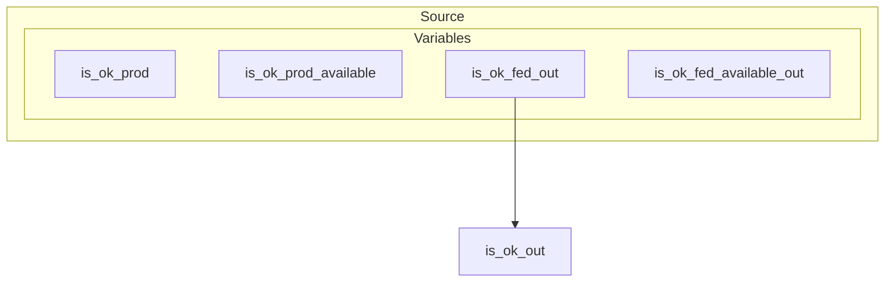
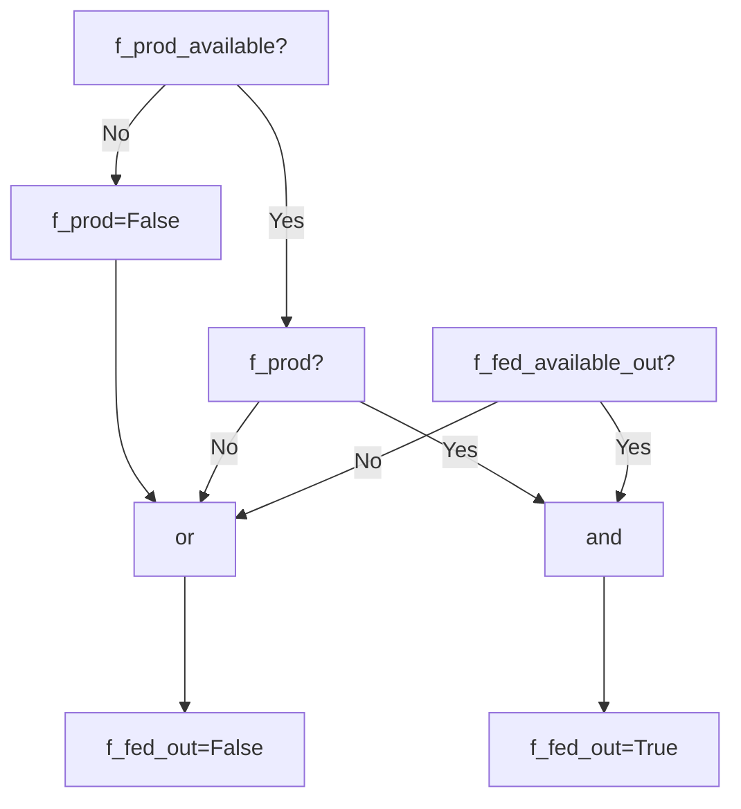
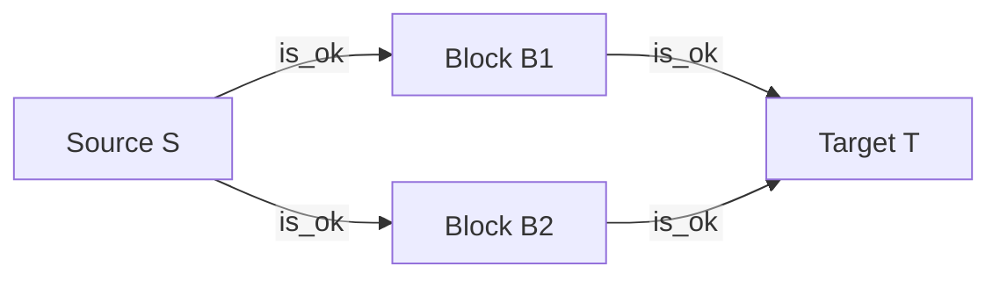
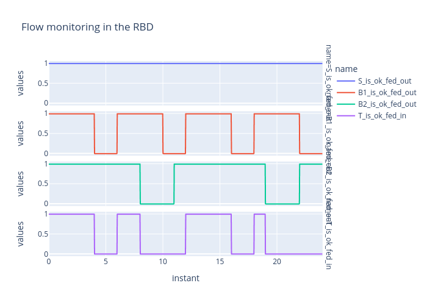

# muscadet

## Introduction

MUSCADET is an open-source knowledge base (KB) framework under the MIT license, written for the PyCATSHOO framework. It aims to facilitate the creation of modeling tools for performing risk and performance assessments of physical systems, particularly those that involve flow propagation (electricity, water, signals, information, etc.). MUSCADET is a French acronym for "Modélisation de flUx StoChAstiques DiscrETs," which translates to "discrete stochastic flow modeling."

This KB relies on the smart component approach, meaning the ultimate goal is to build system models that resemble the real physical architecture of the underlying target system. More concretely, MUSCADET consists of a set of basic PyCATSHOO objects that can be used to efficiently build PyCATSHOO modeling tools on top of it for representing specific classes of systems. For instance, MUSCADET can be used to create a modeling formalism dedicated to electrical system models where the analyst can directly manipulate busbars, breakers, transformers, etc.

## Prerequisite

- Install the PyCATSHOO library by following the instructions on the official website: [http://www.pycatshoo.org/](http://www.pycatshoo.org/).

  To verify the successful installation of PyCATSHOO, open a Python terminal and execute the following command:

  ```python
  import pycatshoo
  ```

  If no errors are raised, the installation is successful.

- Next, install the MUSCADET library in your environment from GitHub:

  ```sh
  pip install https://github.com/edgemind-sas/muscadet.git
  ```
  
## Getting started

We propose creating a basic Reliability Block Diagram (RBD) toolkit using the MUSCADET framework. An RBD consists of three types of components:

- **Sources:** Components capable of producing a functional flow
- **Blocks:** Components that can receive and propagate flows
- **Targets:** Components that receive the flows

Each component can have random failures and repair events governed by an exponential distribution, parameterized by failure and repair rates.

First, import the `muscadet` library:

```python
import muscadet
```

### Creating the components

Now, create the `Source` component like this:

```python
class Source(muscadet.ObjFlow):

    def add_flows(self, **kwargs):

        super().add_flows(**kwargs)

        self.add_flow_out(
            name="is_ok",
			var_prod_default=True,
        )
```

Key points to note are:

- When using the MUSCADET framework, you need to make all components inherit from `muscadet.ObjFlow`.
- You need to override the `add_flows` method (hence the `super().add_flows(**kwargs)` call) to declare all inputs and outputs.
- In this case, the source has only one output, producing a flow named `"is_ok"`. The idea is to make the source produce the `"is_ok"` flow while no failure occurs in the source. To model this, we use the `add_flow_out` method with the parameter `name` set to `"is_ok"` and `var_prod_default` set to `True`, indicating a source is producing flow by default.
- Currently, no failure information is provided, meaning the source is perfect and never fails.

To go a bit deeper into the MUSCADET framework, please note that in the background, the `add_flow_out` method adds the following elements to the components (as shown in the figure below):
- A connection output port named `is_ok_out` to allow the source to be connected to other components.
- A boolean attribute `is_ok_prod` indicating if the component is producing the `is_ok` flow.
- A boolean attribute `is_ok_prod_available` indicating if the component can produce the `is_ok` flow.
- A boolean attribute `is_ok_fed_out` indicating if the component is fed with the `is_ok` flow.
- A boolean attribute `is_ok_fed_available_out` indicating if the component can propagate the `is_ok` flow out.



At this point, it is worth providing an initial explanation of the flow propagation logic for an output flow named `f`:

- If the component is available to produce flow `f` (i.e., `f_prod_available` is `True`), then the production may be enabled depending on whether `f_prod` is `True` or `False`. If `f_prod_available` is `False` (for instance, because a failure event occurred), then `f_prod` is forced to `False`.
- If the component produces the flow `f`, then it can be propagated to output if the output function is available, controlled by the boolean attribute `is_ok_fed_available_out`. Note that we can distinguish two levels of availability: one for production and one for propagation to output.
- If the flow is available to be propagated, the value of `f_fed_out` is propagated to connected components.

The previous process is illustrated in the following diagram:


Now, let's create the `Block` component:

```python
class Block(muscadet.ObjFlow):

    def add_flows(self, **kwargs):

        super().add_flows(**kwargs)

        self.add_flow_in(
            name="is_ok",
			logic="and",
        )

        self.add_flow_out(
            name="is_ok",
            var_prod_cond=[
                "is_ok",
            ]
        )
```

Key points to note are:

- We use the `add_flow_in` method to add an input flow named `"is_ok"` to be consistent with the `Source` component's output flow.
- The parameter `logic="and"` means we want all connected components to a block to produce the `"is_ok"` flow to consider the block verified for the flow `"is_ok"`.
- As for the output version, the `add_flow_in` method creates additional attributes like `is_ok_in` and `is_ok_available_in` to control the component's ability to let the flow `is_ok` in.
- We also add an output flow named `"is_ok"` using `add_flow_out` to propagate flows named `"is_ok"`.
- The `var_prod_cond` parameter is used to specify a list of input flows that must be verified by the component (here `"is_ok"`) to propagate the flow `"is_ok"` to output.

Finally, let's create the `Target` component :
```python
class Target(muscadet.ObjFlow):

    def add_flows(self, **kwargs):

        super().add_flows(**kwargs)

        self.add_flow_in(
            name="is_ok",
			logic="and",
        )
```
The `Target` component is just like a `Block` component without output.

### First RBD

Now our generic components ready, we are going to model the following RBD :



It represents a source `S` providing flows to both parallel blocks `B1` and `B2` that finally propagate flows to target `T`.

Here is the code to create this RBD with MUSCADET:
```python
# Step 1: System Initialization
# Initialize a new system named "My first RBD"
my_rbd = muscadet.System(name="My first RBD")

# Step 2: Adding Components
# Add a source component named "S"
my_rbd.add_component(cls="Source", name="S")

# Add a block component named "B1"
my_rbd.add_component(cls="Block", name="B1")

# Add another block component named "B2"
my_rbd.add_component(cls="Block", name="B2")

# Add a target component named "T"
my_rbd.add_component(cls="Target", name="T")

# Step 3: Connecting Components
# Connect the source "S" to block "B1" using the "is_ok" flow
my_rbd.connect("S", "is_ok_out", "B1", "is_ok_in")

# Connect the source "S" to block "B2" using the "is_ok" flow
my_rbd.connect("S", "is_ok_out", "B2", "is_ok_in")

# Connect block "B1" to the target "T" using the "is_ok" flow
my_rbd.connect("B1", "is_ok_out", "T", "is_ok_in")

# Connect block "B2" to the target "T" using the "is_ok" flow
my_rbd.connect("B2", "is_ok_out", "T", "is_ok_in")
```
Detailed explanation:

1. **System Initialization:**
   - We initialize a new system using `muscadet.System` and give it the name "My first RBD".

   ```python
   my_rbd = muscadet.System(name="My first RBD")
   ```

2. **Adding Components:**
   - We add a source component named "S" to the system.
   - We add two block components named "B1" and "B2".
   - We also add a target component named "T".

   ```python
   my_rbd.add_component(cls="Source", name="S")
   my_rbd.add_component(cls="Block", name="B1")
   my_rbd.add_component(cls="Block", name="B2")
   my_rbd.add_component(cls="Target", name="T")
   ```

3. **Connecting Components:**
   - We connect the source "S" to the block "B1" with the flow named "is_ok".
   - We also connect the source "S" to the block "B2" with the same flow "is_ok".
   - Next, we connect the block "B1" to the target "T" to propagate the "is_ok" flow.
   - Similarly, we connect the block "B2" to the target "T" to propagate the "is_ok" flow.

   ```python
   my_rbd.connect("S", "is_ok_out", "B1", "is_ok_in")
   my_rbd.connect("S", "is_ok_out", "B2", "is_ok_in")
   my_rbd.connect("B1", "is_ok_out", "T", "is_ok_in")
   my_rbd.connect("B2", "is_ok_out", "T", "is_ok_in")
   ```

We can now add an indicator on the target component to monitor if it is correctly fed by the `is_ok` flows. Remember that theoretically, this should be the case since no failures are considered for now. To achieve this, we use the `add_indicator_var` method as follows:

```python
my_rbd.add_indicator_var(
    component="T",
    var="is_ok_in",
    stats=["mean"],
)
```

- The `component` argument specifies the component on which we want to create an indicator.
- The `var` argument sets which component variable to monitor.
- The `stats` argument allows us to provide a list of statistics to be measured on the monitored variable.

In this case, we want to monitor `is_ok_fed_in`, which is a boolean indicating if the `is_ok` flow correctly fed the input of target component `T`.

### Simulation

Once our system is built, we can run a simulation to observe flow propagation in the system. Since no random event is considered for now, the system is entirely deterministic. Consequently, running the simulation should always give the same results, that is, flows `is_ok` propagate without trouble from source `S` through both blocks `B1` and `B2` to finally reach target `T`.

The following code run a simulation of the system :
```python
my_rbd.simulate(
    {
        "nb_runs": 1,
        "schedule": [{"start": 0, "end": 24, "nvalues": 23}],
    }
)
```

We can graphically observe the values taken by the variable `is_ok_fed_in` during the simulation with:
```python
fig_indics = my_rbd.indic_px_line()
fig_indics.show()
```
Note that the method `indic_px_line` produces a Plotly graphic that can be displayed with the `show` method.

The code for this example is available [here](examples/rbd_01/system.py).

### Deterministic Failures

Let's now add deterministic failures for both components `B1` and `B2`. A failure can be considered an event that changes the state of a component. In our case, we suppose that a failure can happen if the component is fed by the flow `is_ok`. When a failure occurs, the component becomes unable to propagate the flow `is_ok` downstream, meaning `is_ok_fed_available_out` becomes `False`, and consequently, `is_ok_fed_out` also becomes `False`. In this first example, we consider deterministic failures that trigger after fixed delays (4 time units for `B1` and 8 time units for `B2`). Once the failure is present, a repair event occurs deterministically after 2 time units for `B1` and 3 time units for `B2`.

The classic way to represent this kind of behavior is to use a 2-state automaton to transition from the absence of failure to the presence of failure. To do that in MUSCADET, we can use the `add_atm2states` method like this:
```python
my_rbd.comp["B1"].add_atm2states(
    name="failure_deterministic",
    occ_law_12={"cls": "delay", "time": 4},
    cond_occ_12="is_ok_fed_out",
    effects_12=[("is_ok_fed_available_out", False)],
    occ_law_21={"cls": "delay", "time": 2},
)
```
The parameters of this method are:
- `name`: The name of the automaton.
- `cond_occ_12`: The condition to enable a transition from the first state to the second state.
- `occ_law_12`: The occurrence law for the transition from the first state to the second state. Here, we have a deterministic delay of 4 time units.
- `effects_12`: The effects of the transition from the first state to the second state.
- `occ_law_21`: The occurrence law for the transition from the second state to the first state. Here, we have a deterministic delay of 2 time units.

For `B2`, we use an equivalent approach that utilizes the high-level method `add_delay_failure_mode` to simplify the automaton creation:
```python
my_rbd.comp["B2"].add_delay_failure_mode(
    name="failure_deterministic",
	failure_cond="is_ok_fed_out",
	failure_time=8,
	failure_effects=[("is_ok_fed_available_out", False)],
	repair_time=3,
)
```
As we see here, failure/repair behavior is specified more directly.

It is now time to evaluate the RBD by launching a simulation. But before that, let's first add indicators to monitor the `is_ok` flow output status for components `S`, `B1`, and `B2`:
```python
my_rbd.add_indicator_var(
    component=".",
    var="is_ok_fed_out",
    stats=["mean"],
)
```
Note that the `component="."` parameter means that we want to create an indicator to monitor the `is_ok_fed_out` variable of each component. If a component has no `is_ok_fed_out` variable, no indicator is created.

We can launch a simulation and show results as previously:
```python
my_rbd.simulate(
    {
        "nb_runs": 1,
        "schedule": [{"start": 0, "end": 24, "nvalues": 23}],
    }
)

my_rbd.indic_px_line(title="Flow monitoring in the RBD", facet_row="name").show()
```




We observe that target `T` is correctly fed if we have flow propagation from both `B1` and `B2` simultaneously.

The code for this example is available [here](examples/rbd_02/system.py).


## More Examples

## Documentation
