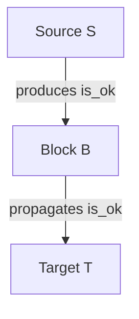

# muscadet

## Introduction

MUSCADET is an open-source knowledge base (KB) framework under the MIT license, written for the
PyCATSHOO framework. It aims to facilitate the creation of
modeling tools for performing risk and performance assessments of physical systems,
particularly those that involve flows propagation 
(electricity, water, signals, information, etc.). MUSCADET is a French acronym for "Modélisation de flUx
StoChAstiques DiscrETs," which translates to "discrete stochastic flow modeling." 

This KB relies on the smart component approach, meaning the ultimate
goal is to build system models that resemble the real physical architecture of the underlying
target system. More concretely, MUSCADET consists of a set of basic PyCATSHOO objects that can
be use to efficiently build PyCATSHOO modeling tools on top of it for representing
specific classes of systems. For instance, MUSCADET can be used to create a modeling formalism
dedicated to electrical system models where the analyst can directly manipulate
busbars, breakers, transformers, etc.

## Prerequisite

- Install the PyCATSHOO library by following the instructions on the official website: [http://www.pycatshoo.org/](http://www.pycatshoo.org/)

  To verify the successful installation of PyCATSHOO, open a Python terminal and execute the following command:

  ```python
  import pycatshoo
  ```

  If no errors are raised, the installation was successful.

- Next, install the MUSCADET library in your environment from GitHub:

  ```sh
  pip install https://github.com/edgemind-sas/muscadet.git
  ```
  
## Getting started

We propose to create a basic Reliability Block Diagram (RBD) toolkit using the MUSCADET framework. An RBD consists of three types of components:

- **Sources:** Components capable of producing a functional flow.
- **Blocks:** Components that can receive and propagate flows.
- **Targets:** Components that receive the flows.

Each component can have random failures and repairing events governed by an exponential distribution, parameterized by failure and repair rates.

First, import the `muscadet` library:

```python
import muscadet
```

### Creating the components

Now, create the `Source` component like this:

```python
class Source(muscadet.ObjFlow):

    def add_flows(self, **kwargs):

        super().add_flows(**kwargs)

        self.add_flow_out(
            name="is_ok",
        )
```

Key points to note are:

- When using the MUSCADET framework, you need to make all components inherit from `muscadet.ObjFlow`.
- You need to override the `add_flows` method (which is why you start with `super().add_flows(**kwargs)`) to declare all inputs and outputs.
- In this case, the source has only one output, producing a flow named `"is_ok"`. The idea is
  to make the source produce the `"is_ok"` flow while no failure occurs in the source. 
  To model this, we use the `add_flow_out` method with parameter `name` set to `"is_ok"`.
- Currently, no failure information is provided, meaning the source is perfect and never fails.

Now, it's time to create the `Block` component :

```python
class Block(muscadet.ObjFlow):

    def add_flows(self, **kwargs):

        super().add_flows(**kwargs)

        self.add_flow_in(
            name="is_ok",
        )

        self.add_flow_out(
            name="is_ok",
            var_prod_cond=[
                "is_ok",
            ]
        )
```
Key points to note are :

- We use the `add_flow_in`to add in input flow named `"is_ok"` to be consistent with the
  `Source` component output flow.
- We also add, still with `add_flow_out`, an output flow named `"is_ok"` to be able to
  propagate flows named `"is_ok"`.
- The `var_prod_cond` parameters is used to give a list of input flows that must be present to
  let the current flow (here `"is_ok"`) be propagated to output.

Now, let's create the `Block` component:

```python
class Block(muscadet.ObjFlow):

    def add_flows(self, **kwargs):

        super().add_flows(**kwargs)

        self.add_flow_in(
            name="is_ok",
			logic="and",
        )

        self.add_flow_out(
            name="is_ok",
            var_prod_cond=[
                "is_ok",
            ]
        )
```

Key points to note are:

- We use the `add_flow_in` method to add an input flow named `"is_ok"` to be consistent with
  the `Source` component's output flow.
- The parameter `logic="and"` means we want that all connected components to a block produce
  the `"is_ok"` flow to considered the block verified the flow `"is_ok"`
- We also add an output flow named `"is_ok"` using `add_flow_out` to propagate flows named `"is_ok"`.
- The `var_prod_cond` parameter is used to specify a list of input flows that must be verified
  by the component (here `"is_ok"`) to propagate the flow `"is_ok"` to output.

Finally, let's create the `Target` component :
```python
class Target(muscadet.ObjFlow):

    def add_flows(self, **kwargs):

        super().add_flows(**kwargs)

        self.add_flow_in(
            name="is_ok",
			logic="and",
        )
```
`Target` component is just like a `Block` component without output.

### First RBD



## More examples


## Documentation
