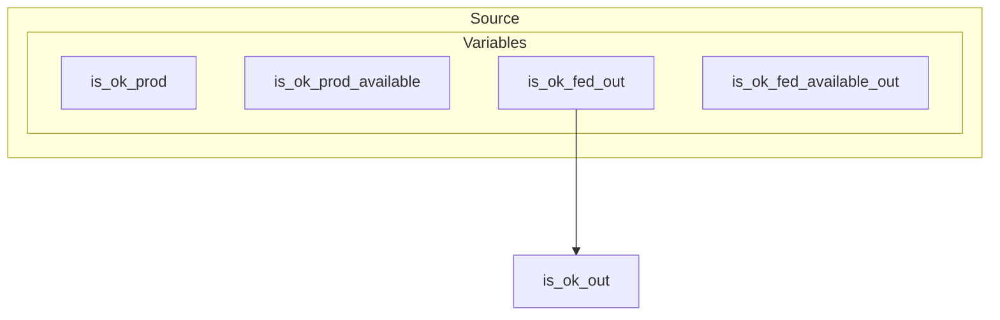
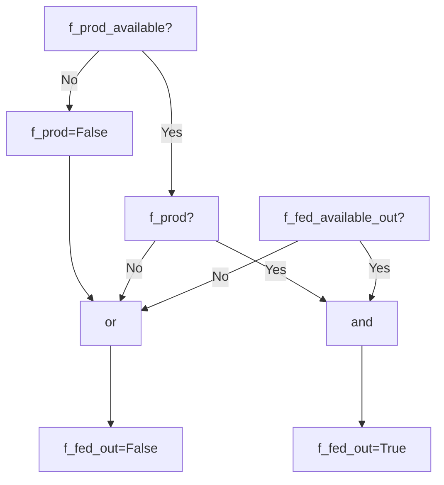
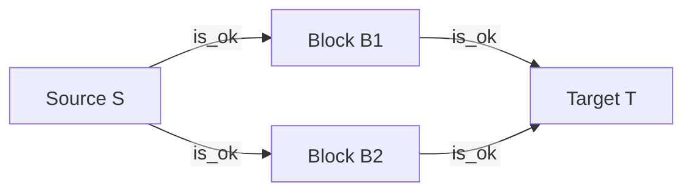
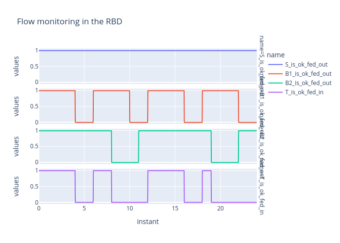
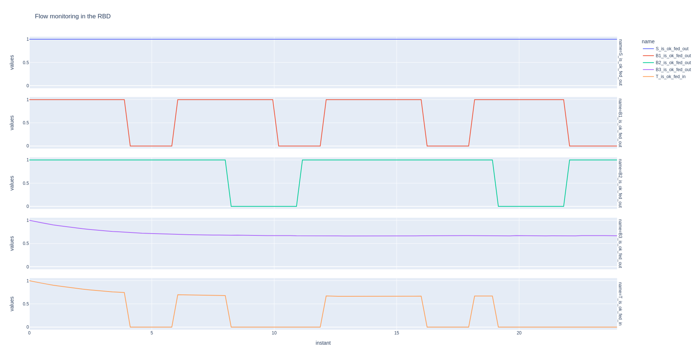
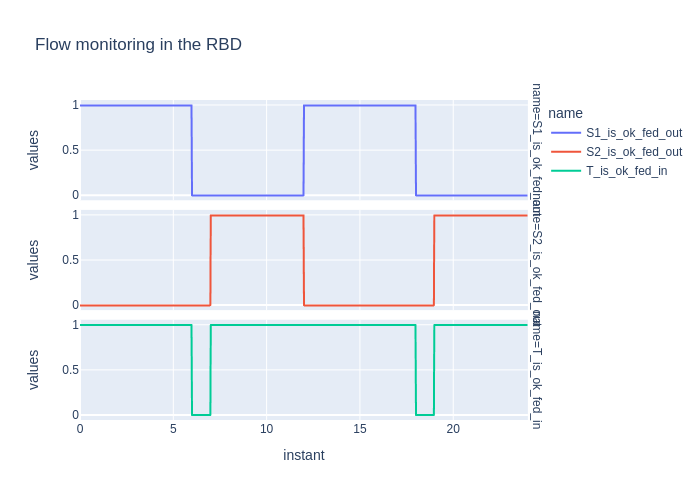

# muscadet

## Introduction

MUSCADET is an open-source knowledge base (KB) framework under the MIT license, written for the PyCATSHOO framework. It aims to facilitate the creation of modeling tools for performing risk and performance assessments of physical systems, particularly those that involve flow propagation (electricity, water, signals, information, etc.). MUSCADET is a French acronym for "Modélisation de flUx StoChAstiques DiscrETs," which translates to "discrete stochastic flow modeling."

This KB relies on the smart component approach, meaning the ultimate goal is to build system models that resemble the real physical architecture of the underlying target system. More concretely, MUSCADET consists of a set of basic PyCATSHOO objects that can be used to efficiently build PyCATSHOO modeling tools on top of it for representing specific classes of systems. For instance, MUSCADET can be used to create a modeling formalism dedicated to electrical system models where the analyst can directly manipulate busbars, breakers, transformers, etc.

## Prerequisite

- Install the PyCATSHOO library by following the instructions on the official website: [http://www.pycatshoo.org/](http://www.pycatshoo.org/).

  To verify the successful installation of PyCATSHOO, open a Python terminal and execute the following command:

  ```python
  import pycatshoo
  ```

  If no errors are raised, the installation is successful.

- Next, install the MUSCADET library in your environment from GitHub:

  ```sh
  pip install git+https://github.com/edgemind-sas/muscadet.git
  ```
  
## Getting started

We propose creating a basic Reliability Block Diagram (RBD) toolkit using the MUSCADET framework. An RBD consists of three types of components:

- **Sources:** Components capable of producing a functional flow
- **Blocks:** Components that can receive and propagate flows
- **Targets:** Components that receive the flows

Each component can have random failures and repair events governed by an exponential distribution, parameterized by failure and repair rates.

First, import the `muscadet` library:

```python
import muscadet
```

### Creating the components

Now, create the `Source` component like this:

```python
class Source(muscadet.ObjFlow):

    def add_flows(self, **kwargs):

        super().add_flows(**kwargs)

        self.add_flow_out(
            name="is_ok",
			var_prod_default=True,
        )
```

Key points to note are:

- When using the MUSCADET framework, you need to make all components inherit from `muscadet.ObjFlow`.
- You need to override the `add_flows` method (hence the `super().add_flows(**kwargs)` call) to declare all inputs and outputs.
- In this case, the source has only one output, producing a flow named `"is_ok"`. The idea is to make the source produce the `"is_ok"` flow while no failure occurs in the source. To model this, we use the `add_flow_out` method with the parameter `name` set to `"is_ok"` and `var_prod_default` set to `True`, indicating a source is producing flow by default.
- Currently, no failure information is provided, meaning the source is perfect and never fails.

To go a bit deeper into the MUSCADET framework, please note that in the background, the `add_flow_out` method adds the following elements to the components (as shown in the figure below):
- A connection output port named `is_ok_out` to allow the source to be connected to other components.
- A boolean attribute `is_ok_prod` indicating if the component is producing the `is_ok` flow.
- A boolean attribute `is_ok_prod_available` indicating if the component can produce the `is_ok` flow.
- A boolean attribute `is_ok_fed_out` indicating if the component is fed with the `is_ok` flow.
- A boolean attribute `is_ok_fed_available_out` indicating if the component can propagate the `is_ok` flow out.


```mermaid
graph TD;
    subgraph Source
        direction LR;

        subgraph Variables
        direction TB;
            A[is_ok_prod]
            B[is_ok_prod_available]
            C[is_ok_fed_out]
            D[is_ok_fed_available_out]
        end

    end

    C ---> Export[is_ok_out]
```

At this point, it is worth providing an initial explanation of the flow propagation logic for an output flow named `f`:

- If the component is available to produce flow `f` (i.e., `f_prod_available` is `True`), then the production may be enabled depending on whether `f_prod` is `True` or `False`. If `f_prod_available` is `False` (for instance, because a failure event occurred), then `f_prod` is forced to `False`.
- If the component produces the flow `f`, then it can be propagated to output if the output function is available, controlled by the boolean attribute `is_ok_fed_available_out`. Note that we can distinguish two levels of availability: one for production and one for propagation to output.
- If the flow is available to be propagated, the value of `f_fed_out` is propagated to connected components.

The previous process is illustrated in the following diagram:

```mermaid
graph TB;
    A[f_prod_available?]
    B[f_prod?]
    C[f_prod=False]
    D[f_fed_available_out?]
    E[f_fed_out=True]
    F[f_fed_out=False]
	G[or]
	H[and]

    A -- Yes --> B
	A -- No --> C
	C ---> G
	G ---> F
	B -- No --> G
    B -- Yes --> H
	D -- Yes --> H
	D -- No --> G
	H ---> E
```

Now, let's create the `Block` component:

```python
class Block(muscadet.ObjFlow):

    def add_flows(self, **kwargs):

        super().add_flows(**kwargs)

        self.add_flow_in(
            name="is_ok",
			logic="and",
        )

        self.add_flow_out(
            name="is_ok",
            var_prod_cond=[
                "is_ok",
            ]
        )
```

Key points to note are:

- We use the `add_flow_in` method to add an input flow named `"is_ok"` to be consistent with the `Source` component's output flow.
- The parameter `logic="and"` means we want all connected components to a block to produce the `"is_ok"` flow to consider the block verified for the flow `"is_ok"`.
- As for the output version, the `add_flow_in` method creates additional attributes like `is_ok_in` and `is_ok_available_in` to control the component's ability to let the flow `is_ok` in.
- We also add an output flow named `"is_ok"` using `add_flow_out` to propagate flows named `"is_ok"`.
- The `var_prod_cond` parameter is used to specify a list of input flows that must be verified by the component (here `"is_ok"`) to propagate the flow `"is_ok"` to output.

Finally, let's create the `Target` component :
```python
class Target(muscadet.ObjFlow):

    def add_flows(self, **kwargs):

        super().add_flows(**kwargs)

        self.add_flow_in(
            name="is_ok",
			logic="and",
        )
```
The `Target` component is just like a `Block` component without output.

### First RBD

Now our generic components ready, we are going to model the following RBD :


```mermaid
%%{
  init: {
    'securityLevel': 'loose',
    'theme': 'default',
    'htmlLabels': false
  }
}%%
graph LR;
    S[Source S] -->|is_ok| B1[Block B1];
	S[Source S] -->|is_ok| B2[Block B2];
    B1 -->|is_ok| T[Target T];
	B2 -->|is_ok| T[Target T];
```

It represents a source `S` providing flows to both parallel blocks `B1` and `B2` that finally propagate flows to target `T`.

Here is the code to create this RBD with MUSCADET:
```python
# Step 1: System Initialization
# Initialize a new system named "My first RBD"
my_rbd = muscadet.System(name="My first RBD")

# Step 2: Adding Components
# Add a source component named "S"
my_rbd.add_component(cls="Source", name="S")

# Add a block component named "B1"
my_rbd.add_component(cls="Block", name="B1")

# Add another block component named "B2"
my_rbd.add_component(cls="Block", name="B2")

# Add a target component named "T"
my_rbd.add_component(cls="Target", name="T")

# Step 3: Connecting Components
# Connect the source "S" to block "B1" using the "is_ok" flow
my_rbd.connect("S", "is_ok_out", "B1", "is_ok_in")

# Connect the source "S" to block "B2" using the "is_ok" flow
my_rbd.connect("S", "is_ok_out", "B2", "is_ok_in")

# Connect block "B1" to the target "T" using the "is_ok" flow
my_rbd.connect("B1", "is_ok_out", "T", "is_ok_in")

# Connect block "B2" to the target "T" using the "is_ok" flow
my_rbd.connect("B2", "is_ok_out", "T", "is_ok_in")
```
Detailed explanation:

1. **System Initialization:**
   - We initialize a new system using `muscadet.System` and give it the name "My first RBD".

   ```python
   my_rbd = muscadet.System(name="My first RBD")
   ```

2. **Adding Components:**
   - We add a source component named "S" to the system.
   - We add two block components named "B1" and "B2".
   - We also add a target component named "T".

   ```python
   my_rbd.add_component(cls="Source", name="S")
   my_rbd.add_component(cls="Block", name="B1")
   my_rbd.add_component(cls="Block", name="B2")
   my_rbd.add_component(cls="Target", name="T")
   ```

3. **Connecting Components:**
   - We connect the source "S" to the block "B1" with the flow named "is_ok".
   - We also connect the source "S" to the block "B2" with the same flow "is_ok".
   - Next, we connect the block "B1" to the target "T" to propagate the "is_ok" flow.
   - Similarly, we connect the block "B2" to the target "T" to propagate the "is_ok" flow.

   ```python
   my_rbd.connect("S", "is_ok_out", "B1", "is_ok_in")
   my_rbd.connect("S", "is_ok_out", "B2", "is_ok_in")
   my_rbd.connect("B1", "is_ok_out", "T", "is_ok_in")
   my_rbd.connect("B2", "is_ok_out", "T", "is_ok_in")
   ```

We can now add an indicator on the target component to monitor if it is correctly fed by the `is_ok` flows. Remember that theoretically, this should be the case since no failures are considered for now. To achieve this, we use the `add_indicator_var` method as follows:

```python
my_rbd.add_indicator_var(
    component="T",
    var="is_ok_in",
    stats=["mean"],
)
```

- The `component` argument specifies the component on which we want to create an indicator.
- The `var` argument sets which component variable to monitor.
- The `stats` argument allows us to provide a list of statistics to be measured on the monitored variable.

In this case, we want to monitor `is_ok_fed_in`, which is a boolean indicating if the `is_ok` flow correctly fed the input of target component `T`.

### Simulation

Once our system is built, we can run a simulation to observe flow propagation in the system. Since no random event is considered for now, the system is entirely deterministic. Consequently, running the simulation should always give the same results, that is, flows `is_ok` propagate without trouble from source `S` through both blocks `B1` and `B2` to finally reach target `T`.

The following code run a simulation of the system :
```python
my_rbd.simulate(
    {
        "nb_runs": 1,
        "schedule": [{"start": 0, "end": 24, "nvalues": 23}],
    }
)
```

We can graphically observe the values taken by the variable `is_ok_fed_in` during the simulation with:
```python
fig_indics = my_rbd.indic_px_line()
fig_indics.show()
```
Note that the method `indic_px_line` produces a Plotly graphic that can be displayed with the `show` method.

The code for this example is available [here](examples/rbd_01/rbd_01.py).

### Deterministic Failures

Let's now add deterministic failures for both components `B1` and `B2`. A failure can be considered an event that changes the state of a component. In our case, we suppose that a failure can happen if the component is fed by the flow `is_ok`. When a failure occurs, the component becomes unable to propagate the flow `is_ok` downstream, meaning `is_ok_fed_available_out` becomes `False`, and consequently, `is_ok_fed_out` also becomes `False`. In this first example, we consider deterministic failures that trigger after fixed delays (4 time units for `B1` and 8 time units for `B2`). Once the failure is present, a repair event occurs deterministically after 2 time units for `B1` and 3 time units for `B2`.

The classic way to represent this kind of behavior is to use a 2-state automaton to transition from the absence of failure to the presence of failure. To do that in MUSCADET, we can use the `add_atm2states` method like this:
```python
my_rbd.comp["B1"].add_atm2states(
    name="failure_deterministic",
    occ_law_12={"cls": "delay", "time": 4},
    cond_occ_12="is_ok_fed_out",
    effects_12=[("is_ok_fed_available_out", False)],
    occ_law_21={"cls": "delay", "time": 2},
)
```
The parameters of this method are:
- `name`: The name of the automaton.
- `cond_occ_12`: The condition to enable a transition from the first state to the second state.
- `occ_law_12`: The occurrence law for the transition from the first state to the second state. Here, we have a deterministic delay of 4 time units.
- `effects_12`: The effects of the transition from the first state to the second state.
- `occ_law_21`: The occurrence law for the transition from the second state to the first state. Here, we have a deterministic delay of 2 time units.

For `B2`, we use an equivalent approach that utilizes the high-level method `add_delay_failure_mode` to simplify the automaton creation:
```python
my_rbd.comp["B2"].add_delay_failure_mode(
    name="failure_deterministic",
	failure_cond="is_ok_fed_out",
	failure_time=8,
	failure_effects=[("is_ok_fed_available_out", False)],
	repair_time=3,
)
```
As we see here, failure/repair behavior is specified more directly.

It is now time to evaluate the RBD by launching a simulation. But before that, let's first add indicators to monitor the `is_ok` flow output status for components `S`, `B1`, and `B2`:
```python
my_rbd.add_indicator_var(
    component=".",
    var="is_ok_fed_out",
    stats=["mean"],
)
```
Note that the `component="."` parameter means that we want to create an indicator to monitor the `is_ok_fed_out` variable of each component. If a component has no `is_ok_fed_out` variable, no indicator is created.

We can launch a simulation and show results as previously:
```python
my_rbd.simulate(
    {
        "nb_runs": 1,
        "schedule": [{"start": 0, "end": 24, "nvalues": 1000}],
    }
)

fig_indics = my_rbd.indic_px_line(
    markers=False, title="Flow monitoring in the RBD", facet_row="name"
).show()
```




We observe that target `T` is correctly fed if we have flow propagation from both `B1` and `B2` simultaneously.

The code for this example is available [here](examples/rbd_02/rbd_02.py).

### Stochastic Failures

Stochastic failures and their associated variables are similar to deterministic failures, with the key difference being that stochastic failures occur randomly based on failure and repair rates. In this example, we consider stochastic failures for component B3, which can be triggered approximately every 8 time units. Once a failure occurs, a repair event can occur approximately every 4 time units for B3.

A classic way to represent this behavior is to use a 2-state automaton to transition between the absence and presence of a failure. In MUSCADET, this can be achieved using the `add_exp_failure_mode` method as shown below:
```python
my_rbd.comp["B3"].add_exp_failure_mode(
    name="failure_stochastic",
    failure_cond="is_ok_fed_out",
    failure_rate=1/8,
    failure_effects=[("is_ok_fed_available_out", False)],
    repair_rate=1/4,
)
```

The parameters of this method are:
- `name`: The name of the automaton.
- `failure_cond`: The condition to enable a transition from the current state to the sefailure state.
- `failure_rate`: The transition rate from the available state to the failure state. In this case, the transition occurs approximately every 8 time units.
- `failure_effects`: The effects that occur during the transition from the available state to the failure state.
- `repair_rate`: The transition rate from the failure state back to the available state. Here, the repair occurs approximately every 4 time units.

Before lauching a simulation, we add indicators to monitor the `is_ok` flow output status for components `B3`:
```python
my_rbd.add_indicator_var(
    component="B3",
    var="is_ok_fed_out",
    stats=["mean"],
)
```
Note that the `component="."` parameter means that we want to create an indicator to monitor
the `is_ok_fed_out` variable of each component. If a component has no `is_ok_fed_out` variable,
no indicator is created. You can replace "B3" by "." to create the indication for each block.

We can launch a simulation and display the results. For stochastic simulations, it is advisable to use a high number of runs to average out the randomness (e.g., nb_runs = 10 000):
```python
my_rbd.simulate(
    {
        "nb_runs": 10000,
        "schedule": [{"start": 0, "end": 24, "nvalues": 1000}],
    }
)

fig_indics = my_rbd.indic_px_line(
    markers=False, title="Flow monitoring in the RBD", facet_row="name"
).show()
```




We observe that target `T` is correctly fed if we have flow propagation from both `B1`, `B2` and `B3` simultaneously.

The code for this example is available [here](examples/rbd_03/rbd_03.py).

### Source Triggered on condition

A source can produce and propagate a flow to the connected target as long
as it is not in failure state. However, a source with an "out_on_trigger" flow will only propagate
its flow if a triggering condition is true.

In this example, there are two sources: the first will propagate its flow by default, while the second source
will only propagate its flow if the main source cannot propagate its flow because of a failure.

```python
# Components classes
# ==================
class Source(muscadet.ObjFlow):
    def add_flows(self, **kwargs):
        super().add_flows(**kwargs)

        self.add_flow_out(
            name=flow1,
            var_prod_default=True,
        )
		
class SourceTrigger(muscadet.ObjFlow):
    def add_flows(self, **kwargs):
        super().add_flows(**kwargs)

        self.add_flow_out_on_trigger(
            name=flow1,
            trigger_time_up=1,
            trigger_time_down=0,
            trigger_logic="and",
            var_prod_default=True,
        )
		
class Target(muscadet.ObjFlow):
    def add_flows(self, **kwargs):
        super().add_flows(**kwargs)

        self.add_flow_in(
            name=flow1,
            logic="or",
        )
```

The specific parameters of the method `add_flow_out_on_trigger` are:
- `trigger_logic`: The logic applied on the condition to trigger the flow. Can be `and` or `or`.
- `trigger_time_up`: The transition time from the waiting state to the run state. In this
  case, the transition occurs after 1 time units.
- `trigger_time_down`: The transition time from the run state to the waiting state. In this case, the transition occurs after 0 time units. 

To activate the second source when the main source is unavailable, they must be connected as below.

```python
my_rbd.add_component(cls="Source", name="S1")
my_rbd.add_component(cls="SourceTrigger", name="S2")

my_rbd.connect_trigger("S1", "S2", flow1)
```

Here the flow to connect is `flow1` with `S1` as the main source and `S2` as the triggered source.

A classic way to represent this behavior is to use a 2-state automaton to transition between the absence and presence of a failure. In MUSCADET, this can be achieved using the `add_delay_failure_mode` method as shown below:
```python
my_rbd.comp["S1"].add_delay_failure_mode(
    name="failure_deterministic",
    failure_cond="is_ok_fed_out",
    failure_time=6,
    failure_effects=[("is_ok_fed_available_out", False)],
    repair_time=6,
)
```

The parameters of this method are:
- `name`: The name of the automaton.
- `flow_name`: The flow to stop if the component is not available.
- `failure_cond`: The condition to enable a transition from the current state to the sefailure state.
- `failure_time`: The transition time from the available state to the failure state. In this
  case, the transition occurs after 6 time units.
- `failure_effects`: The effects that occur during the transition from the available state to the failure state.
- `repair_time`: The transition time from the failure state to the repair state. In this case, the transition occurs after 6 time units.

Now we can launch a simulation and display the results for all the `fed_out` flow. 





We observe that target `T` is correctly fed if we have flow propagation from `S1` or `S2`.

The code for this example is available [here](examples/rbd_04/rbd_04.py).


### Knowledge base classes

Some generic classes can be import from the knowledge base `kb`.
These classes are:
- Source
- SourceTrigger
- Block
- Target

**Sources** are components capable of producing a functional flow
**SourceTrigger** are components capable of producing a functional flow depending on a triggering condition
**Blocks** components can receive and propagate flows
**Targets** are components that receive the flows

There are 2 methods to create a component of a class from the knowledge base.

```python
import muscadet.kb.rbd as rbd

# Components classes
# ==================
# Add components
my_rbd.add_component(cls="Source", name="S1")
s1 = rbd.Source("S1")
```

The method `add_component(cls=className, name=componentName)` can find the `className` in the imported file. (Source is available in muscadet.kb.rbd)
The second method is `rbd.Source(name)`, where `Source` is accessible from the `rbd`.

```python
import muscadet.kb.rbd as rbd

# Components classes
# ==================
# Add components
my_rbd.add_component(cls="Source", name="S1")
my_rbd.add_component(cls="SourceTrigger", name="S2")
my_rbd.add_component(cls="Block", name="B1")
my_rbd.add_component(cls="Block", name="B2")
my_rbd.add_component(cls="Target", name="T")
```
The code for this example is available [here](examples/rbd_05/rbd_05.py).

### Sequences analysis

Pycatshoo can analyze for each simulation the list of transitions that have been triggered and
obtain the sequences of all transitions obtained after all simulations.
To do this, the list of transitions to observe msut be monitored. The transitions to monitor
can be filtered to display only specific component transitions.
Here, using the pattern `#.*` allows monitoring all transitions exhaustively.

To analyze all sequences leading to a particular state of an element, use the
`addTarget` method. Thus, each simulation will stop as soon as the target is reached.

```python
# Configure sequences
# -------------------
my_rbd.addTarget("top_event", "T.is_ok_fed_in", "VAR", "!=", 1)
my_rbd.monitorTransition("#.*")
```

The parameters of the `addTarget` method are:
- `name`: The name of the target (e.g., `top_event`).
- `elementName`: the name of the target event (e.g., `T.is_ok_fed_in`).
- `elementType`: The type of the target event. Should be a variable `VAR`, `ST`, `AUT`,or `NULL`
- `op`: The operation of the condition (e.g., can be != or ==).
- `value`: The condition value to stop (e.g., a state or a value of a variable).

```python
# System simulation
# =================
my_rbd.simulate(
    {
        "nb_runs": 10,
        "schedule": [{"start": 0, "end": 24, "nvalues": 1000}],
    }
)
```

To use the Analyser and export the sequences in HTML and XML result files, some methods from
the Pycatshoo library must be imported.
The method `printFilteredSeq` will create an XML file with all the explored sequences, followed
by an HTML file if the Java application is installed. 

```python
import Pycatshoo as pyc

analyser = pyc.CAnalyser(my_rbd)
analyser.keepFilteredSeq(True)

analyser.printFilteredSeq(100, "sequences.xml", "PySeq.xsl")
```

The code for this example is available [here](examples/rbd_06/rbd_06.py).

## Flow class names: canonical and legacy

Everything above declares *discrete* flows — boolean signals that are either fed or not. Since MUSCADET 2.0 the discrete flow classes carry an explicit `Discrete` in their name, so that they read as one family beside the continuous one introduced in the next chapter.

| Canonical name             | Legacy name          |
|----------------------------|----------------------|
| `FlowDiscreteIn`           | `FlowIn`             |
| `FlowDiscreteOut`          | `FlowOut`            |
| `FlowDiscreteOutTempo`     | `FlowOutTempo`       |
| `FlowDiscreteOutOnTrigger` | `FlowOutOnTrigger`   |

The canonical names on the left are the ones to use in new models. The legacy names on the right are **supported indefinitely**: they carry no removal date, they emit no deprecation warning, and there is no plan to withdraw them. They are real classes placed inside the canonical inheritance chain — not assignment aliases — so a flow declared through a legacy name still reports that name as its runtime class, and every `isinstance` relation that held before the rename still holds.

Concretely:

- **Every example above stays valid and needs no rewriting.** `add_flow_in()`, `add_flow_out()`, `add_flow_out_tempo()` and `add_flow_out_on_trigger()` are unchanged and keep building the legacy-named classes.
- **Both spellings work in the `cls=` string form** of `add_flow`. These two declare the same output; write one or the other:

  ```python
  self.add_flow(dict(cls="FlowOut", name="is_ok", var_prod_default=True))          # legacy
  self.add_flow(dict(cls="FlowDiscreteOut", name="is_ok", var_prod_default=True))  # canonical
  ```

- Both name sets are importable from the package root and from `muscadet.flow`:

  ```python
  import muscadet

  muscadet.FlowDiscreteIn, muscadet.FlowDiscreteOut
  muscadet.FlowIn, muscadet.FlowOut
  ```

One consequence is worth knowing when mixing the two: because the legacy names sit *below* the canonical ones, a flow declared canonically is **not** an instance of the legacy class. `isinstance(flow, muscadet.FlowOut)` is `True` for a flow declared with `add_flow_out()` or with `cls="FlowOut"`, and `False` for one declared with `cls="FlowDiscreteOut"`. Test against the canonical name — `isinstance(flow, muscadet.FlowDiscreteOut)` — and it holds for both.

To enumerate a whole family rather than one class, test against its **marker base**. `muscadet.FlowDiscrete` and `muscadet.FlowContinuous` sit directly under `FlowModel`, one per family, and every class of a family descends from its own:

```python
discrete = [f for f in comp.flows_out.values() if isinstance(f, muscadet.FlowDiscrete)]
rates    = [f for f in comp.flows_out.values() if isinstance(f, muscadet.FlowContinuous)]
```

Prefer this to `not isinstance(f, muscadet.FlowContinuous)`: a negation labels *everything that is not continuous* as discrete, which stops being true the day a third family exists.

## Continuous flows

A discrete flow answers *is this component fed?*. A **continuous flow** carries a real-valued rate instead — litres per hour, kilowatts, kilograms per second — and MUSCADET integrates it over time. The two families sit side by side: a component may declare both, a rule may read a boolean flow, and a boolean output may be driven by a continuous quantity. What a continuous flow may **not** do is be connected to a discrete one; that is refused with an error naming both flows and both components.

The refusal holds on **every** connection route — `connect_flow`, `auto_connect`, `connect_trigger` and the raw `System.connect(source, "x_out", target, "x_in")` used throughout this README. Left through, a boolean signal reads as a mass flow of one unit per unit time and feeds every downstream balance, capacity level and indicator with a quantity nothing produced. Connections that are *not* flow-to-flow are untouched: a measurement link (`{c}_level_out` → `{c}_level_in`), a logic gate's export, and a trigger all resolve to no mismatch and wire exactly as before.

### Declaring continuous flows

The declaration methods mirror the discrete ones:

```python
import muscadet


class Pump(muscadet.ObjFlow):
    def add_flows(self, **kwargs):
        super().add_flows(**kwargs)

        self.add_flow_continuous_out(
            name="water",
            var_fed_default=10.0,  # the rate it can produce
        )


class Boiler(muscadet.ObjFlow):
    def add_flows(self, **kwargs):
        super().add_flows(**kwargs)

        self.add_flow_continuous_in(
            name="water",
            var_demand_default=3.0,  # what it asks for
        )
```

A continuous flow **refuses a declaration key it does not read**, by name and at declaration time:

```python
muscadet.FlowContinuousOut(name="q", var_prod_cond=["ctrl"])   # ValueError
muscadet.FlowContinuousIn(name="q", demand=5.0)                # ValueError
```

Pydantic ignores unknown keys, so both used to construct and drop the parameter: the first is the *discrete* production gate written on a continuous output — the source the modeller believes is gated produces unconditionally for the whole run — and the second is the KB's own spelling (`ConsumerContinuous(demand=...)`) against a flow-level field named `var_demand_default`, so the consumer published a demand of zero and its whole chain reported zero. The refusal names the flow, its class, the offending keys and the accepted set; it generalises what `combine` / `combine_fun` were declared-and-refused to close for one key, and those two keep their own message. The discrete family is 1.x surface and is left as it was.

Connections are declared exactly as for a discrete flow:

```python
my_plant = muscadet.System(name="Plant")
my_plant.add_component(cls="Pump", name="P")
my_plant.add_component(cls="Boiler", name="B")

my_plant.connect_flow(source="P", target="B", flow_name="water")
```

One connection wires **both directions**: the quantity travels downstream, and the demand travels back upstream. What is actually delivered on a connection is the lesser of what the producer can produce and what the consumer asks for — so the pump above delivers 3, not 10.

Per continuous flow named `f`, MUSCADET creates:

- `f_fed_out` — on an output flow, the total value delivered downstream. Always equal to the sum of the shares its consumers receive
- `f_demand_in` — on an output flow, the demands published by its consumers
- `f_out_rate` — on an output flow, the rate its production is multiplied by, holding `1.0`. The one endpoint a failure mode clamps; see [deratings](#failure-modes-on-a-continuous-output-deratings)
- `f_out_profile` — on an output flow **that declares a time profile**, the factor currently applied. A read-only publication, rewritten at every step; see [time profiles](#time-profiles-production-as-a-function-of-the-clock)
- `f_fed_in` — on an input flow, the value received: the **sum**, over every incoming connection, of the share that producer allocated to this consumer
- `f_demand_out` — on an input flow, the demand this consumer publishes upstream

and the values are read back through the flow objects:

```python
my_plant.comp["P"].flows_out["water"].var_fed.value()          # total delivered
my_plant.comp["B"].flows_in["water"].get_delivered()           # this consumer's share
my_plant.comp["B"].flows_in["water"].var_demand.value()        # published upstream
my_plant.comp["P"].flows_out["water"].get_var_demand_value()   # demand read back
```

A component transfers onto the output of the same name every continuous input **no transformation rule names** — which is the whole of them when it declares no rule at all. A transfer carries the downstream demand across unchanged — including an unbounded one a real consumer published. An output **nothing is connected to** asks for nothing, so a pass-through whose far end is unwired transfers nothing and claims nothing upstream: the same rule that governs a rule's outputs, below, so the two paths agree. A pipe standing for a discharge to atmosphere is modelled by declaring the discharge as a consumer with its own demand, which states the intent instead of resting it on an absent connection. A **capacity** behind that output is the exception both paths make: the volume claims its `fill_rate` for itself, so a two-sided tank at the end of a chain fills instead of asking for nothing.

### Transformation rules

A component that turns inputs into outputs declares an ordered set of **rules** with `add_rules`. Each rule carries a guard (`cond`), a `cons` map of consumed input coefficients and a `prod` map of produced output coefficients:

```python
class Mixer(muscadet.ObjFlow):
    def add_flows(self, **kwargs):
        super().add_flows(**kwargs)

        self.add_flow_in(name="run", logic="and")
        self.add_flow_continuous_in(name="water")
        self.add_flow_continuous_in(name="sugar")
        self.add_flow_continuous_out(name="syrup")

        self.add_rules(
            name="recipe",
            rules=[
                # 2 of water + 1 of sugar make 1 of syrup, while "run" holds
                dict(
                    name="mixing",
                    cond="run",
                    cons={"water": 2, "sugar": 1},
                    prod={"syrup": 1},
                ),
                # ... and nothing at all once it drops
                dict(name="idle", cond="not run", prod={"syrup": 0}),
            ],
        )
```

Key points:

- A rule set is declared **on the component**, not on an output flow. A reaction with correlated outputs cannot be stated one output at a time: declaring `prod={"x": 5, "y": 2}` keeps `x` and `y` in that proportion whatever the scale.
- `cons` names resolve against the component's **input** flows, `prod` names against its **output** flows. A coefficient left out of a map defaults to `1`.
- The **scarcest input sets the scale**. With the recipe above, water delivered at 10 and sugar at 2 produce 2 of syrup, not 5: sugar is the limiting reagent.
- **What the outputs are asked for sets how much is claimed upstream.** A component claims from its inputs only what its outputs are actually asked for, mapped back through the rule's declared coefficients. An output **nothing is connected to** asks for nothing, so it constrains nothing: a deliberately unwired output — a vent, a discharge, a branch not built yet — is a legitimate model and neither raises nor makes the component draw more. A consumer connected and asking for **zero** is a different statement and does constrain, at scale zero. When *no* output of a rule constrains it — every one of them unwired — the rule runs at its **nominal** scale, claiming exactly its declared `cons` coefficients. Wire a consumer, and declare what it wants, whenever a scenario depends on a rule running above nominal. The one thing that still asks with nobody connected is a **capacity** sitting behind the output: its `fill_rate` is a claim the volume makes for itself, so a buffered output carries it whether or not anything is wired to it — and what is produced into that volume stays there instead of leaving through a connection that does not exist.
- **A rule set says what its component transforms, not what its component carries.** A continuous flow present on both sides and named by no rule set is still a pass-through, exactly as it is on a component that declares no rule at all — so adding a rule to an existing splitter, buffer or manifold does not stop the flows beside it. The R31 mismatch check applies to that same residue: a *wired* flow no rule names and with no counterpart of the same name on the other side is a hole in the model and raises. A residue that lies on **one side only** transfers nothing and raises nothing — such an input is a sink and such an output a source, as they always were.
- **Two rule sets on one input share it.** Each is sized against what the previous ones left, in **declaration order**: the first set declared is the first served. Without that they were each told the whole of the input and produced twice what the component received.
- A rule declared **without a guard** is the *default rule* of its set and applies when no other rule matches. A set may declare at most one; declaring two is refused at declaration time.
- A set with no default rule and no guard holding produces **zero** — it does not fall back on whichever rule it happens to carry.
- **At most one guard may hold at a time.** Two holding together is a model error, raised at evaluation and naming both rules.
- The flows a rule names must already be declared, so call `add_rules` *after* the `add_flow_*` calls.

#### Guards

A guard is a **conjunction** of operands. It may be written as a string, which is normalised into structured operands at declaration time, or given structurally in the first place. These two rules are identical:

```python
dict(cond="run and level >= 10", cons={"water": 3}, prod={"syrup": 1})

dict(
    cond=[
        {"name": "run"},
        {"name": "level", "op": ">=", "value": 10},
    ],
    cons={"water": 3},
    prod={"syrup": 1},
)
```

An operand mapping carries:

- `name` — a flow of this component (a discrete flow, or a continuous one)
- `negate` — `True` reads the boolean operand inverted; the string form spells it `not name` or `!name`
- `op` and `value` — given together, they make the operand a **comparison** of the quantity that name carries against a threshold. The six operators are `<`, `<=`, `>`, `>=`, `==`, `!=`. A comparison cannot also be negated: use the opposite operator.
- `port` — `"in"` or `"out"`, to disambiguate a name carried by both an input and an output flow of the component. Left out, the input is resolved first.

The string grammar is deliberately minimal: a flat conjunction joined by `and`, with `not` / `!` and the six comparison operators. There is no disjunction, no parenthesis and no arithmetic — express a disjunction as several rules.

Guards compile into a **watched mode automaton**, one state per rule. Two consequences matter to a modeller: a threshold such as `level >= 10` fires *at* the crossing rather than at the next integration step, and the coefficients are frozen while the mode holds. The active rule is readable back:

```python
my_plant.comp["MIXER"].rule_sets["recipe"].active_rule().name  # -> "mixing"
```

`active_rule()` returns `None` when the set declares no default and no guard holds.

### Capacities

A **capacity** is a volume a component holds over one or more of its continuous flows. It is declared independently of the transformation rules, so a buffer can be added to an existing model without touching its logic:

```python
import math


class Tank(muscadet.ObjFlow):
    def add_flows(self, **kwargs):
        super().add_flows(**kwargs)

        self.add_flow_continuous_in(name="water")
        self.add_flow_continuous_out(name="water")

        self.add_capacity(
            name="tank",
            flow="water",
            capacity=1000.0,
            side="in",
            fill_rate=math.inf,
            content_init={"water": 200.0},
        )
```

The parameters are:

- `name` — the capacity name, unique on the component. It is also the name of the **measurement channel** a sensor observes it through.
- `flow` / `flows` — the held flows. `flow` is the single-flow short form; `flows` takes a list of names, or of mappings carrying `name` and `weight`.
- `capacity` — the volume the held flows **share**, a single strictly positive scalar.
- `side` — `"in"` places the whole capacity upstream of the component's rules, `"out"` downstream. Left out, it is resolved from the held flows and defaults to `"in"` for a flow carried by both sides. Every held flow must resolve to the same side.
- `fill_rate` — what the volume claims **for itself** while it has room, on top of the demand crossing it. The default `0` is a pure pass-through buffer: it asks for exactly what passes through it, and therefore never stocks up. `math.inf` means "whatever the producer can deliver" — a tank connected to a pump fills at the pump's rate. The claim is the volume's own, so it does **not** depend on anything being connected downstream: a tank at the end of a chain, its own output wired to nothing, fills at its producer's rate exactly as one in the middle of it does.
- `content_init` — the initial raw quantity per held flow; an omitted flow starts empty. Validated at declaration: each quantity must be positive or zero, and the **weighted** total must fit in the volume. A tank declared at five times its own capacity used to build, start `full`, throttle its producer from t=0, and report a bound violation its own empty/full automaton could not raise — being already past it. The bound is on the weighted sum because several constituents share one volume: `{"a": 40, "b": 40}` at weights 1 and 2 occupies 120 of a volume of 100, though neither exceeds it alone.

The bounds are what a capacity is for, and they are watched by the solver so they are reached exactly:

- a **full** capacity accepts only what leaves it, so the demand it publishes upstream collapses and its producer delivers less;
- an **empty** one serves only what currently transits through it;
- a **stocked** one answers a consumer asking without bound out of its stock — "deliver whatever you can" is what it holds, not what it produces — and never serves more than what it holds plus what transits it.

**Weights and composition.** Several constituents may share one volume. Each carries a `weight`, the volume one unit of it occupies:

```python
self.add_capacity(
    name="vessel",
    flows=[
        {"name": "m1", "weight": 1},
        {"name": "m2", "weight": 3},
        {"name": "m3", "weight": 5},
    ],
    capacity=1000.0,
    side="out",
    content_init={"m1": 30.0, "m2": 10.0, "m3": 10.0},
)
```

A draw on such a volume is composed at the constituents' **raw quantity** share — not at the share of the volume they occupy. A mixture therefore cannot serve a pure constituent: asking for more of one than its share of the draw allows serves only that share.

What a capacity reports:

```python
tank = my_plant.comp["TANK"].capacities["tank"]

tank.get_quantity("water")   # raw quantity held, of one flow
tank.get_quantity()          # ... or of the capacity as a whole
tank.get_fill("water")       # weighted fill
tank.total_fill()            # total weighted fill, in [0, 1]
tank.is_empty, tank.is_full
tank.get_inflow("water"), tank.get_outflow("water")
tank.weight_of("water")
```

### Allocation policies

When the demands of several consumers exceed what a producer can supply, the output flow decides how to split what there is. The policy is declared on the continuous output:

```python
# Proportional to the demands -- the default, and the only policy that stays
# meaningful when consumers come and go.
self.add_flow_continuous_out(name="q", var_fed_default=10.0)

# Fixed shares, keyed by CONSUMER COMPONENT NAME. They must sum to 1.
self.add_flow_continuous_out(
    name="q",
    var_fed_default=10.0,
    allocation="shares",
    allocation_shares={"C1": 0.7, "C2": 0.3},
)

# Ordered priorities: the lowest number is served first, and a consumer no
# priority is declared for is served last.
self.add_flow_continuous_out(
    name="q",
    var_fed_default=10.0,
    allocation="priority",
    allocation_priorities={"C1": 1, "C2": 2, "C3": 3},
)
```

Whatever the policy, a consumer proposed more than it demanded is capped at its demand and the policy is applied again to what is left, until no consumer exceeds its demand. A declaration that cannot be applied — an unknown policy name, shares that do not sum to 1, `"shares"` without an `allocation_shares` map — is refused at declaration time rather than showing up as a slightly wrong split inside a run.

When none of the three policies expresses what a component needs, `allocation_fun` takes a Python callable `split(available, demands) -> {consumer: quantity}` and is used **in preference** to the declared policy. It only proposes a split; the surplus redistribution above still applies to it:

```python
def split_evenly(available, demands):
    """One each, whatever is asked for."""
    if not demands:
        return {}
    return {key: available / len(demands) for key in demands}


self.add_flow_continuous_out(name="q", var_fed_default=10.0, allocation_fun=split_evenly)
```

### Demand, delivery and consumption: what agrees, and what does not

Three quantities travel through a continuous component:

| | |
|---|---|
| **demand** | what it publishes upstream — the downstream demand mapped back through the rule's declared coefficients |
| **delivery** | what its suppliers actually give it — the lesser of production, demand and its allocated share |
| **consumption** | what its rule actually uses — `scale × uptake × coefficient`: the scale set by the scarcest input, and the `uptake` its outputs were actually produced at |

**Delivery equals consumption.** A rule limited by one reagent is fetched more of the others than it can use, because the demand was sized before the scale was known. What it does not use is **released back to the supplier** at the end of the production sweep, so nothing is destroyed:

```python
electro = plant.comp["Electro"]          # 4 H2O + 1 Elec -> 1 H2 + 1 O2

electro.flows_in["H2O"].get_delivered()  # 2.0  -- the source is the bottleneck
electro.flows_out["H2"].var_fed.value()  # 0.5  -- so the rule runs at 0.5
electro.flows_in["Elec"].get_delivered() # 0.5  -- and it draws 0.5, not 1.0
```

Behind a stock, this is the difference between a battery falling from 100 to 97.5 over five time units and one falling to 0.67. What a component draws equals what it consumes plus what it stores, for every component and at every stop.

**A derated or profiled output draws less too.** `rule_scale` computes what the *inputs* allow, and the derating rate and the time profile scale what the outputs *deliver* — so the draw has to follow the second, not the first. An electrolyser whose `H2` output a failure mode cuts to zero produces nothing and therefore consumes nothing; it does not go on emptying its battery and its water tank at the nominal rate for the rest of the mission, nor starve a rival sharing them as if it were still running:

```python
electro.flows_out["H2"].get_effective_rate()  # 0.0  -- the mode cut it
electro.flows_out["H2"].var_fed.value()       # 0.0  -- so it produces nothing
electro.flows_in["Elec"].get_delivered()      # 0.0  -- and it draws nothing
battery.capacities["battery"].get_outflow("Elec")   # 0.0 -- the stock is frozen
```

A rule producing **several** outputs is scaled by the **largest** of their factors, not the smallest. A derating is a loss on the leg it bears on, never a saving on the reagents the other legs still consume: cutting one output of a two-output reaction to zero while the other still delivers in full must not cut the draw to zero, or the surviving output would be making matter out of nothing. On a single-output rule — where a derating is almost always declared — the two coincide. A factor above 1 (an amplifying profile) leaves the draw at the scale the supply allowed: there is nothing more to draw.

The demand is deliberately **not** scaled, exactly like the derating and the profile themselves: the demand sweep maps demand back through the rule's *declared* coefficients. A derated component therefore still asks for its nominal share and hands the surplus straight back.

Three draws are deliberately **not** capped, and none of them destroys anything:

- an input a **capacity** buffers — the surplus enters the volume, which is what a buffer is for, and `draw = consumption + storage` still holds;
- an input **no rule accounts for** — a pure consumer *is* the sink;
- a connection whose producer never allocated a split, which has nothing to correct.

**Demand does not equal consumption.** The demand is still the declared coefficients at the demand scale, so a component limited by a scarce reagent still *asks* for its nominal share of the abundant ones. It no longer takes it, but it still competes for it, and two consumers of one supply are therefore split in proportion to a demand one of them cannot honour:

```python
# SE supplies 1.0.  U1 is limited to 0.1 by another input; U2 can use 1.0.
u1.flows_in["E"].var_demand.value()   # 1.0    -- the nominal claim
u1.flows_in["E"].get_delivered()      # 0.1    -- what it takes (capped)
u2.flows_in["E"].get_delivered()      # 0.5    -- 0.909 would be its fair share
```

The surplus is *available-but-untaken* rather than lost, so the rival gets it back at the next step and a deprivation is a delay rather than a permanent loss — but the split itself is unchanged. Closing it is not a missing pass: a delivery is `min(capability, demand)`, so a demand recomputed from what arrived is self-referential. Bounding the demand by what the inputs allowed at the previous evaluation converges to **zero** (measured: 0.1 down to 5e-4 over 4000 evaluations), and the variant that only counts a saturated input **oscillates with period 2**. What is missing is the suppliers' *capability*, which `min(capability, demand)` destroys; recovering it needs a channel of its own, which is a design decision and not a bug fix.

### Failure modes on a continuous output: deratings

A continuous output carries an **effective rate**, defaulting to 1, by which whatever it produces is multiplied. A failure mode declares its effect against the output flow, giving the rate it leaves:

```python
my_plant.comp["P"].add_delay_failure_mode(
    name="wear",
    failure_time=13.0,
    failure_effects=[("water", 0.4)],  # 40 % of nominal while the mode holds
    repair_time=1e6,
)

my_plant.comp["P"].add_exp_failure_mode(
    name="cavitation",
    failure_rate=1e-3,
    failure_effects=[("water", 0.0)],  # a total loss of production
    repair_rate=1e-2,
)
```

- The effect pattern is matched on the flow name **and** on the name of the variable it exports, so `"water"` and `"water_fed_out"` designate the same output.
- The flow-name match is **anchored** (`^...$`), on this path and on the standalone `ObjFailureMode*` one alike: `("H2", 0.5)` names `H2` and never `H2O`. An unanchored match let a declaration meant for one output silently halve its neighbour, and made the two spellings of one declaration produce different physics.
- One pattern reaches **every output it names, in both families**. `failure_effects=[(".*", False)]` on a plant declaring an `H2` rate beside an `H2_status` signal derates the rate *and* clears the signal's availability; a continuous match no longer diverts the pattern away from the discrete outputs it also names.
- A pattern naming no output flow at all keeps the 1.x resolution: an unanchored regex over the component's variable basenames, which is what `("is_ok_fed_available_out", False)` relies on.
- A rate of `0` expresses a **total loss of production**. Continuous flows carry no separate boolean availability gate: the one number expresses both the cut and the degradation.
- A mode that derates on one state returns the output to its nominal rate on the other, unless it declares a value there itself (a mode repairing to a degraded rather than an as-new state is a legitimate model).
- The same declaration works with `add_atm2states`, and the effect-string form carries numeric values: `comp.compute_effects_tuples("water=0.25")` yields `[("water", 0.25)]`.

#### Concurrent deratings compose by minimum

**When several failure modes derate the same continuous output at once, the effective rate is the minimum of the active deratings.** Two modes leaving 0.5 and 0.8 of an output give an effective rate of 0.5 — not 0.4, their product, and not whichever value the mode that fired last happened to write.

MUSCADET computes that minimum itself, and allocates **one derating variable per (mode, output flow) pair**, named `{mode}_derating_{flow}`. A mode therefore clamps the variable *it* owns and never a shared one, which is what makes the rule order-independent and, more importantly, safe on repair: when the mode leaving 0.5 repairs while the mode leaving 0.8 still holds, the effective rate becomes 0.8. On a single shared variable the repair would have written 1 back and hidden a degradation that never went away.

The rate and the per-mode variables are readable back:

```python
flow = my_plant.comp["P"].flows_out["water"]

flow.get_effective_rate()                  # the minimum over everything derating it
flow.var_out_rate                          # the shared rate variable, water_out_rate
flow.derating                              # {mode name: variable}
my_plant.comp["P"].derating_vars_of("wear")  # {variable basename: variable}
```

#### The shared rate variable: `{flow}_out_rate`

Every continuous output also carries **one shared rate variable**, named `{flow}_out_rate` — `water` gives `water_out_rate` — created with the flow itself and holding `1.0`. It is public, writable, and in existence from the moment the flow is declared. Setting it to `0` is a total loss of production, exactly like a derating of `0`.

It exists so that **anything targeting a component variable by name can derate a continuous output**, with no MUSCADET-specific call anywhere in the declaration. A native `cod3s.ObjMode2S` / `cod3s.ObjFM*` resolves its effects against the target component's declared variables by name, and this is the one a continuous output offers it:

```python
my_plant.add_component(
    cls="ObjMode2S",
    mode_name="leak",
    targets=["P"],
    occ_law={"cls": "delay", "time": 13.0},
    not_occ_law={"cls": "delay", "time": 2.0},
    occ_effects={"water_out_rate": 0.5},      # 50 % of nominal while the mode holds
    not_occ_effects={"water_out_rate": 1.0},  # back to nominal on repair
)
```

The output's two other variables, `water_fed_out` and `water_demand_in`, belong to the PDMP solver and are rewritten at every integration step: a clamp on either is erased inside the step. `water_out_rate` is the endpoint to clamp.

#### Effects the solver would overwrite are refused, not ignored

The same is true of every other variable the sweeps write, and naming one is now a **refused declaration** rather than a mode that builds, runs and does nothing:

| Named in an effect | Why it cannot work | What to write instead |
| --- | --- | --- |
| `{flow}_fed_{in,out}`, `{flow}_demand_{in,out}` | rewritten by the two sweeps | `("{flow}", rate)` on an output; on an input, derate the producer |
| `{flow}_out_profile` | a read-only publication of the applied factor | declare a different `profile`, or derate the output |
| `{c}_qty*`, `{c}_fill*`, `{c}_inflow_{f}`, `{c}_outflow_{f}` | integrated by the solver, or written at every hop | derate the output the capacity buffers, or gate it with a rule guard |
| `{m}_level`, `{m}_fill` of a **sourced** publication | republished at every integration step | clamp `{m}_level_gain` |

The refusal names the variables the pattern reached and the endpoint that works. It fires only when a pattern matches **nothing else**: a wildcard that also names something clampable keeps sweeping the component as before, and a publication declaring no `source` stays a plain writable variable a model may drive.

**The two mechanisms compose, they do not compete.** `get_effective_rate()` is the minimum over the shared variable *and* every per-mode derating, so a mode declared outside MUSCADET and a mode declared on the component can degrade one output at once and neither hides the other. MUSCADET itself never writes `{flow}_out_rate`: it keeps the per-mode variables for the modes whose identity it knows, precisely so that two of them stay independent on repair.

For a caller holding a pattern rather than an exact name, `comp.pat_to_var_value_list(("water", 0.5))` resolves onto `water_out_rate` and drops the solver-owned endpoints.

#### Standalone failure modes derate too

A failure mode declared as a **component of its own** — `ObjFailureModeExp`, `ObjFailureModeDelay`, or their `cod3s.ObjFM*` successors — resolves its effect patterns against its targets' output flows. A pattern matching a continuous output is routed to a derating exactly as one declared on the component would be, so a common-cause mode may hit both families at once:

```python
my_plant.add_component(
    cls="ObjFailureModeDelay",
    fm_name="shared_supply",
    targets=["P", "Q"],
    failure_effects={".*": 0.4},   # 40 % on a continuous output, unavailable on a discrete one
    failure_param=[(13.0,), (13.0,)],
    repair_param=[(1e6,), (1e6,)],
)
```

Each automaton the mode builds owns its own derating variable on each target, so the two combinations a second-order mode makes over one component compose by minimum rather than overwriting one another, and the direction that names nothing releases the rate it took. A pattern matching no output flow at all is still refused at declaration time.

`ObjFailureMode`, `ObjFailureModeExp` and `ObjFailureModeDelay` are **thin subclasses of `cod3s.ObjFM`, `cod3s.ObjFMExp` and `cod3s.ObjFMDelay`** since 2.0 — the common-cause combinatorics, the per-order parameter variables and the automaton build are the cod3s engine's, and the generated automaton, state and transition names are unchanged from 1.x. What MUSCADET still owns is the two spellings a 1.x model uses and a native cod3s mode does not:

- **effects named by flow, matched as a regex** — `{"f.*": False}`, `{".*": 0.4}` — resolved to what each matching output flow offers a mode: the availability variable of a discrete output, the derating variable of a continuous one. A native `cod3s.ObjFM*` names the target's variables by their exact basename instead (`{"f1_fed_available_out": False}`, `{"water_out_rate": 0.5}`); both contracts are supported, each by its own class;
- **the dict shorthand for a condition** — `failure_cond={"c1": True}` requires every named *input* flow of every target of the combination to be fed with that value. cod3s structured condition lists and plain callables work too.

The classes stay available indefinitely under their own names, and keep emitting a `DeprecationWarning` at construction pointing at the `cod3s.ObjFM*` equivalent. Two `cod3s.ObjFM` keywords are **refused** rather than silently honoured with no effect, because they route effects through the engine's exact-variable-name path that a flow pattern never matches: `behaviour` and `failure_effects_trans` / `repair_effects_trans`. A model needing them wants `cod3s.ObjFM*` directly.

### Time profiles: production as a function of the clock

A continuous output's production is otherwise either a constant — the rate it was declared with — or whatever its transformation rule computes from what its inputs deliver. A **profile** is the third term: a declared function of simulation time scaling what the output produces, so a solar curve or a daily demand cycle is stated on the flow rather than wired as a component recomputing an equation of its own.

```python
import math
import muscadet


class Panel(muscadet.ObjFlow):
    def add_flows(self, **kwargs):
        super().add_flows(**kwargs)

        self.add_flow_continuous_out(
            name="power",
            var_fed_default=100.0,  # the nominal the curve scales
            profile=muscadet.SinusoidalProfile(
                amplitude=0.5,
                offset=0.5,
                period=24.0,
                phase_shift=6.0,
            ),
        )
```

A profile **multiplies a declared nominal**; it never sets the produced value outright. That is what lets it compose with the rules — a profiled output of a transformer scales what the rule produced — and what makes a negative quantity unreachable.

#### The composition rule

```
production = what the rule (or the declared rate) produces
             × profile(t)
             × min(out_rate, per-mode deratings)
```

**A profile and a derating compose by product; deratings compose by minimum among themselves.** The two rules are different on purpose and neither can be expressed through the other:

- a derating says how much of the output a failure mode *left*. Several of them fold by **minimum**, which is what makes them order-independent and safe on repair;
- a profile says how *large* the output is at this instant. It is the size of the thing being degraded, not a competing degradation, so it **multiplies** whatever the deratings left.

A panel at 30 % of its curve that is also 50 % derated produces **15 %**, not 30 %. That is why a profile is a channel of its own and is never folded into `{flow}_out_rate`: written there, the three numbers would fold by minimum, production would read 50 % of nominal, and nothing would signal the error.

```python
flow = my_plant.comp["PV"].flows_out["power"]

flow.profile                    # the declared Profile
flow.get_profile_factor(6.0)    # the factor at t = 6
flow.var_profile                # power_out_profile, the published factor
flow.get_effective_rate()       # unchanged: the minimum over the deratings
```

#### Only continuous profiles, and continuity is declared

A profile is read inside the production equation, at the integration points the solver chooses, so a **smooth** curve is integrated to the solver's own accuracy. A **discontinuous** one is not: nothing makes the solver place a step boundary at the jump, so it crosses the breakpoint inside a step and overshoots by up to that step, undetectably. Getting that right needs a watched transition at every breakpoint — the mechanism a rule guard's threshold compiles into — and MUSCADET does not derive those from a Python callable.

Continuity cannot be inspected, so it is **declared**. `muscadet.Profile` takes a `continuous` flag with **no default**, and a bare callable is refused:

```python
# refused: no attestation
comp.add_flow_continuous_out(name="q", profile=lambda t: 0.5 + 0.5 * math.sin(t))

# accepted: the modeller states what MUSCADET cannot check
comp.add_flow_continuous_out(
    name="q",
    var_fed_default=10.0,
    profile=muscadet.Profile(lambda t: 0.5 + 0.5 * math.sin(t), continuous=True),
)
```

`continuous=False` is refused too, with an error naming what would be needed. A step, a schedule or a lookup table is therefore modelled the way every other discontinuity in MUSCADET is: as a mode with a watched transition — a rule guard, or a `control` port driven by a sensor.

A profile factor may not be **negative**, at declaration for the shipped shapes and at evaluation for a callable. A negative production in a conserved-quantity flow model means either nothing or a reverse flow, and MUSCADET models neither: a negative quantity is clamped away on a plain output and would *drain* a buffered one.

#### The shipped shapes

`muscadet.SinusoidalProfile` covers `amplitude`, `period`, `phase_shift`, `offset` and the clamps `value_min` / `value_max`:

```
amplitude × sin(2π (t − phase_shift) / period) + offset,  clamped into [value_min, value_max]
```

`value_min` defaults to **0** and may not be negative, so a curve dipping below zero is cut rather than admitted. `period` must be strictly positive. The `{"cls": ...}` mapping form the rest of the declaration API uses works too:

```python
profile={"cls": "SinusoidalProfile", "amplitude": 25.0, "offset": 30.0, "period": 24.0}
```

And `SourceSinusoidalContinuous` in `muscadet.kb.continuous` declares the whole thing by parameters:

```python
my_plant.add_component(
    name="PV",
    cls="SourceSinusoidalContinuous",
    flow="power",
    amplitude=25.0,
    offset=30.0,
    period=24.0,
    phase_shift=6.0,
)
```

Its `amplitude` and `offset` are in **flow units**, so `rate` defaults to `1` there and the curve *is* the production. Everything a `SourceContinuous` does applies unchanged: a `control` port, an allocation policy, a failure mode derating it.

### Driving a discrete output from a continuous value

A boolean output may be conditioned on a continuous quantity: `var_prod_cond` accepts the very same `{name, op, value}` comparison operand a rule guard uses. That is the whole declaration of a threshold alarm — no component code reads the level, and no equation is written by hand:

```python
class Alarm(muscadet.ObjFlow):
    def add_flows(self, **kwargs):
        super().add_flows(**kwargs)

        self.add_flow_continuous_in(name="level", var_demand_default=100.0)
        self.add_flow(
            dict(
                cls="FlowDiscreteOut",
                name="high",
                var_prod_cond=[{"name": "level", "op": ">=", "value": 80.0}],
            )
        )
```

A comparison operand over a continuous input reads **what this component is allocated**, which is the same quantity its rules would consume — never the total its producer publishes to all of its consumers. An input therefore has to ask for what it means to watch: an input left at the default demand of 0 is allocated 0, and a threshold over it never fires. To observe a quantity *without* asking for any of it, use the measurement link below, which is the channel for reading a value one does not consume.

Such an alarm may be read anywhere **except back upstream of the flow it watches**. A comparison against a continuous *rate* is algebraic — the rate a producer exports this instant is a function of the guard it reads this instant, with nothing in between — so wiring the alarm's signal to a component producing that very rate closes a loop within one instant, and the two regimes select each other for ever. That is refused at the first run, like any other continuous-flow cycle, with a `muscadet.RateComparisonLoopError` — a subclass of `muscadet.ContinuousFlowCycleError`, so one `except muscadet.ContinuousFlowCycleError` catches both shapes of refusal and reads the offending `cycle` and `connections` off it. A deadband does not make it safe: a deadband damps a value that moves *through* the band, and a rate jumps across it, crossing both edges at once. To gate production on a quantity, threshold a **capacity level** instead — see the sensor pattern below. A level is integrated, and integrated state is what breaks the loop.

The refusal does not depend on *how* either end of the loop is written. The comparison may sit in a discrete production condition as above **or in a rule guard** (`cond="q >= 5"`), and what the returning signal gates may be a rule guard **or a mode** — one declared on the component with `add_atm2states` / `add_exp_failure_mode`, or a standalone `ObjFailureMode*` declared outside it and derating the very output it is gated by. All four combinations close the same instantaneous loop and all four are refused. The residual is a mode whose condition is a Python **callable**: nothing can be derived from a function body, so such a mode stays invisible to the analysis.

The same operand thresholds a level read over a **measurement link** — a read-only channel through which a component observes another component's capacity. It carries no quantity and enters no allocation:

```python
class LevelAlarm(muscadet.ObjFlow):
    def add_flows(self, **kwargs):
        super().add_flows(**kwargs)

        self.add_measurement_in(name="tank")
        self.add_flow(
            dict(
                cls="FlowDiscreteOut",
                name="high",
                var_prod_cond=[{"name": "tank", "op": ">=", "value": 80.0}],
            )
        )
```

and it is wired with an ordinary `connect`, from the capacity holder's exported level to the observer's imported one:

```python
my_plant.connect("TANK", "tank_level_out", "ALARM", "tank_level_in")
```

Such a channel observes **exactly one** publisher — a second `connect` onto it is refused by the engine. To read several publishers and vote on them, declare how they combine: see [redundant instruments](#redundant-instruments-combining-several-readings-on-one-channel) below.

### The sensor pattern: gating production on a level

A rule guard may read a flow, but **not** a capacity level. To make production depend on a level — a pump that refills a tank, a battery that stops charging when full — read the level over a measurement link and drive a discrete control output, which a producing component's rule guard then reads. That is the sensor pattern, and the shipped `SensorContinuous` is its ready-made form.

Because a control loop closed through a single threshold oscillates around it, a sensor carries a **deadband**: `activate` is the level at which the control output comes on, `release` the level at which it goes off, and between them the output holds whatever it already was. Declaring no `release` makes the two coincide — the degenerate single-threshold case.

```python
import muscadet
from muscadet.kb.continuous import (
    CapacityContinuous,
    ConsumerContinuous,
    SensorContinuous,
    SourceContinuous,
)

my_loop = muscadet.System(name="Sensor pattern")

# A source whose rate is gated by a discrete control port
my_loop.add_component(name="SRC", cls="SourceContinuous", flow="q", rate=2.0, control="fill")
# The tank it fills, holding 10 to start with
my_loop.add_component(
    name="CAP",
    cls="CapacityContinuous",
    flow="q",
    capacity=100.0,
    capacity_name="tank",
    content_init={"q": 10.0},
)
# What drains it
my_loop.add_component(name="SINK", cls="ConsumerContinuous", flow="q", demand=1.0)
# ... and the sensor closing the loop: call for water below 4, release above 8
my_loop.add_component(
    name="SENS",
    cls="SensorContinuous",
    measurement="tank",
    control="fill",
    direction="below",
    activate=4.0,
    release=8.0,
)

my_loop.connect_flow(source="SRC", target="CAP", flow_name="q")
my_loop.connect_flow(source="CAP", target="SINK", flow_name="q")
my_loop.connect("CAP", "tank_level_out", "SENS", "tank_level_in")
my_loop.connect_flow(source="SENS", target="SRC", flow_name="fill")
```

`direction` says which way the level activates the sensor: `"above"` for a high-level detector, in which case `release` must not exceed `activate`, and `"below"` for a low-level one, in which case it must not fall below it. A band declared the wrong way round is refused at declaration time.

The connection graph above carries a loop — source to capacity, capacity to sensor, sensor back to source — and the system starts all the same: neither a measurement link nor a discrete control port is a continuous flow, so neither takes part in the acyclicity check that continuous flows are subject to.

### Recirculation: which continuous loops build, and which are refused

A loop in the **continuous** flow graph is refused only when nothing on it is integrated. A tank wired to a recirculation pump and back builds and runs, because its own volume breaks the loop:

```python
loop = muscadet.System(name="Recirculation")

loop.add_component(
    name="TANK", cls="CapacityContinuous", ports="both", flow="q",
    capacity=100.0, capacity_name="tank", content_init={"q": 50.0},
)
loop.add_component(
    name="PUMP", cls="TransformerContinuous",
    flows_in=["q"], flows_out=["q"],
    rules=[dict(name="recirculate", cons={"q": 1.0}, prod={"q": 1.0})],
)

loop.connect_flow(source="TANK", target="PUMP", flow_name="q")
loop.connect_flow(source="PUMP", target="TANK", flow_name="q")

loop.simulate(...)          # builds: TANK then PUMP
```

The edge `A --q--> B` exists because B reads what A exports, so dropping it lets B run first — which is sound exactly when **B's own exports do not algebraically depend on what arrived**. A capacity of B's is what makes that true, since the volume is then the counterparty of the rules:

- a capacity of B holding `q` on its **input** side: what arrives is integrated before any rule reads it;
- a capacity of B holding **every** continuous output of B on the **output** side: what leaves is served from the volume, not from what arrived. That is `CapacityContinuous(ports="both")`, whose capacity `side` is `"out"`, and it is what the loop above rests on.

The break belongs to the **receiving** component: a capacity behind a *producer's* output does not license its consumer to run first, since the consumer would still use the stale value algebraically. And one buffered output is not enough — a transformer buffering `p` while exporting `r` straight through still passes its input on, so a loop closing through `r` is refused.

**A genuinely algebraic loop is still refused**, with the same `muscadet.ContinuousFlowCycleError`:

```python
# Two transformers whose rates depend on each other, nothing integrated between
# ContinuousFlowCycleError: Continuous flow graph must be acyclic (R30):
# ALG_A -> ALG_B -> ALG_A closes a loop. Connections closing the loop:
# ALG_A.q_out -> ALG_B.q_in, ALG_B.q_out -> ALG_A.q_in
```

**Nothing acyclic changes.** The whole edge set is sorted first, and the state-broken edges are dropped only when that sort finds a cycle — so a model that builds today derives exactly the order it derived before. `compute_equation_order(system).torn` reports what was dropped, and is empty for every acyclic model.

Two limits are worth knowing before leaning on this:

- the break is **structural** — declared, not conditioned on the level. A volume standing at zero degrades to a pass-through, so the torn dependency is then read one evaluation late rather than not at all. The solver evaluates the equation set several times per integration step, so that is a within-step lag absorbed by the level;
- a capacity does **not** break the *demand* sweep: `Capacity.demand_claim` passes a demand straight through a volume by design. The demand of a mass-conserving loop is therefore a unit-gain fixpoint read one evaluation late — it holds whatever it is seeded with (the tank's declared input `demand`), which is what sets the circulating rate, but a claim injected **inside** the loop (a `fill_rate`, or a consumer hanging off the tank) makes it drift by that claim per evaluation. Declare the claim outside the loop.

### Redundant instruments: combining several readings on one channel

A measurement channel observes **one** publisher by default. Declaring a `combine` policy lifts that cap and says how the several readings arriving on the channel reduce to a single number:

| `combine`  | The reading is                                     |
|------------|----------------------------------------------------|
| `"sum"`    | their sum — what a single-source channel has always done, generalised |
| `"mean"`   | their arithmetic mean                              |
| `"median"` | their median — the estimator redundancy exists for |
| `"min"`    | the smallest                                       |
| `"max"`    | the largest                                        |

`combine_fun=f(values) -> float` is the Python extension point, used in **preference** to the named policy — the exact mirror of `allocation_fun` beside `allocation`. An output declares how it *splits* one quantity among its consumers; a measurement input declares how it *combines* its publishers.

There is no way to reach many-to-one without stating the policy. That is deliberate: a silent sum over three redundant sensors is a wrong model, not a sensible default.

#### Why the median, and why it needs its own channel

A **mean** rejects nothing: one wild reading drags the estimate by its full deviation divided by the count, which is exactly the failure redundant sensors are installed to survive. A **median** over an odd number of readings cannot be moved at all by a single stuck or wild one. And a median cannot be recovered from a sum — it needs the individual values — which is why this is a property of the channel and not something a component can compute after the fact.

Redundancy is not several *observations* of one tank: those are identical and reject nothing. It is several **instruments** between the tank and whoever votes, each able to fail on its own. So a component must be able to publish a reading, which is what `add_measurement_out` is for:

```python
class Instrument(muscadet.ObjFlow):
    def add_flows(self, **kwargs):
        super().add_flows(**kwargs)
        self.add_measurement_in(name="tank")                     # reads the level
        self.add_measurement_out(name="reading", source="tank")  # republishes it


class Voter(muscadet.ObjFlow):
    def add_flows(self, **kwargs):
        super().add_flows(**kwargs)
        # Several instruments, one reading: the majority's.
        self.add_measurement_in(name="reading", combine="median")
        self.add_flow(
            dict(
                cls="FlowDiscreteOut",
                name="alarm",
                var_prod_cond=[{"name": "reading", "op": ">=", "value": 30.0}],
            )
        )
```

wired with the same plain `connect` a single-source measurement uses, once per instrument:

```python
for name in ("I1", "I2", "I3"):
    my_loop.connect("CAP", "tank_level_out", name, "tank_level_in")
    my_loop.connect(name, "reading_level_out", "VOTE", "reading_level_in")
```

A published channel exports the same two aliases as a capacity's, so an observer cannot tell a republisher from a capacity and needs no second kind of import. It also carries `{name}_level_gain`, a public variable created at 1 that multiplies everything published — the endpoint a failure mode clamps to make one instrument lie, exactly as `{flow}_out_rate` is for a continuous output:

```python
my_loop.comp["I3"].add_delay_failure_mode(
    name="wild",
    failure_time=2.0,
    failure_effects=[("^reading_level_gain$", 5.0)],   # reports five times the level
    repair_cond=False,
)
```

With that fault standing and the tank at 26, the three readings are 26, 26 and 130. The median voter reads 26 and stays quiet; a mean voter reads 60.7 and raises an alarm for a level that never happened.

`SensorContinuous` carries all of it as declaration keys — `combine`, `combine_fun`, `publish` (republish the reading under this channel name; `True` reuses `measurement`) and `gain`. A sensor that declares `publish` and no `activate` is a pure instrument, with no control port and no deadband.

#### Combination is a measurement policy, never a flow policy — this is the part to get right

**A continuous flow carries a conserved quantity and is the sum of its connections, permanently.** Taking the median of three pipes delivering water would create or destroy matter. So a combination policy cannot be declared on a flow at all:

```python
muscadet.FlowContinuousIn(name="water", combine="median")
# ValueError: Flow water: a combination policy cannot be declared on a flow (R37).
# A continuous flow carries a CONSERVED quantity and is the sum of its
# connections; taking a mean or a median of it would create or destroy matter.
# Combine readings on a MEASUREMENT channel instead ...
```

The key is *refused by name* rather than left to a docstring, because pydantic ignores unknown keys: without the refusal a `combine="median"` written on a pipe would be accepted, dropped, and the flow would go on summing — a model that reads as a vote and behaves as a sum.

The restriction holds from the other side too. A measurement channel is not a flow, so its name can appear in **no** rule:

```python
comp.add_rules(name="r", rules=[dict(prod={"reading": 1.0})])
# ValueError: ... rule 'prod' map references measurement channel reading, which
# is not a flow: a measurement carries a READING and no quantity -- its channel
# may combine several publishers by mean or median, which conserves nothing --
# so it can neither be consumed nor produced
```

and a rule *guard* may not read one either, for the same reason it may not read a capacity level: gate production on a reading through a sensor driving a control port, and guard on that port.

To **vote on booleans** rather than on numbers, nothing new is needed: a discrete input already accepts an integer `logic`, so `add_flow_in(name="ok", logic=2)` over three connected sources is a 2-out-of-3 majority.

### Assemble the whole system before the first run

A system carrying continuous flows must be **complete** — every component and every connection — before `simulate()` or `isimu_start()` is called the first time.

That first call runs a *pre-run step*: it reads the connection graph back from the engine, checks it for loops nothing integrates, derives the evaluation order of the two sweeps from it, and registers each sweep equation on the PDMP solver with its order. The step cannot run a second time. PyCATSHOO refuses to register an equation its solver already holds and offers no way to remove one, while the order is derived from the *whole* graph — so a component arriving late does not merely add equations, it renumbers ones that can no longer be renumbered.

A continuous component or connection added after that first call is therefore refused at the next entry point:

```python
my_plant.simulate(...)                     # the pre-run step runs here
my_plant.add_component(cls="Boiler", name="B2")
my_plant.connect_flow(source="P", target="B2", flow_name="water")

my_plant.simulate(...)
# muscadet.ModelChangedAfterPrerunError: System Plant: the continuous-flow
# model changed after the pre-run step (components added since: B2) ...
```

Without the refusal the late component would run **inert** — no rule evaluated, no demand published upstream, its outputs frozen at their declared defaults — and the components feeding it would silently produce less too, with no diagnostic and a run that completes normally. To extend a model, build a fresh `System`.

Restarting an *unchanged* system is unaffected: `isimu_stop()` followed by `isimu_start()` is the no-op it always was. Purely discrete systems are unaffected too — they register no sweep equation, so they keep growing between runs exactly as they did in 1.x.

The step is hooked onto the engine primitive `startInteractive()` as well as onto `simulate()`, so it runs whichever way a session is opened — `isimu_start()`, `isimu_start_cli()`, the COD3S TUI, or a driver calling `system.startInteractive()` by hand. It used to hang off the two wrappers alone, and a session opened through the primitive registered no equation at all: every sweep was inert and a Src → Tank chain reported a level of 0 while its source advertised its full rate.

A pre-run that **raised did not run**. A model refused on its first entry point — a loop nothing integrates, a rate comparison closing one — is refused again, with the same diagnostic, at the next one. Catching the error and re-running does not get you a run; it gets you the error again, which is the point.

### The shipped continuous components

MUSCADET ships six domain-neutral continuous components in `muscadet.kb.continuous`. Import them, and they resolve by name in `add_component(cls=...)`:

| Class                    | What it is                                                                    |
|--------------------------|-------------------------------------------------------------------------------|
| `SourceContinuous`       | a continuous output delivering a declared `rate`, optionally gated by a `control` port or scaled by a `profile` |
| `SourceSinusoidalContinuous` | the same source, its rate following a sinusoid of simulation time             |
| `TransformerContinuous`  | continuous inputs turned into continuous outputs by rules given as a **parameter** |
| `CapacityContinuous`     | a volume held over one or more flows: buffer (`ports="both"`), accumulator (`"in"`) or reservoir (`"out"`) |
| `ConsumerContinuous`     | a continuous input publishing a declared `demand`                             |
| `SensorContinuous`       | a level read over a measurement link — one publisher, or several combined by `combine="median"` — driving a discrete control output, and optionally republishing what it read (`publish`) so another sensor can vote on it |

A transformer takes its rules as a parameter, so a two-in two-out reaction needs no subclass at all:

```python
my_plant.add_component(
    name="T",
    cls="TransformerContinuous",
    flows_in=["a", "b"],
    flows_out=["x", "y"],
    rules=[dict(cons={"a": 10, "b": 50}, prod={"x": 5, "y": 2})],
)
```

Anything carrying domain knowledge — an electrolyser with a membrane leak percentage, a battery with a start-up policy — stays with the project that needs it.

### A worked example

[`examples/continuous_01`](examples/continuous_01/continuous_01.py) puts rules, a capacity, a sensor and a derating failure mode into one model: a bottling line whose pump is gated by a level sensor, degraded mid-run by a derating mode until the tank empties and the line is short-served, then idled by a discrete command. Run it with:

```sh
python examples/continuous_01/continuous_01.py
```

It prints one row per event the solver stopped at, and a summary of what the trace shows.

## More Examples

[here](examples/datacenter/README.md).

## Importing models from COD3S Platform

The `muscadet.importers.cod3s_platform` plugin converts a model
exported from the COD3S Platform UI (`GET
/modelisation/{name}/export?include_kb=true`) into a `muscadet.System`
ready for `cod3s-isimu` interactive simulation or `cod3s.simulate()`
Monte Carlo runs.

```python
import json
from muscadet.importers import system_from_export

with open("dil_v2_export.json") as f:
    payload = json.load(f)

system = system_from_export(payload)

# system is a fully-populated muscadet.System :
#   - components instantiated as muscadet.ObjFlow
#   - class_name preserved in each component's metadata['class_name']
#     (the generic ObjFlow doesn't lose the source identity)
#   - input flows declared first, output flows resolved against them
#   - inter-component connections wired via System.connect_flow

# Now simulate :
system.isimu_start()
# or :
system.simulate({"nb_runs": 100, "schedule": [{"start": 0, "end": 24, "nvalues": 1000}]})
```

The plugin accepts both shapes :

- **Full Platform export** : `{export_version, model, kb_embedded, ...}`
  — what the export endpoint returns
- **Canonical** : `{model, kb}` — convenient for tests

Errors during conversion (malformed payload, unknown KB class,
dangling connection reference, ...) raise
`muscadet.importers.cod3s_platform.Cod3sPlatformImportError` (a
`ValueError` subclass).

### Phase 1 scope

The current converter handles the topology layer only :

- Components + their input / output flows
- Inter-component connections
- `class_name` preservation in metadata

Out of scope (deferred to later phases) :

- Failure modes (wire `add_exp_failure_mode` from KB attributes)
- Business attribute initial states (preserved in metadata as
  `attributes_initial` but not yet wired as `var_in_default`)
- Indicators / observation points

See `tests/test_importer_cod3s_platform_*` for the full behaviour
specification and `tests/fixtures/` for sample inputs.


