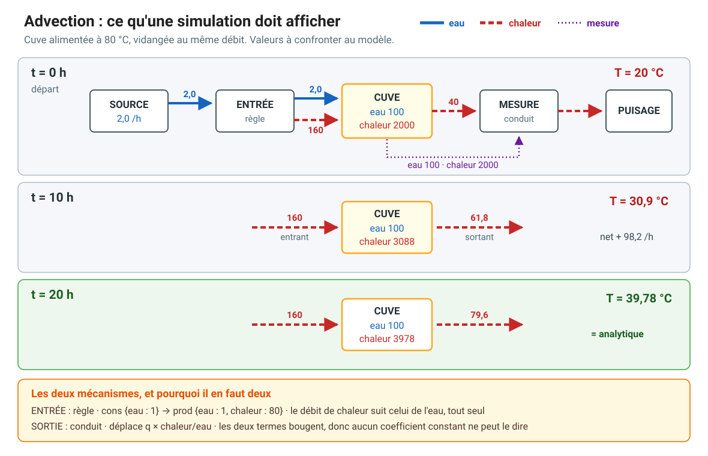
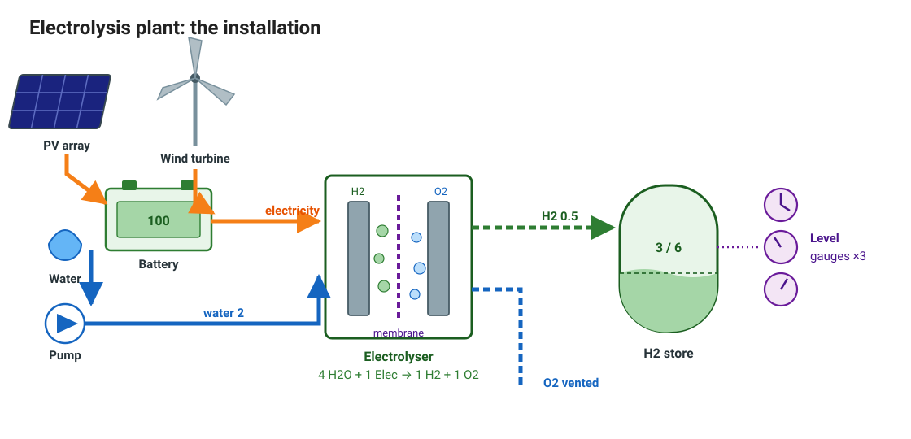
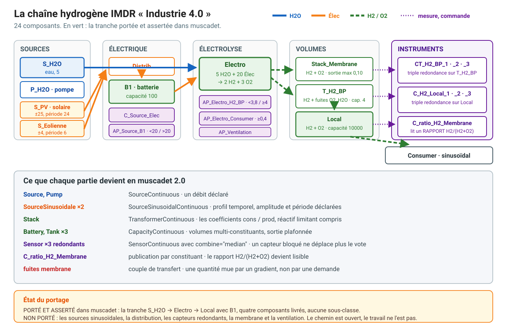
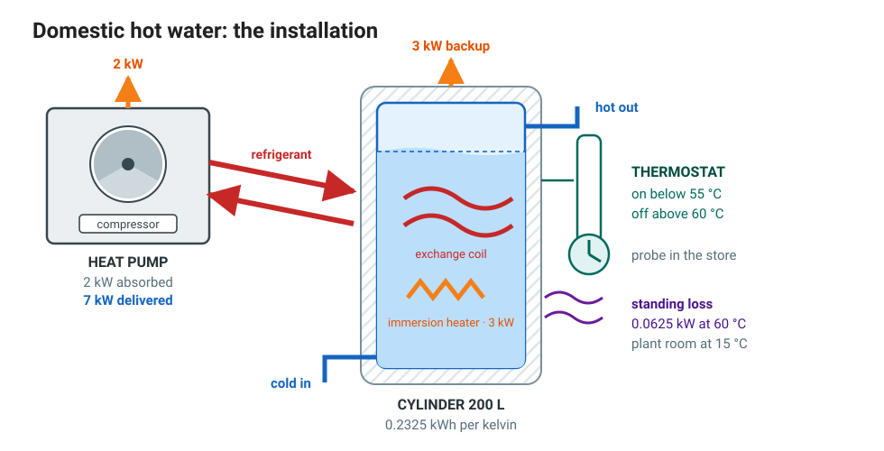
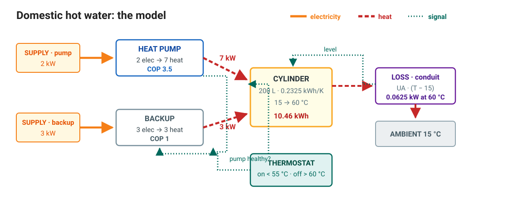

# Worked models

Five MUSCADET models, each carrying figures computed outside the library. They
are executable tests, so they cannot drift from the code: every number below is
asserted.

| Model | Demonstrates | Checked against |
|---|---|---|
| [Heated tank](#heated-tank) | discrete regulation, redundancy, feared events | a published dynamic-reliability benchmark |
| [Advection](#advection) | a quantity carried by its stream through a mixing volume | the analytic solution of the mixing ODE |
| [Counter-flow exchanger](#counter-flow-exchanger) | transfer pairs moving a computed quantity between balances | the effectiveness-NTU relation |
| [Electrolysis plant](#electrolysis-plant) | an industrial plant built from shipped components alone | the IMDR "Industrie 4.0" study, open data |
| [Domestic hot water](#domestic-hot-water) | rules, capacity, thermostat, redundancy and standing loss in one system | elementary physics on ordinary domestic figures |

```sh
.venv/bin/python -m pytest tests/test_heated_tank_001.py -v
.venv/bin/python -m pytest tests/test_advection_001.py -v
.venv/bin/python -m pytest tests/test_literature_validation_001.py -v
.venv/bin/python -m pytest tests/test_h2_stack_001.py -v
.venv/bin/python -m pytest tests/test_domestic_heating_001.py -v
```

---

## Heated tank

`tests/test_heated_tank_001.py`

The classical dynamic-reliability benchmark: a tank whose level is regulated
between two thresholds by two pumps and a valve, with dry-out and overflow as
feared events. Origins, obtained through OpenAlex:

- T. Aldemir, *IEEE Transactions on Reliability* (1987), DOI `10.1109/tr.1987.5222318`
- M. Marseguerra and E. Zio, *Reliability Engineering & System Safety* (1996),
  DOI `10.1016/0951-8320(95)00131-x`

Parameters are those of the PyCATSHOO distribution (`Samples/HeatedTank/S8d`):
tank section 1, dry-out at 4, overflow at 10, regulation band 6 to 8, nominal
flow 1.5 per pump and per valve, failure rates 0.0022831, 0.0028571 and
0.0015625 per hour.

### Results

Both pumps run below 6 and stop above 8; the valve opens above 8 and shuts
below 6. The level cycles with a period of **exactly 2 hours**, being 2/3.0 h
filling against two pumps and 2/1.5 h draining through one valve. Both feared
events are driven deterministically and arrive when the ramp predicts.

*Stuck closed* is a derating of the continuous output to zero. *Stuck on* has no
equivalent, since a derating can only subtract: forced production goes through a
discrete output of the component's own, produced unconditionally with its
availability initially false, which the failure mode clamps true and a third
rule guard reads back.

### Limits

The temperature-dependent failure rate is not reproduced.
`add_exp_failure_mode` already creates a variable for the rate and hands the
*variable object* to PyCATSHOO's `newLaw`, so the parameter is a model variable
rather than a literal; what is missing is `ITransition.setModifiable`, without
which the engine draws every firing time from the parameter's initial value.

A watched threshold cannot yet name one constituent of a multi-constituent
volume: a sensor's band is built from the `{name, op, value}` operand
vocabulary, which names a channel and has no slot for a constituent of one. The
reading is available (see [Advection](#advection)); the guard is not.

The benchmark's Monte-Carlo estimate is out of reach: one 200 h sequence costs
about 37 s, so 1000 sequences over 1000 h would run for days. The module
asserts the deterministic sequence behind each feared event instead.

---

## Advection

`tests/test_advection_001.py`

A tank fed at one temperature and drained at the same rate mixes toward the
inlet:

```
dT/dt = q (T_in - T) / V        T(t) = T_in + (T_0 - T_in) exp(-q t / V)
```

Two mechanisms are needed, and neither substitutes for the other.

**The inflow is a rule.** Coefficients are per unit consumed, so
`cons={"water": 1}, prod={"water": 1, "heat": T_in}` produces heat exactly in
proportion to the water it passes, at any rate. The receiving volume must
declare a `fill_rate`, or it asks for no heat and the enthalpy never lands.

**The outflow is a conduit.** It carries the tank's own temperature, so its rate
is `q x H/V` with both terms moving, where a rule coefficient and a demand
default are constants. A transfer pair states a computed quantity, reading `H`
and `V` separately over a per-constituent measurement channel. Without that
channel the total of a water-plus-heat volume is neither term and the ratio is
unreachable.



### Results

Fed at 80 degrees from 20, `q = 2` into `V = 100`, the model tracks the analytic
solution at every stop and reaches **39.781 degrees at 20 h** against 39.781
computed outside it. The figure gives the rate on every connection at three
stops, so a run can be checked directly: the inlet carries a constant 160 while
the meter rises 40, 61.8, 79.6 as the tank warms, and net accumulation falls
from 120 to 80.4 per hour. Volume is conserved, temperature is monotone and
never passes the inlet, and the energy balance closes.

### Limit

The declaration, not the physics. Nothing ties the carried quantity to its
carrier, so the association is stated twice, once in the rule's coefficients and
once in the conduit's equation, and MUSCADET checks neither against the other.

---

## Counter-flow exchanger

`tests/test_literature_validation_001.py`

Compared against the counter-flow effectiveness-NTU relation of R. K. Shah and
D. P. Sekulic, *Fundamentals of Heat Exchanger Design*, Wiley (2003),
DOI `10.1002/9780470172605`.

The correlation is an **input**. A single-node component cannot derive a
counter-flow arrangement's effectiveness, and pretending otherwise would make
the test circular; what is checked is everything downstream of it.

| Quantity | Value |
|---|---|
| hot stream | 2000 W/K at 80 degrees in |
| cold stream | 4000 W/K at 20 degrees in |
| `UA` | 2000 W/K, so NTU = 1 and Cr = 0.5 |
| effectiveness | 0.5647 |
| duty | 67768 W |
| hot outlet | 46.116 degrees |
| cold outlet | 36.942 degrees |

The energy balance closes, no temperature crossing occurs, and the smaller
capacity rate swings twice as far as the larger. The exchanger is a two-flow
transfer pair whose equation forms both temperatures itself, from the raw
enthalpy rates divided by the declared capacity rates.

### Precision floor

A quantity crossing a PyCATSHOO variable carries about **seven significant
digits**. A balance closing exactly in Python reads `240000.0078125` against
`240000.0`, which is half an ulp of single precision at that magnitude. Nothing
leaks; it is representation. Two consequences: an assertion tighter than
`rel=1e-7` measures the engine's storage, and a balance formed as the
*difference* of two large stored quantities needs an absolute tolerance scaled
to the operands' ulp, since the cancellation lifts that residual into the
seventh digit.

---

## Electrolysis plant

`tests/test_h2_stack_001.py`

The IMDR "Industrie 4.0" study, whose figures are open data: water and
electricity into an electrolyser, hydrogen into a store, with a delay failure
mode on the stack.



**Not one component is subclassed.** What the original expresses by subclassing
a flow object and overriding `compute_iflow` in Python, MUSCADET expresses as
declared coefficients: the plant is four `add_component` calls against
`muscadet.kb.continuous`, and the test asserts it by reading back each
component's runtime type.

| Component | Shipped class | Declaration |
|---|---|---|
| `S_H2O` | `SourceContinuous` | water at a rate of 2 |
| `B1` | `CapacityContinuous` | battery, capacity 100, stocked at 100 |
| `Electro` | `TransformerContinuous` | `4 H2O + 1 Elec -> 1 H2 + 1 O2` |
| `Local` | `CapacityContinuous` | store, capacity 6, stocked at 3 |



### Results

Water arrives at 2 against a coefficient of 4, so the stack runs at scale 0.5
and produces 0.5 of hydrogen however full the battery: `min(H2O/4, Elec/1)` is
what the two coefficient maps state. H2 and O2 come from one rule, so they move
together and the failure mode takes both down between t = 2 and t = 4.

The stack asks its battery for **0.5**, not its nominal 1: asking for a full
unit would claim electricity no reaction could use. The original asked 1, was
delivered 1, reacted 0.5, and the missing 0.5 entered no reaction, no stock and
no output. While the stack is down its water intake reads 0, not the nominal 2.
Over the mission the battery falls 100 to 98.5 and the store rises 3 to 4.5:
1.5 of electricity for 1.5 of hydrogen.

---

## Domestic hot water

`tests/test_domestic_heating_001.py`

A heat pump backed by an electric resistance, charging an insulated cylinder
under thermostatic control and losing heat to the plant room.



Every mechanism of the continuous layer meets here: a rule with coefficients,
where the coefficient of performance is the ratio of the produced to the
consumed coefficient; a capacity integrating the stored energy; a sensor with a
deadband; a failure mode derating an output; and a transfer pair for the
standing loss, the one quantity here moving because a gradient makes it move.



| Quantity | Value |
|---|---|
| cylinder | 200 L, water at 4.185 kJ/(kg.K), so 0.2325 kWh/K |
| heat pump | 2 kW electrical, COP 3.5, so 7 kW thermal |
| resistive backup | 3 kW electrical, COP 1 |
| thermostat | on below 55 degrees, off above 60 |
| standing loss | 1.5 kWh per day at a 45 K difference |

### Results

From a cold start at 15 degrees the pump alone reaches the 60 degree cut-out in
**1.4946 h**, net of a 0.0625 kW standing loss at the top of the band. The
coefficient of performance is asserted as a *ratio of two measured quantities*
rather than read back. The backup delivers nothing while the pump is healthy;
once it is not, the same heat costs three and a half times the electricity.

### Modelling notes

The cylinder stores heat only, with the water mass a declared constant, because
a watched threshold cannot name one constituent of a multi-constituent volume: a
thermostat on a water-plus-heat tank would compare against the sum of a mass and
an energy.

Two general reading rules. The initial condition is read *before* any step,
since the first integration jumps straight to the next watched crossing. And
stepping stops on transitions, not on dates: a helper advancing "to t = 0.7 h"
stops at whatever crossing comes first.

Three lessons from building it are in the README's *Modelling pitfalls* section:
the time unit decides whether a model is simulable, a rule's coefficients are a
ratio rather than a rating, and an infinite source delivers NaN.
