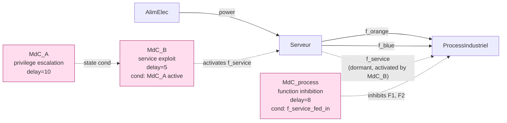

# feat: cyber compromise mode (MdC) 3-component POC for isimu

## Overview

Build a single self-contained interactive simulation factory at
`examples/isimu/cyber_3comp.py` that reproduces the cascading cyber
compromise scenario from the IMdR P23-4 atelier slides (49-56) using only
the existing `muscadet` + `cod3s.ObjFM*` building blocks. The factory
exposes a `build()` callable for `cod3s-isimu --factory` and a `run()`
helper that scripts the timeline from plain Python (matching the
conventions of the four existing `examples/isimu/` factories).

## Problem Statement / Motivation

Slides 38-56 of the atelier deck propose extending the failure-mode
abstraction (MdD) to a "compromise mode" (MdC) that adds two cyber
specifics:

1. **Cascade between MdC**: a MdC's activation can be conditioned on
   another MdC being already active (e.g. privilege escalation must
   succeed before exploitation of a service function).
2. **Exploitation effect**: a MdC can *activate* a normally dormant
   "service function" of a component (rather than just inhibiting an
   output), letting the attack propagate through the system's flow
   graph.

Slide 58 explicitly lists "Réalisation d'un POC en utilisant le framework
de modélisation PyCATSHOO sur un système type 3 composants" as the next
step. This plan delivers exactly that, in muscadet, with the smallest
surface area possible — to validate that the cyber concepts map onto the
existing dynamics without needing a new abstraction layer.

## Proposed Solution

A single new file `examples/isimu/cyber_3comp.py` containing:

- Three component classes: `AlimElec`, `Serveur`, `ProcessIndustriel`,
  declared with the muscadet `ObjFlow` API. The `Serveur` carries an
  additional dormant `FlowOut` named `f_service` representing the
  exploitable service function (slides 51-55, the violet pale output).
- Three failure-mode components added via the system, of class
  `cod3s.ObjFMDelay` (deterministic delays — chosen for readable
  stepping, matches the four sibling isimu factories):
  - `MdC_A` on `Serveur`, no input condition, fires after a delay
    (privilege escalation, see slide 51 left bubble).
  - `MdC_B` on `Serveur`, conditioned on `MdC_A` being active, fires
    after a delay; its activation effect sets the `f_service` flow's
    `var_prod_available` to True (the dormant service is now activated
    and feeds the process — slides 52-55).
  - `MdC_process` on `ProcessIndustriel`, conditioned on the
    `f_service_fed_in` input being True, fires after a delay; its
    activation effect inhibits the two functional outputs `F1` and `F2`
    (slide 56).
- A `build() -> muscadet.System` factory.
- A `run()` helper that fires the three transitions in order and prints
  a per-event snapshot.

## Technical Approach

### System architecture (Mermaid)



### File: `examples/isimu/cyber_3comp.py`

#### Component classes (pseudocode)

```python
# examples/isimu/cyber_3comp.py
import muscadet


class AlimElec(muscadet.ObjFlow):
    def add_flows(self, **kwargs):
        super().add_flows(**kwargs)
        self.add_flow_out(name="power", var_prod_default=True)


class Serveur(muscadet.ObjFlow):
    def add_flows(self, **kwargs):
        super().add_flows(**kwargs)
        self.add_flow_in(name="power", logic="and")
        # Two normal mission outputs
        self.add_flow_out(name="f_orange", var_prod_cond=[["power"]])
        self.add_flow_out(name="f_blue",   var_prod_cond=[["power"]])
        # Dormant service flow — exploitable.
        # var_prod_default=False makes var_prod_available start at False;
        # var_prod_cond=[] (default) means no sensitive method binds it,
        # so the value stays False until MdC_B's effect latches it to True.
        self.add_flow_out(name="f_service", var_prod_default=False)


class ProcessIndustriel(muscadet.ObjFlow):
    def add_flows(self, **kwargs):
        super().add_flows(**kwargs)
        # Functional inputs from the server
        self.add_flow_in(name="f_orange", logic="and")
        self.add_flow_in(name="f_blue",   logic="and")
        # Service input — only fed when server is compromised
        self.add_flow_in(name="f_service", logic="or")
        # Two functional outputs that MdC_process will inhibit
        self.add_flow_out(name="F1", var_prod_cond=[["f_orange"]])
        self.add_flow_out(name="F2", var_prod_cond=[["f_blue"]])
```

#### Factory `build()` (pseudocode)

```python
def build() -> muscadet.System:
    system = muscadet.System(name="cyber_3comp")
    system.add_component(name="Alim", cls="AlimElec")
    system.add_component(name="Srv",  cls="Serveur")
    system.add_component(name="Proc", cls="ProcessIndustriel")

    system.auto_connect("Alim", "Srv")    # power
    system.auto_connect("Srv",  "Proc")   # f_orange + f_blue + f_service

    # MdC_A — privilege escalation. No input condition.
    # No effects on flows: only its automaton state matters
    # (MdC_B's failure_cond watches it). Repair disabled (cond=False).
    system.add_component(
        cls="ObjFMDelay",
        fm_name="mdc_a",
        targets=["Srv"],
        failure_param=10,
        failure_effects={},                 # state-only, no flow effect
        repair_cond=lambda: False,           # one-way (no de-compromise)
        repair_param=1e9,
    )

    # MdC_B — service exploit. Conditioned on MdC_A being active.
    # Effect: activates the dormant f_service output by latching
    # f_service_prod_available to True.
    system.add_component(
        cls="ObjFMDelay",
        fm_name="mdc_b",
        targets=["Srv"],
        failure_param=5,
        failure_cond=[[
            {"attr": "occ", "obj": "Srv__mdc_a", "value": True}
        ]],
        failure_effects={"f_service_prod_available": True},
        repair_cond=lambda: False,
        repair_param=1e9,
    )

    # MdC_process — function inhibition. Conditioned on the service
    # input being fed (i.e. the attack has propagated from server).
    system.add_component(
        cls="ObjFMDelay",
        fm_name="mdc_proc",
        targets=["Proc"],
        failure_param=8,
        failure_cond=[[
            {"attr": "f_service_fed_in", "value": True}
        ]],
        failure_effects={
            "F1_fed_available_out": False,
            "F2_fed_available_out": False,
        },
        repair_cond=lambda: False,
        repair_param=1e9,
    )

    return system
```

#### Helper `_mdc_active()` (state introspection)

```python
def _mdc_active(system, fm_comp_name: str, aut_name: str) -> bool:
    aut = system.comp[fm_comp_name].automata_d[aut_name]
    return aut.get_state_by_name("occ")._bkd.isActive()
```

#### Snapshot + `run()` (pseudocode)

```python
def _snapshot(system):
    a = _mdc_active(system, "Srv__mdc_a",  "mdc_a")
    b = _mdc_active(system, "Srv__mdc_b",  "mdc_b")
    p = _mdc_active(system, "Proc__mdc_proc", "mdc_proc")
    svc_out = system.comp["Srv"].flows_out["f_service"].var_fed.value()
    svc_in  = system.comp["Proc"].flows_in["f_service"].var_fed.value()
    f1 = system.comp["Proc"].flows_out["F1"].var_fed.value()
    f2 = system.comp["Proc"].flows_out["F2"].var_fed.value()
    return (
        f"t={system.currentTime():g} | "
        f"MdC[A={'1' if a else '0'} B={'1' if b else '0'} P={'1' if p else '0'}] | "
        f"Srv.svc_out={'1' if svc_out else '0'} Proc.svc_in={'1' if svc_in else '0'} | "
        f"Proc[F1={'1' if f1 else '0'} F2={'1' if f2 else '0'}]"
    )


def run():
    import cod3s
    system = build()
    try:
        system.isimu_start()
        print(f"INITIAL              {_snapshot(system)}")

        # Only MdC_A is fireable initially.
        # Fire each pending failure transition in turn.
        for label in ("MdC_A fires", "MdC_B fires", "MdC_process fires"):
            transitions = system.isimu_fireable_transitions()
            fireable = [(i, t) for i, t in enumerate(transitions) if t]
            # pick the earliest one
            fireable.sort(key=lambda it: it[1].end_time)
            idx, tr = fireable[0]
            system.isimu_set_transition(idx, date=tr.end_time)
            system.isimu_step_forward()
            print(f"{label:20s} {_snapshot(system)}")

        system.isimu_stop()
    finally:
        system.deleteSys()
        cod3s.terminate_session()


if __name__ == "__main__":
    run()
```

### Key technical points (background for the implementer)

1. **Why the dormant flow uses `var_prod_default=False` (and not
   `var_is_active_default=False`).** `var_is_active` is not in the
   sensitive-method trigger set of the FlowOut "fed" recomputation
   (`muscadet/flow.py` `update_sensitive_methods` registers var_prod,
   var_fed_available, var_prod_available). Setting var_is_active via
   failure_effects would update its value but not refresh var_fed
   downstream. By contrast, `var_prod_available` IS in that trigger
   set, and crucially has no `setReinitialized(True)` (an explicit
   comment in `flow.py` confirms this), so the latch persists.

2. **Why `var_prod_cond=[]` keeps the flow dormant despite
   `var_prod_default=False` being only an *initial* value.** The
   `set_<flow>_prod_available` sensitive method is only registered on
   the inner-flow `var_fed` of each entry in `var_prod_cond`. With an
   empty `var_prod_cond`, the method never fires, so `var_prod_available`
   stays at its initial value (False, from `var_prod_default`). Once
   MdC_B latches it to True, no method overrides it back.

3. **Why `failure_cond=[[{"attr": "occ", "obj": "Srv__mdc_a", "value":
   True}]]` works for the cascade.** `cod3s/pycatshoo/common.py`
   `prepare_attr_tree` resolves `obj` strings via
   `system.comp[obj]`, then matches `attr` against the component's
   states / variables / Python attributes. For a `pyc.IState`, it sets
   `attr_val_name="isActive"`; the structured-cond evaluator then calls
   `state.isActive()` and compares to `value` via `==`. The single-
   target ObjFM names its automaton just `fm_name` and the failure
   state `failure_state` (default `"occ"`).

4. **Why `repair_cond=lambda: False`.** ObjFMDelay always treats the
   repair occurrence law as active (`is_occ_law_repair_active` returns
   True unconditionally). Setting `repair_cond` to a callable returning
   False makes the repair transition cond never fire — i.e. once
   compromised, the MdC stays active for the simulation horizon. We
   pair it with `repair_param=1e9` belt-and-suspenders to keep any
   listed end_time astronomical.

5. **`failure_effects` keys resolve via PyCATSHOO `comp.variable(name)`
   lookup.** ObjFM's internal handler tries `hasattr(comp, var)` first
   then falls back to `comp.variable(var)`. Muscadet does not expose
   flow variables as Python attributes, so the second branch is what
   we hit. Names used here:
   - `"f_service_prod_available"` (variable on Serveur, owned by
     `flows_out["f_service"]`)
   - `"F1_fed_available_out"`, `"F2_fed_available_out"` (variables on
     Process, owned by `flows_out["F1"]`/`["F2"]`)

### Expected interactive timeline

```
t=0    | MdC[A=0 B=0 P=0] | Srv.svc_out=0 Proc.svc_in=0 | Proc[F1=1 F2=1]
t=10   | MdC[A=1 B=0 P=0] | Srv.svc_out=0 Proc.svc_in=0 | Proc[F1=1 F2=1]
t=15   | MdC[A=1 B=1 P=0] | Srv.svc_out=1 Proc.svc_in=1 | Proc[F1=1 F2=1]
t=23   | MdC[A=1 B=1 P=1] | Srv.svc_out=1 Proc.svc_in=1 | Proc[F1=0 F2=0]
```

Inside `cod3s-isimu` the same dynamics show up as the "Fireable
transitions" panel evolving:
- t=0: only `Srv__mdc_a.mdc_a_rep_occ` (delay=10) is fireable.
- After firing it: `Srv__mdc_b.mdc_b_rep_occ` becomes fireable
  (its cond on MdC_A.occ is now True), `Proc__mdc_proc.mdc_proc_rep_occ`
  is still gated.
- After firing MdC_B: f_service propagates to Proc, MdC_process
  becomes fireable.
- After firing MdC_process: F1 and F2 drop, no further actions.

### Acceptance Criteria

- [x] `examples/isimu/cyber_3comp.py` exists, with `build()` and
      `run()` exposed at module top-level and importable as
      `examples.isimu.cyber_3comp`.
- [x] `python -m examples.isimu.cyber_3comp` prints exactly four lines
      matching the timeline shape above (initial state + three
      transitions). Times match `[0, 10, 15, 23]`.
- [x] `cod3s-isimu --factory examples.isimu.cyber_3comp:build` launches
      cleanly. The first fireable-transitions panel shows exactly one
      transition (the MdC_A privilege escalation, `end_time=10`).
- [x] After firing MdC_A in the TUI, the fireable list shows MdC_B
      (`end_time=15`) but **not** MdC_process — confirming the cascade
      gate.
- [x] After firing MdC_B in the TUI, MdC_process appears with
      `end_time=23`, and the components panel shows `Srv.f_service_fed`
      flipped to True and `Proc.f_service_fed_in` flipped to True.
- [x] After firing MdC_process, `Proc.F1_fed_out` and `Proc.F2_fed_out`
      both show False.
- [x] `examples/isimu/README.md` is updated with the new factory in
      its examples table and an entry in the run-as-script section.
- [x] `pytest tests/` still ends with the same baseline (98 pass, 1
      pre-existing fail, no new failures).

### Files to add/modify

- **Add** `examples/isimu/cyber_3comp.py` (~150 lines including
  docstring and timeline header).
- **Modify** `examples/isimu/README.md`: add a row to the "Examples"
  table and a line under "Running as a plain Python script" / "Running
  with cod3s-isimu (TUI)".

No changes expected to `muscadet/` source — this POC validates the
hypothesis precisely because it doesn't need any.

## Success Metrics

- Demo runs end-to-end (Python and TUI) on first attempt without
  edits to `muscadet/` core. This is the validation that
  `cod3s.ObjFM*` is sufficient for MdC modelling on muscadet flow
  components.
- The four lines printed by `run()` match the expected timeline.
- The fireable-transitions panel in the TUI mirrors the cascade
  progression at each step.

## Dependencies & Risks

- **Dependency**: cod3s ≥ 1.1 with `cod3s-isimu` script available
  (already installed in the venv via `uv pip install -e ../../cod3s`,
  see prior session).
- **Risk** *(low)*: the structured-cond resolution of an automaton
  state by name (`{"attr": "occ", "obj": "Srv__mdc_a"}`) is exercised
  in cod3s but not yet in muscadet tests. If the resolution fails for
  any reason, fallback is a callable closure on the FM component
  reference (less elegant but equivalent). Decision criterion: if
  cod3s raises during ObjFM init, switch to callable.
- **Risk** *(low)*: `repair_cond=lambda: False` may interact badly with
  `drop_inactive_automata` in unexpected ways. If the MdC automaton is
  silently dropped, fallback to `repair_cond=True, repair_param=1e9`
  (always-active repair with infinite delay).
- **Risk** *(low)*: `var_prod_available` latch reset by some hidden
  `setReinitialized` on a related variable. If the dormant flow keeps
  flipping back to False after MdC_B fires, switch to **option β**
  (FlowOutOnTrigger) from the brainstorm.

## Open Questions

- Should we also add `tests/test_cyber_3comp.py` to lock the cascade
  invariants? Brainstorm default: **no**, this is a pedagogical
  example. Open for discussion if any of the risks above materialise
  and we want regression coverage.
- The slides also show MdD (failure modes) on Alim and Serveur in
  parallel with the MdC. Out of scope for this POC; could be a
  follow-up to demonstrate sûreté + sécurité on the same system.

## References

### Brainstorm
- `docs/brainstorms/2026-05-01-cyber-mdc-poc-brainstorm.md`

### Slides (project IMdR P23-4)
- `doc/IMDR-P23-4 - 2025-09-19 - Industrie 4.0 - Atelier modélisation
  cyber - Slides.pdf` — slides 38-58 cover MdC formalisation, the 3-
  component example, and the POC roadmap.

### Codebase
- Existing isimu factories (template): `examples/isimu/rbd_kn.py`,
  `examples/isimu/trigger_source.py`,
  `examples/isimu/datacenter_lite.py`,
  `examples/isimu/inverter_chain.py`.
- Existing cod3s.ObjFM* tests on muscadet: `tests/test_comp_failure_cod3s_001.py`
  ... `tests/test_comp_failure_cod3s_delay_001.py` (added in this same
  session).

### Cod3s internals
- ObjFM / ObjFMExp / ObjFMDelay implementation:
  `../../cod3s/cod3s/pycatshoo/component.py:851` (ObjFM),
  `:1802` (ObjFMExp), `:1857` (ObjFMDelay).
- Structured `failure_cond` resolution incl. state attrs:
  `../../cod3s/cod3s/pycatshoo/common.py:200-280`.
- Automaton state introspection: `automata_d` (component.py:46),
  `get_state_by_name` (automaton.py:263).

### Muscadet internals
- FlowOut variable initialisation (var_prod_default cascade):
  `muscadet/flow.py:342-376`.
- Sensitive-method trigger registration (`var_prod_available` is in
  the fed-out trigger set): `muscadet/flow.py:555-602`.
- ObjFlow attribute exposure (no automatic Python attrs for flow
  variables → cod3s falls back to `comp.variable(name)`):
  `muscadet/obj.py` (no flow-name attribute synthesis).

## Out of scope

- New `muscadet.kb.cyber` module / `ObjCompromiseMode` typed alias
  — out of scope for this POC, would be a separate brainstorm if the
  POC succeeds (option γ from the brainstorm).
- Layering MdD on top of MdC for combined sûreté + sécurité analysis
  on the same system — possible follow-up.
- Probabilistic occurrence laws (Exp / Weibull / etc.) representing
  attacker skill — slide 58 perspective; out of scope here.
- Any change to `muscadet/` source code — explicit non-goal of this
  POC.
