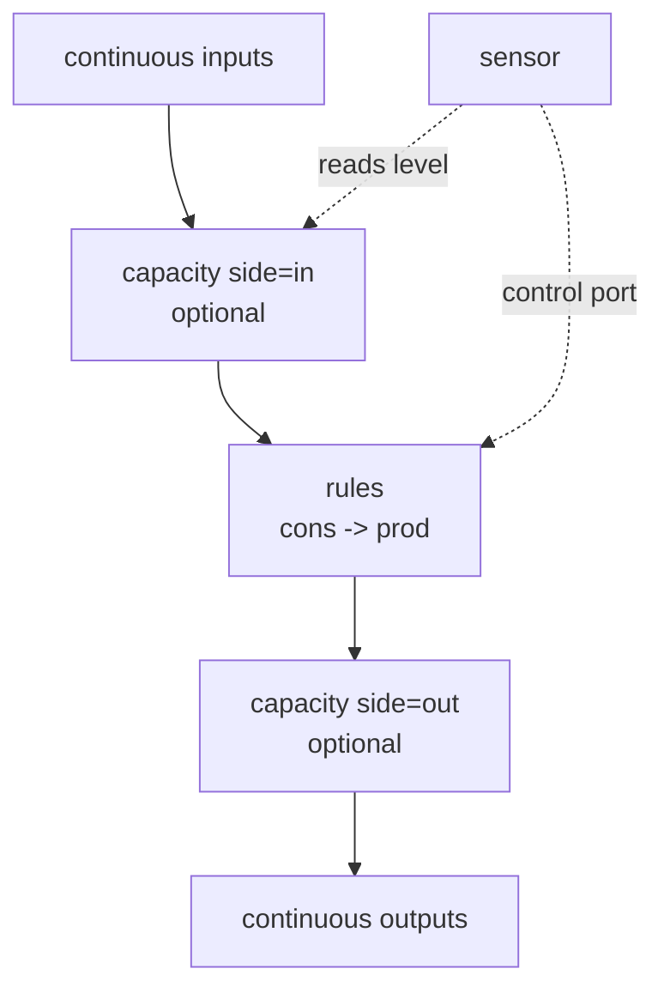
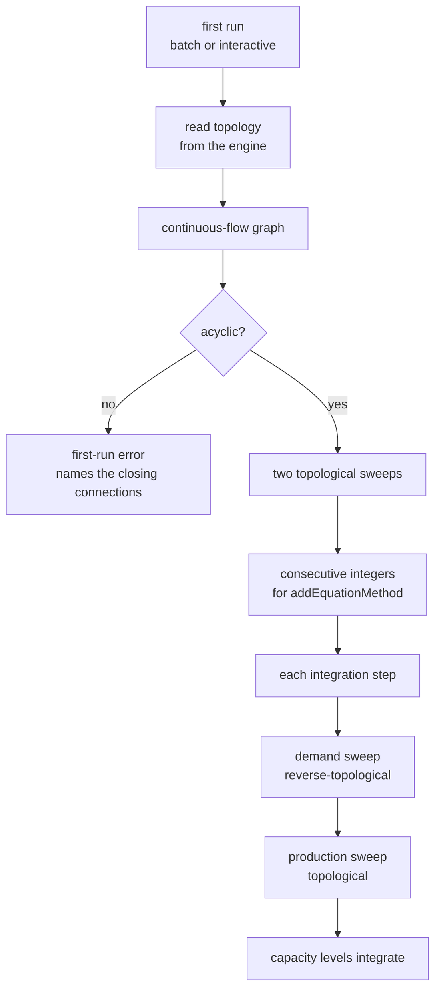
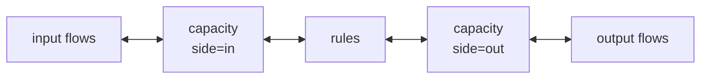
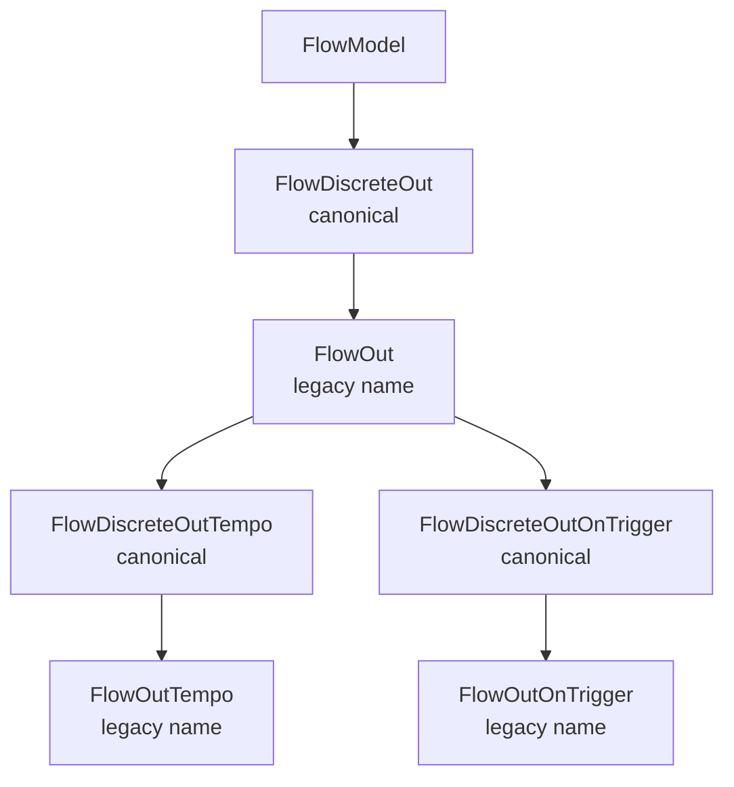

# MUSCADET 2.0 Continuous Flows - Plan

## Goal Capsule

- **Objective.** Add continuous, real-valued flow modelling to MUSCADET as version 2.0.0, generalising the continuous-flow work already prototyped outside the library, while every existing boolean-flow model keeps working unchanged.
- **Product authority.** This Product Contract. The hydrogen-production model of the IMDR-P23-4 Industrie 4.0 project is the reference workload, and its golden-CSV regression suite is the behavioural oracle for the continuous layer.
- **Execution profile.** Library work, no service or deployment surface. The compatibility constraint is the dominant risk, so the rename lands first and the existing suite is the gate on every later unit.
- **Stop conditions.** Stop and ask if the 70 existing test files cannot pass unmodified, if a continuous flow cannot be expressed without changing a Product Contract requirement, or if the automatic evaluation order cannot be derived without an iterative solver. Stop and re-plan the ordering approach if U6 finds that PyCATSHOO freezes equation-method registration at component construction, or if U7 finds that same-named PDMP managers do not sequence equations across components — either finding invalidates KTD1, KTD3 and KTD14 together.
- **Open blockers.** None.

---

## Product Contract

### Summary

MUSCADET 2.0 adds continuous flows alongside the boolean ones: real-valued rates that propagate production downstream and demand upstream. A component declares transformation rules mapping consumed inputs to produced outputs, and declares capacities separately to buffer either side of those rules. The existing flow classes are renamed `FlowDiscrete*` and their current names stay available as permanent aliases.

### Problem Frame

MUSCADET describes a system as boolean flows: a component is fed or it is not. The storage layer is already type-agnostic — `FlowModel.var_type` accepts `bool`, `int` and `float`, and `muscadet/common.py` maps all three to PyCATSHOO types — but every consumer of a flow variable is hardwired boolean: `andValue`/`orValue`/`sumValue(0) >= k`, the CNF evaluation of `var_prod_cond`, and `var_prod_available`, which is declared `t_bool` regardless of `var_type` (`muscadet/flow.py:477`).

A hydrogen-production study needs flow rates, and that need has now been met outside the library twice.

The `muscadet-2` fork is a from-scratch rewrite: one commit, everything untracked, zero test files, a broken `__init__.py` importing three modules that do not exist in it, and two competing parallel drafts of both flow and object modules. Its coefficient-based transformer — the exact mechanism the hydrogen model needs — is never instantiated anywhere, so it has never run.

The IMDR-P23-4 Industrie 4.0 component library is the opposite: a working H2/O2 model with YAML studies and golden-CSV regression tests. But every transformation equation is hand-written per component, the three allocation rules it needs are each hardwired into a fixed component shape, and equation evaluation order is a manually curated global integer spanning 0 to 32 across the whole model. Adding a component means renumbering a sequence that belongs to no one.

The cost is paid twice over. The same demand-propagation architecture was invented independently in both places, neither can absorb the other's work, and a third project needing continuous flows would start a third fork.

### Key Decisions

- KD1. **Continuous flows are a new flow family alongside the discrete ones, not a retyping of the existing classes.** The discrete classes keep their boolean semantics untouched, which is what makes the compatibility guarantee cheap. Governs R1, R2.
- KD2. **2.0.0 covers continuous flows, transformation rules, capacities and guards; temporisation of continuous outputs is deferred.** (session-settled: user-directed — chosen over the full announced perimeter and over an imperative port deferring the schema to 2.1: temporisation is the one item with no prior art in either prototype and no settled definition of what delaying a rate means.)
- KD3. **A continuous quantity is either a rate or a capacity level, and the two are declared differently.** A rate is algebraic and recomputed each step; a level is integrated and obeys a conservation law. Both prototypes converged on this split. Governs R3, R4.
- KD4. **Propagation is bidirectional: production travels downstream, demand travels upstream, and the delivered quantity is the lesser of the two.** Both prototypes invented this independently, which is the strongest signal in the prior art. Governs R5, R6, R7.
- KD5. **Equation evaluation order is derived from the connection graph, never declared.** (session-settled: user-approved — chosen over carrying IMDR's manual global integer ordering: a library where adding a component forces renumbering a global sequence cannot compose, and that is what blocks generalisation.) Governs R8.
- KD6. **Transformation rules are declared on the component with `add_rules`, using `cons` and `prod` coefficient maps.** (session-settled: user-directed — chosen over declaring rules per output flow under `var_prod_cond`: a reaction with correlated outputs cannot be stated one output at a time, and its limiting-reagent computation must be shared rather than duplicated.) Governs R9, R10, R11.
- KD7. **Guards compile to a mode automaton whose transitions are watched by the PDMP solver.** Freezing the coefficients within a mode also breaks the algebraic loop between demand and production. Governs R12.
- KD8. **At most one rule is active at a time, and an unguarded rule serves as the default.** A model in which two production regimes hold at once is wrong, and reporting it beats electing one silently. Governs R13, R14.
- KD9. **Allocation of an insufficient supply is a declarative policy with a Python extension point.** (session-settled: user-directed — chosen over a single proportional rule: IMDR needed three different rules, and offering one would force the next project into another fork.) Governs R16, R17.
- KD10. **A continuous output flow carries a single rate variable; setting it to 0 expresses total loss of production.** (session-settled: user-directed — chosen over a boolean availability gate plus a separate numeric factor: one variable expresses both the cut and the derating, and `ObjMode2S` already targets arbitrary component variables with arbitrary values.) Governs R18, R19.
- KD11. **Concurrent deratings compose by minimum.** (session-settled: user-directed — chosen over the product of factors: the minimum is the simplest rule and the one the team wants documented.) Governs R20.
- KD12. **Discrete and continuous flows do not interconnect.** Connections are matched on flow name alone today (`muscadet/system.py:74-85`), so nothing would otherwise prevent it. Governs R23.
- KD13. **Backward compatibility is delivered by permanent alias subclasses, not by assignment aliases or a deprecation cycle.** Three importer tests assert the exact runtime class name, which an assignment alias cannot satisfy. Governs R24, R25, R26, R27.
- KD14. **Capacities are declared independently of transformation rules.** (session-settled: user-directed — chosen over capacities owned by the rule set: a buffer can then be added to an existing model without touching its transformation logic, and one rule set can be reused with different buffering.) Governs R4, R7, R28.
- KD15. **Rule guards cannot read capacity levels; threshold control over production goes through a sensor component and a control port.** (session-settled: user-directed — chosen over allowing capacity operands in guards: a guard reading a level its own rule fills is the mode-chattering case, and forbidding it removes that class of instability by construction.) Governs R29.
- KD16. **The continuous-flow graph is assumed acyclic, and measurement and control links are excluded from the check.** (session-settled: user-approved — chosen over supporting capacity-broken loops in 2.0.0: two topological sweeps are only valid on an acyclic graph, and excluding measurement links is what keeps the sensor pattern modellable.) Governs R30.
- KD17. **Legacy flow names sit inside the canonical inheritance chain rather than in a parallel alias hierarchy.** (session-settled: user-approved — chosen over parallel aliases: client code testing a tempo flow against the legacy output class keeps working.) Governs R25.
- KD18. **A component that declares continuous flows and no rules performs an identity transfer.** Without it, every plain tank would need a ceremonial same-in-same-out rule. Governs R31.

The declaration model — rules and capacities are independent, and capacities sit on one side of the rules:

### Requirements

**Continuous flow primitives**

- R1. MUSCADET exposes `FlowContinuousIn` and `FlowContinuousOut` alongside the discrete flow classes, declarable both through dedicated `add_flow_*` methods and through the dict form consumed by `add_flow`.
- R2. A continuous flow carries a real value over the same message-box mechanism as a boolean flow. Several connections feeding one continuous input aggregate by sum.
- R3. A continuous output carries a production rate, recomputed at each integration step from the component's current inputs, active rule, capacities and rate variable.
- R4. A component declares capacities separately from its rules. A capacity groups one or more continuous flows, holds a scalar volume, and sits entirely upstream (`side="in"`) or entirely downstream (`side="out"`) of that component's rules.

**Bidirectional propagation**

- R5. A continuous input propagates a demand upstream, aggregated over the connections feeding it.
- R6. The quantity delivered on a connection is the lesser of what the producer can produce and what the consumer demands.
- R7. A capacity that has reached its volume reduces the demand propagated upstream. A capacity that is empty limits what its side can serve onward to what currently transits through it.
- R36. A capacity declares a fill rate at which it claims free headroom in the demand it propagates upstream, so it accumulates what its producer delivers beyond what its consumers draw. An unbounded rate means "whatever you can deliver" and is bounded by the producer, since delivery is already the lesser of production and demand. Declaring no rate leaves the capacity a pass-through buffer whose inflow never exceeds its outflow. The claim collapses when the capacity fills.
- R8. Equation evaluation order is derived from the continuous-flow connection graph. A model author never declares an order, and adding a component never requires editing another component's declaration.
- R34. A component maps the demand aggregated on an output back onto its inputs through the active rule's `prod` and `cons` coefficients. The mapping uses the declared coefficients, not the quantities actually available.

**Transformation rules**

- R9. A component declares transformation rules with `add_rules`. Each rule carries a guard, a `cons` map of consumed input coefficients, and a `prod` map of produced output coefficients. A coefficient defaults to 1.
- R10. A guard operand reuses the discrete operand form and extends it with a comparison operator and a threshold, so one guard may mix discrete flow states with numeric comparisons on continuous flow values.
- R11. A guard may also be written as an expression string, which MUSCADET normalises to the structured form at declaration time. The structured form is what is stored, serialised and round-tripped.
- R12. Guards compile to a mode automaton whose transitions are registered as watched transitions, so a threshold crossing is detected at the crossing and not at the following integration step.
- R13. At most one rule is active at any time. Two guards true simultaneously raises a model error naming the conflicting rules.
- R14. A rule declared without a guard is the default and applies when no other rule matches. A rule set with no default produces zero when no guard is true.
- R15. Within the active rule, production is the largest quantity the `cons` coefficients allow given the inputs actually available, and every entry of `prod` is produced at that same scale.
- R29. Rule guards cannot reference a capacity level. Gating production on a level goes through a sensor component that reads the capacity and drives a control port.
- R31. A component that declares continuous flows and no rules performs an identity transfer, matching each input to the output of the same name. A component whose continuous flows all sit on one side is a source or a sink and transfers nothing. On a two-sided component, a wired continuous flow with no counterpart of the same name raises a model error naming the component and the flow. With a capacity interposed, the transfer takes that capacity as its counterparty per KTD13.

**Capacities**

- R28. A capacity exposes, for each flow it holds, the raw quantity and the weighted fill. The weighted fill is that flow's quantity times its declared weight divided by the capacity's volume, and the per-flow fills sum to the capacity's total fill.
- R33. A capacity exposes its level over a measurement link: a read-only export that another component imports to observe the level. A measurement link carries no quantity, takes part in no allocation, and cannot be written by the importing component.
- R35. Drawing on a capacity that holds several flows draws each constituent in proportion to its share of the capacity's total quantity. The share is computed on raw quantities: weights govern how much volume a unit occupies, not how a withdrawal is composed.
- R30. The continuous-flow connection graph must be acyclic. A cycle is refused when the system starts its first run, before any equation is evaluated, with an error naming the connections that close it. Measurement links and the discrete control flows built on them are not continuous flows and do not participate in the check.

**Allocation**

- R16. A continuous output declares how an insufficient supply is split among its consumers, choosing between proportional to demand (the default), fixed shares, and ordered priorities.
- R17. A component may supply its own allocation rule in Python when the declared policies do not cover its case.

**Failure modes**

- R18. Each continuous output flow carries an effective rate, defaulting to 1, by which its production is multiplied. A failure mode declares its effect against the output flow, and the library allocates one derating variable per mode and output rather than letting several modes clamp one shared variable.
- R19. A rate variable at 0 expresses a total loss of production. Continuous flows carry no separate boolean availability gate.
- R20. When several modes derate the same output flow at once, the effective rate is the minimum of the active deratings, computed by the library rather than left to the order in which effects are applied. This rule is stated in the user documentation.

**Discrete and continuous interoperation**

- R21. A discrete flow may appear as a guard operand on a transformation rule.
- R22. A continuous quantity may condition a discrete output, so a component can emit a boolean signal derived from a measured value.
- R23. Connecting a continuous flow to a discrete flow, in either direction, is refused with an error naming both flows and both components.

**Shipped components**

- R32. MUSCADET ships five continuous components: a source, a transformer, a capacity, a consumer, and a sensor. The sensor reads a capacity level over a measurement link and drives a discrete control output, and carries a declarable deadband so a control loop built on it does not oscillate around its threshold. Domain-specific components stay with the projects that need them.

**Renaming and backward compatibility**

- R24. The existing flow classes are renamed `FlowDiscreteIn`, `FlowDiscreteOut`, `FlowDiscreteOutOnTrigger` and `FlowDiscreteOutTempo`.
- R25. The present names remain available as subclasses carrying those names, placed inside the canonical inheritance chain. The `add_flow_*` methods keep instantiating the legacy-named classes, so an object built by any route available in 1.x satisfies the same `isinstance` tests it did in 1.x. Both the Python import path and the `cls` string form of `add_flow` keep resolving unchanged, and the canonical names are reachable through the `cls` string form.
- R26. Legacy names are supported indefinitely and emit no deprecation warning.
- R27. The documentation states which names are canonical, which are legacy aliases, and that the legacy names carry no removal date.

### Key Flows

- F1. Production limited by the scarcest input
  - **Trigger:** A transformer's continuous inputs are delivered at quantities that do not all match the active rule's `cons` coefficients.
  - **Steps:** The active rule is selected from the guards; each input is compared against its coefficient; the scale is set by the scarcest ratio; every `prod` entry is produced at that scale; the result is multiplied by each output's rate variable.
  - **Outcome:** The component produces the largest quantity its inputs allow, and its correlated outputs stay in their declared proportion.
  - **Covered by:** R9, R15, R18

- F2. Insufficient supply split among consumers
  - **Trigger:** The demands aggregated on a continuous output exceed what the producer can produce.
  - **Steps:** The output's allocation policy distributes the available quantity; each consumer receives at most what it demanded; any surplus freed by a capped consumer is redistributed by the same policy, repeating until no consumer exceeds its demand and bounded by the consumer count.
  - **Outcome:** The distributed total equals the available quantity, and the split follows the declared policy.
  - **Covered by:** R6, R16, R17

- F3. Degradation and repair of a producing component
  - **Trigger:** A failure mode enters its occurrence state while the component is producing.
  - **Steps:** The mode clamps the output's rate variable; production is multiplied by the effective rate; downstream demand and allocation are recomputed. On repair, the mode stops clamping and the effective rate is recomputed from whatever deratings remain active.
  - **Outcome:** Production reflects every active derating at once, and repairing one does not restore the others.
  - **Covered by:** R18, R19, R20

- F4. Threshold control through a sensor
  - **Trigger:** A capacity level crosses a threshold a modeller wants to gate production on.
  - **Steps:** A sensor reads the capacity level over a measurement link; its watched transition fires at the crossing; it drives a discrete signal onto a control port; the producing component's guard reads that discrete flow and selects a different rule.
  - **Outcome:** Production responds to the level without any rule guard referencing the level, and the measurement link stays outside the acyclicity check.
  - **Covered by:** R21, R29, R30, R32

### Acceptance Examples

Except where stated otherwise, these use a component with discrete input `F4`, continuous inputs `F1`, `F2`, `F3`, and continuous output `X`, declaring three rules: when `F4` is false, 3 of `F3` and 2 of `F2` produce 2 of `X`; when `F4` is true and `F1 < 10`, production is 0; when `F4` is true and `F1 >= 10`, 3 of `F1` produce 0.5 of `X`.

- AE1. **Covers R9, R10, R21.** Given `F4` is false, `F3` is delivered at 3 and `F2` at 2, when production is evaluated, then `X` produces 2.
- AE2. **Covers R10, R12.** Given `F4` is true and `F1` is delivered at 9, when production is evaluated, then `X` produces 0.
- AE3. **Covers R10, R12.** Given `F4` is true and `F1` is delivered at 12, when production is evaluated, then `X` produces 2.
- AE4. **Covers R15.** Given `F4` is false, `F3` is delivered at 3 but `F2` only at 1, when production is evaluated, then `X` produces 1 — half the nominal, set by the scarcest input.
- AE5. **Covers R9, R15.** Given a rule consuming 10 of `H2O` and 50 of `elec` to produce 5 of `H2` and 2 of `O2`, when only half the nominal `elec` is delivered, then `H2` produces 2.5 and `O2` produces 1 — both outputs scale together.
- AE6. **Covers R14.** Given a rule set whose guards leave some input combination uncovered and which declares no unguarded rule, when production is evaluated in that combination, then `X` produces 0.
- AE7. **Covers R11.** Given a rule whose guard is declared as the string `F4 and F1 >= 10`, when the component is built, then the stored guard is the structured operand form and serialises identically to the same rule declared structurally.
- AE8. **Covers R13.** Given two rules whose guards are both true for the same input values, when production is evaluated, then a model error is raised naming both rules.
- AE9. **Covers R31.** Given a component declaring a continuous input and a continuous output of the same name and no rules, when it is built, then it transfers its input to its output unchanged.
- AE10. **Covers R4, R28.** Given a capacity of volume 100 holding `H2O` at weight 1 and `additif` at weight 2, when it holds 40 of `H2O` and 20 of `additif`, then the reported quantities are 40 and 20, the weighted fills are 0.4 and 0.4, and the total fill is 0.8.
- AE11. **Covers R7.** Given a capacity at its volume and still fed upstream, when demand is propagated, then the demand it exports upstream drops and the producer feeding it delivers less.
- AE12. **Covers R29.** Given a rule whose guard references a capacity level, when the component is built, then a model error names the guard and points at the sensor pattern.
- AE13. **Covers R18, R20.** Given two failure modes derating `X` at 0.5 and 0.8 simultaneously, when production is evaluated, then the effective rate is 0.5.
- AE14. **Covers R20.** Given the mode derating at 0.5 repairs while the mode derating at 0.8 stays active, when production is evaluated, then the effective rate becomes 0.8.
- AE15. **Covers R19.** Given a failure mode setting the rate variable of `X` to 0, when production is evaluated, then `X` produces 0 whatever its inputs.
- AE16. **Covers R6, R16.** Given a producer able to supply 10 and two consumers demanding 8 and 12 under the default policy, when allocation runs, then they receive 4 and 6.
- AE17. **Covers R30.** Given three components whose continuous flows form a loop, when the system starts its first run, then it fails with an error naming the connections that close the loop.
- AE18. **Covers R30, R32.** Given a sensor reading a component's capacity and driving that same component's control port, when the system starts its first run, then it starts successfully — the measurement and control links are not continuous flows.
- AE22. **Covers R35.** Given a capacity holding 30 of `H2` and 10 of `O2` and a downstream draw of 8, when extraction runs, then 6 of `H2` and 2 of `O2` leave it.
- AE19. **Covers R23.** Given a continuous output and a discrete input sharing a flow name, when they are connected, then the connection is refused with an error naming both flows.
- AE20. **Covers R25.** Given a component declaring a flow through `add_flow(dict(cls="FlowOut", ...))`, when it is built under 2.0.0, then it resolves to a class whose runtime name is `FlowOut` and behaves as it did in 1.x.
- AE21. **Covers R25.** Given a flow built through `add_flow_out_tempo`, when it is tested against the legacy output class, then it is still an instance of it.

### Success Criteria

- The IMDR-P23-4 hydrogen model is rebuildable using MUSCADET alone, with no project-local flow base classes.
- The rebuilt model reproduces the IMDR golden-CSV references at the `rtol=1e-3` that suite already uses.
- The 70 existing MUSCADET test files pass without modification. This is the compatibility guarantee in executable form and is the most constraining of the three.

### Scope Boundaries

**Deferred for later**

- Temporisation of continuous outputs — ramp, first-order lag, startup delay. Per KD2.
- Hysteresis or minimum dwell time in guards. KD15 removes the within-instant case; a control loop closed through a sensor can still oscillate around its threshold, and R32's sensor deadband is where that is damped.
- Demand that reflects the limiting input. Per R34, an input's demand comes from the active rule's declared coefficients, so a component whose production is capped by a scarce input still claims its nominal demand on the others and over-claims a shared upstream supply. Correcting it needs a second demand pass or an iterative solve, both outside KTD1.
- Cyclic continuous-flow networks, including loops broken by a capacity. Per KD16.
- Result indicators over continuous quantities — integrals, time under threshold, service rates. 2.0.0 exposes the variables; analysis can be layered on later.

**Deferred to follow-up work**

- Continuous flow declaration from a COD3S Platform export. The export format has no continuous concept, so the importer keeps emitting discrete flows; it is reworked when the platform side gains the notion.
- Domain-specific continuous components (electrolyser, battery, pump). They stay with the projects until a second independent occurrence proves the shape.

**Outside this work**

- A general flow-network solver. PyCATSHOO offers no Kirchhoff-style facility, only a raw linear-equation manager, and neither prototype attempted one.
- Porting `muscadet-2` or the IMDR component library as-is. Both are inputs to the design, neither is a base to build on.
- The legacy pydantic KB wrapper in `muscadet/cod3s_wrapper.py`. It is frozen, its tests live in the deprecated directory, and no active test exercises it.
- Pre-existing type-check failures, including the signature violations in `muscadet/obj_logic.py`.

### Dependencies / Assumptions

- PyCATSHOO provides the full PDMP family this work needs — a manager, ODE and explicit variables, an equation method, a boundary checker, and watched transitions — and its message boxes carry doubles exactly as they carry booleans. Verified against the installed binary.
- `cod3s` 1.14.4 wraps almost none of the PDMP API; its only touchpoint registers watched transitions through `add_aut2st`. MUSCADET is the first layer to abstract PDMP and the design assumes no help from below.
- `ObjMode2S` effects are `{variable: value}` clamps applied with `setValue` and maintained while the mode holds, with no restriction to booleans. The boolean restriction that must be lifted is MUSCADET's own, in `compute_effects_tuples` (`muscadet/obj.py:762-789`).
- The rename requires no `cod3s` release: `from_dict` resolves over live subclasses of `ObjCOD3S` keyed by `cls.__name__`, and two classes with distinct names never collide.
- Reading a capacity level introduces no algebraic dependency, because the level is produced by the integrator from history rather than solved within the instant. This is what makes the sensor pattern safe and the measurement-link exclusion in R30 sound.
- The 230 literal `cls="FlowOut"` / `cls="FlowIn"` occurrences live in Python test files only; the JSON fixtures under `tests/fixtures/` contain none. The 158 `.value() is True/False` assertions all operate on genuinely boolean values.
- Pydantic v2 accepts the alias chain of KD17, in which a subclass adds no fields and a canonical class then inherits through it. U1 verifies this before any continuous work depends on it; if it does not hold, the fallback is the parallel alias hierarchy, which costs the `isinstance` relation that KD17 exists to preserve.
- Verified in U6: PyCATSHOO accepts equation-method, ODE-variable, explicit-variable and watched-transition registration made after every component exists, so KTD14's first-run registration is sound. Two tanks whose derivatives were registered from the pre-run step integrated to their exact analytic values on both entry points.
- Verified in U6: equations registered on one PDMP manager are sequenced globally across components, not only within each. Flipping two components' order integers flips their recorded call sequence — the trace is the evidence, since the converged values were identical either way.
- PyCATSHOO forbids more than one live system per process, and `cod3s.PycSystem.simulate` cannot be called twice on the same system. Both constrain test shape: a module that needs two systems builds and tears down the first before the second.

### Outstanding Questions

**Resolved before implementation** — the reference model was audited against the three deferrals.

- Its continuous-flow graph is acyclic: a scripted cycle check over every assembled system in that repository found none, so KD16 holds on the reference workload. The apparent loop — flow forward, demand backward — rides one connection and is not a cycle between distinct components.
- It applies no ramp, lag or time constant to any flow rate. Its only integrators are content conservation, its only delays are failure-mode occurrence laws, so KD2's temporisation deferral costs nothing here.
- It does rely on shared-volume mixture extraction, and not incidentally: two of its multi-fluid capacities have several outputs wired downstream, and one feeds the composition ratio into the sensors that gate ventilation and the electrolyser. R35 brings extraction into scope in response.

**Deferred to implementation and validation** — does not block starting work.

- Whether R13's mutual exclusivity proves too strict on real models. First-match-wins is the fallback, to be settled while rebuilding the hydrogen model.

---

## Planning Contract

### Product Contract preservation

Changed: R4, R7, R9, R14, R28-R32 — the declaration unit moved from the output flow to component-level transformation rules, capacities became independently declared with per-flow weights, the acyclicity, sensor and identity-transfer rules were added, and MUSCADET now ships five continuous components (R32). KD3, KD6 and KD13 were rewritten on the same dimension they already owned; KD14-KD18 are new. Every change was proposed and confirmed with the user during planning. R1-R3, R5, R6, R8, R10-R13, R15-R27 keep their original meaning.

Corrected during implementation: R36 was first written as an unconditional claim. Implementation showed that makes a buffer compete with a real consumer on a shared source, and a declared fill rate is the more faithful shape anyway — the reference workload's battery charges at a nominal rate, not at infinite speed. R31's unmatched-flow error was written to fire on any missing counterpart, which would have rejected a pure source and a pure sink — neither has one by construction. It now scopes to wired flows on two-sided components.

Added after the pre-implementation audit: R35 brings shared-volume composition extraction into scope, because the reference model turned out to depend on it in its control path rather than incidentally.

Added during review: R33 defines the measurement link the sensor pattern already depended on but never declared; R34 states how an output's demand maps back onto its inputs. R18, R25 and R31 were tightened where they promised more than the design delivers — respectively that mode effects clamp one shared rate variable, that every 1.x inheritance relation survives, and that identity transfer is defined for every flow arrangement.

Clarified without scope change: R30 said a cycle is refused "at build time". Research established that `muscadet.System` has no build step, so the wording now names the moment that exists — the start of the first run, before any equation is evaluated. AE17 and AE18 follow. The behaviour is unchanged: a cyclic model never evaluates an equation.

### Key Technical Decisions

- KTD1. **Evaluation order comes from two independent topological sweeps over the connection graph, computed once at first run.** Demand is ordered in reverse-topological order, production in topological order; the resulting sequences map onto distinct increasing integers passed as the equation order. No matching, block-triangular decomposition or tearing is needed, because R30's acyclicity and the capacity/mode state-breaks remove every algebraic loop by construction. Governs R8.
- KTD2. **Ordering uses `graphlib.TopologicalSorter` from the standard library.** It is available on the repo's Python floor, its `CycleError` carries the offending path for R30's error message, and it adds no dependency. Governs R8, R30.
- KTD3. **Every equation receives a distinct order integer, and graph nodes are inserted in declaration order rather than iterated from a set.** PyCATSHOO falls back to alphabetical equation-name order when two equations share an order value, so determinism cannot rest on registration order alone — distinct integers are what make the engine's sequence a function of the graph. `TopologicalSorter` breaks its own ties by insertion order, which is what makes those integers stable across runs. The golden-CSV oracle depends on run-to-run reproducibility, so this is verified rather than assumed. Governs R8.
- KTD4. **Each rule set compiles to one `cod3s.PycAutomaton` whose states are the rules, with transitions registered through the PDMP manager as watched transitions.** Guard evaluation drives the transition conditions; the active state selects the coefficient maps. Governs R12, R13, R14.
- KTD5. **`muscadet.System` owns the PDMP manager, created lazily on the first continuous declaration.** Both prototypes put it on the system, and a lazily created manager keeps purely discrete systems byte-identical to 1.x. Governs R8.
- KTD6. **The rename lands as a single unit before any continuous work.** `FlowDiscrete*` become the canonical classes, the legacy names become subclasses placed inside the chain per KD17, and the three `isinstance` sites in `muscadet/obj.py` are repointed to the canonical bases. Governs R24, R25.
- KTD7. **The COD3S Platform importer keeps emitting legacy `cls` strings.** Three tests assert the exact runtime class name of flows it builds, so switching it to canonical names would break them. Governs R25.
- KTD8. **The effective rate is computed by the library as the minimum over the active derating variables, not by successive writes to one variable.** Independent modes each own their own derating variable; a single shared variable would give last-writer-wins instead of a minimum. Governs R20.
- KTD9. **The guard operand is a pydantic model carrying name, negation, port, operator and threshold, and the string form is normalised into it at validation time.** `postprocess_flow_specs` already normalises short operand forms, so this extends an established pattern rather than introducing one. Governs R10, R11.
- KTD10. **Continuous flows are declared on the existing `ObjFlow` component class, and the new flow classes sit on the shared `FlowModel` base beside the discrete ones.** No new component base class is introduced. A component mixes discrete and continuous flows in the same declaration — the reference example gates a continuous output on a discrete input — so splitting either hierarchy would force multiple inheritance on ordinary components. Governs R1, R21.
- KTD11. **A capacity owns one ODE variable per flow it holds plus a total, and one empty/full automaton driven by the total weighted fill.** Per-flow levels are what R28 reports; the automaton is what watches the bounds. Governs R4, R7, R28.
- KTD12. **Demand throttling and allocation are closed-form functions of already-known values, never a renegotiation with a capped consumer.** A consumer that revised its demand after seeing partial delivery would reopen a fixed point inside the forward sweep and invalidate KTD1. Governs R7, R16.
- KTD14. **A single pre-run step, invoked by both the batch and the interactive entry points, computes and registers the evaluation order.** `muscadet.System` has no build step: the modeller adds components, connects them, then simulates. The only moment where every connection exists and no equation has run is inside the run entry points, and those two do not converge today — `simulate` passes through `prepare_simu`, while `isimu_start` calls the engine directly. Both must call the same step, or the interactive path silently runs with no order at all. Governs R8, R30.
- KTD15. **The connection graph is read back from the engine rather than recorded during `connect`.** Neither `muscadet.System` nor its cod3s base retains a Python-side connection registry, and the engine already holds the topology: walking each component's message boxes yields its connected counterparts. Reading it back avoids instrumenting `connect`, `auto_connect` and `connect_flow` separately and cannot drift from what the engine actually wired. Governs R8, R30.
- KTD13. **An interposed capacity replaces the flow it buffers as the counterparty of the rules.** With an input capacity, the rules draw from what that capacity can serve rather than from the input flow directly, and the input flow fills the capacity. With an output capacity, the rules produce into it and the output flow draws from it. With no capacity on a side, the rules face that side's flows directly. Demand traverses the same four hops in reverse. Without this rule the buffered and unbuffered paths would each need their own evaluation logic. Governs R4, R7, R15.

### High-Level Technical Design

Evaluation within one integration step, and where the order comes from:

The four hops a quantity crosses inside one component, per KTD13. Production runs left to right, demand runs right to left, and a side without a capacity collapses its hop:

The inheritance shape the rename produces, for the output side:

Placing the legacy name between the canonical parent and the canonical children is what keeps every 1.x inheritance relation true. A parallel hierarchy would make `FlowOut` a sibling of `FlowDiscreteOutTempo`, and client code testing a tempo flow against `FlowOut` would silently stop matching.

### Sequencing

The rename is unit one and lands alone, because it is the only unit that can break existing models and it is cheapest to bisect in isolation. Everything after it is additive: the existing suite stays green throughout, and a regression in it means the unit in flight touched discrete behaviour it should not have. U12 is the one exception — it extends the discrete production-condition code so a continuous quantity can gate a discrete output, so for that unit the existing suite is a compatibility check rather than a did-not-touch check.

---

## Implementation Units

| U-ID | Title | Key files | Depends on |
|---|---|---|---|
| U1 | Rename discrete flows and install legacy aliases | `muscadet/flow.py`, `muscadet/obj.py`, `muscadet/__init__.py` | — |
| U2 | Continuous flow primitives | `muscadet/flow_continuous.py`, `muscadet/obj.py`, `muscadet/__init__.py` | U1 |
| U3 | Connection type checking | `muscadet/system.py` | U2 |
| U4 | Rule declaration model | `muscadet/rules.py`, `muscadet/obj.py` | U2 |
| U6 | PDMP manager and shared pre-run step | `muscadet/system.py` | U2 |
| U5 | Capacity declaration model and measurement link | `muscadet/capacity.py`, `muscadet/obj.py` | U6 |
| U7 | Automatic equation ordering | `muscadet/ordering.py`, `muscadet/system.py` | U5, U6 |
| U8 | Rule evaluation and limiting reagent | `muscadet/rules.py`, `muscadet/obj.py` | U4, U7 |
| U9 | Guard compilation to mode automata | `muscadet/rules.py`, `muscadet/obj.py` | U8 |
| U10 | Demand propagation and allocation | `muscadet/flow_continuous.py`, `muscadet/obj.py` | U8 |
| U11 | Derating and failure-mode effects | `muscadet/flow_continuous.py`, `muscadet/obj.py` | U8 |
| U12 | Discrete and continuous interoperation | `muscadet/flow_continuous.py`, `muscadet/rules.py`, `muscadet/flow.py`, `muscadet/obj.py` | U9, U10 |
| U13 | Shipped continuous components | `muscadet/kb/continuous.py` | U10, U11, U12 |
| U14 | Documentation, example and release | `README.md`, `CLAUDE.md`, `CONVENTIONS.md`, `examples/`, `muscadet/version.py` | U13 |

### U1. Rename discrete flows and install legacy aliases

- **Goal.** `FlowDiscrete*` become the canonical flow classes with the legacy names preserved as real subclasses, and no existing test changes.
- **Requirements.** R24, R25, R26. Covers AE20, AE21.
- **Dependencies.** None.
- **Files.** `muscadet/flow.py`, `muscadet/obj.py`, `muscadet/__init__.py`, `tests/test_flow_rename_aliases.py`.
- **Approach.**
  1. Rename the four classes in `muscadet/flow.py` to their canonical names, keeping `FlowDiscreteOutTempo` and `FlowDiscreteOutOnTrigger` inheriting through the legacy `FlowOut` name per the inheritance diagram above.
  2. Declare the four legacy names as `pass`-bodied subclasses so each carries its own `__name__`.
  3. Repoint the three `isinstance` sites in `muscadet/obj.py` to the canonical bases.
  4. Keep the four `add_flow_*` factory methods instantiating the legacy-named leaf classes, per R25 — a canonically-built flow would not satisfy an `isinstance` test against a legacy leaf name, since the leaf sits below the canonical class rather than above it.
  5. Re-export both name sets from `muscadet/__init__.py`, and repoint the repr path in `muscadet/obj.py` that resolves a flow class by runtime name.
  6. Leave the COD3S Platform importer emitting legacy `cls` strings, per KTD7.
- **Patterns to follow.** The existing export list in `muscadet/__init__.py`; the dict-dispatch branch in `ObjFlow.add_flow`.
- **Test scenarios.**
  - Covers AE20. A flow built through `add_flow(dict(cls="FlowOut", ...))` has runtime class name `FlowOut`.
  - Covers AE21. A flow built through `add_flow_out_tempo` is an instance of the legacy output class and of the canonical one.
  - A flow built through `add_flow(dict(cls="FlowDiscreteOut", ...))` resolves and behaves identically to its legacy-named counterpart.
  - `add_flow` with an unrecognised class string raises with the offending name.
  - Both name sets are importable from the package root and from the flow module.
  - The default output automaton still attaches to tempo and trigger flows.
  - The alias chain builds under pydantic: a canonical class inheriting through a no-field alias constructs and validates without a model-construction error.
- **Verification.** The full existing suite passes with `tests/` unmodified — confirm with a clean `git status` over pre-existing test files. The pydantic assumption behind KD17 is settled here, before any later unit depends on it.

### U2. Continuous flow primitives

- **Goal.** `FlowContinuousIn` and `FlowContinuousOut` exist, declare their PyCATSHOO variables and message boxes, and carry real values between components.
- **Requirements.** R1, R2, R3.
- **Dependencies.** U1.
- **Files.** `muscadet/flow_continuous.py`, `muscadet/obj.py`, `muscadet/__init__.py`, `tests/test_flow_continuous_001.py`.
- **Approach.**
  1. Add the two classes on the shared `FlowModel` base, typed `float` so `get_pyc_type` yields `t_double`.
  2. Declare the value and demand variables plus their message boxes, mirroring the discrete naming convention.
  3. Add `add_flow_continuous_in` / `add_flow_continuous_out` on `ObjFlow` and the matching dict-dispatch branches.
  4. Aggregate several incoming connections with the reference sum accessor.
- **Patterns to follow.** `FlowIn.add_variables` / `add_mb` for the variable-and-message-box pair; `muscadet/common.py:get_pyc_type` for the type mapping.
- **Test scenarios.**
  - A continuous flow's value round-trips a non-integer real between two components.
  - Two producers feeding one continuous input deliver the sum.
  - A continuous flow declared through the dict form is equivalent to the method form.
  - A continuous output with no rules and no capacity holds its declared default.
  - An unconnected continuous input reads its declared default rather than raising.
- **Verification.** Continuous values propagate across a two-component system in an interactive simulation step.

### U3. Connection type checking

- **Goal.** Connecting a continuous flow to a discrete flow fails with a message naming both sides.
- **Requirements.** R23. Covers AE19.
- **Dependencies.** U2.
- **Files.** `muscadet/system.py`, `tests/test_connect_type_check.py`.
- **Approach.** Compare the flow classes of source and target in `connect_flow` before wiring the message boxes, and raise naming both components and both flows. `auto_connect` inherits the check through the same call path.
- **Patterns to follow.** The `component_authorized` check already performed in `connect_flow`.
- **Test scenarios.**
  - Covers AE19. A continuous output connected to a same-named discrete input raises, and the message names both components and the flow.
  - The reverse direction raises the same way.
  - `auto_connect` over components carrying both families connects only the matching pairs and raises on a mismatched one.
  - Discrete-to-discrete and continuous-to-continuous connections are unaffected.
- **Verification.** The existing connection tests pass unchanged.

### U4. Rule declaration model

- **Goal.** `add_rules` accepts an ordered rule list with guards and `cons`/`prod` maps, validates it, and normalises the string guard form.
- **Requirements.** R9, R10, R11, R13, R14. Covers AE7.
- **Dependencies.** U2.
- **Files.** `muscadet/rules.py`, `muscadet/obj.py`, `tests/test_rules_model_001.py`.
- **Approach.**
  1. Define the operand model with name, negation, port, comparison operator and threshold.
  2. Define the rule model with a guard operand list, `cons` and `prod` coefficient maps defaulting to 1, and the unguarded default rule.
  3. Parse and normalise the string guard form into operands at validation time; store only the structured form.
  4. Validate that operand names resolve to declared flows. The capacity-name rejection of R29 lands in U5, which owns the capacity registry.
- **Patterns to follow.** `ObjFlow.postprocess_flow_specs` for operand resolution and short-form normalisation; the pydantic field style in `muscadet/flow.py`.
- **Test scenarios.**
  - Covers AE7. A string guard normalises to the structured form and serialises identically to the same rule declared structurally.
  - A rule omitting `cons` coefficients defaults them to 1.
  - A guard operand naming an undeclared flow raises with the offending name.
  - A rule list with two unguarded rules raises.
  - An operand naming a flow present on both ports resolves to the input unless the port is stated.
  - A rule set round-trips through the dict form unchanged.
- **Verification.** Declaration-time validation only; no simulation required.

### U6. PDMP manager ownership and the shared pre-run step

- **Goal.** `muscadet.System` owns a PDMP manager created on the first continuous declaration, and a single pre-run step runs exactly once before either the batch or the interactive path starts.
- **Requirements.** R8.
- **Dependencies.** U2.
- **Files.** `muscadet/system.py`, `tests/test_pdmp_manager_lifecycle.py`, `tests/test_prerun_hook.py`.
- **Approach.**
  1. Add a lazily created manager on `System`, reached by components through `self.system()`.
  2. Add the pre-run step required by KTD14 and have both run entry points call it first — the batch path and the interactive path, which do not share one today.
  3. Make the step idempotent, so a second run or a restart after a stop does not recompute or re-register.
  4. Expose the registration helpers the later units need for ODE variables, explicit variables, equation methods and watched transitions.
- **Patterns to follow.** The manager creation in the cod3s PDMP example; the `pdmp_managers` parameter already accepted by `add_aut2st`; the existing override style in `muscadet/system.py`, which subclasses its cod3s base without touching its constructor.
- **Execution note.** Add the interactive-path test first. It is the path the existing suite exercises most, and it is the one that silently does nothing if the step is wired only into the batch entry point.
- **Test scenarios.**
  - A system with only discrete flows creates no manager and the pre-run step is a no-op.
  - The first continuous flow declaration creates exactly one manager, and a second declaration reuses it.
  - The pre-run step runs before the first interactive step, not only before a batch run.
  - Two successive batch runs on the same system run the step once.
  - Stopping and restarting an interactive session does not re-register equations.
  - Teardown releases the manager so a following test module starts clean.
- **Verification.** The step is observable through an inspection accessor and asserted on both entry points; the existing suite's teardown convention still frees PyCATSHOO resources between modules.

### U5. Capacity declaration model and measurement link

- **Goal.** `add_capacity` declares a volume over one or more flows with per-flow weights and a side, integrates its levels, exposes quantity and fill, and publishes its level over a measurement link.
- **Requirements.** R4, R7, R28, R29, R33, R35. Covers AE10, AE12, AE22.
- **Dependencies.** U6.
- **Files.** `muscadet/capacity.py`, `muscadet/obj.py`, `tests/test_capacity_001.py`, `tests/test_measurement_link.py`.
- **Approach.**
  1. Define the capacity model: name, flow entries carrying name and weight, scalar volume, side defaulting to input, initial contents.
  2. Create one ODE variable per held flow plus the total, and the derived fill variables per R28.
  3. Build the empty/full automaton on the total weighted fill and register its transitions as watched.
  4. Publish the level as a read-only measurement export per R33, and provide the matching import side another component uses to observe it. The link exchanges no quantity and never enters allocation.
  5. Implement composition extraction per R35: a draw on a multi-flow capacity takes each constituent at its share of the total raw quantity, with the share clamped to the unit interval so an empty or negative content cannot invert it.
  6. Validate that all held flows resolve to the same side and that no two capacities claim the same flow and side.
  7. Reject a rule guard that names a declared capacity, pointing at the sensor pattern — this is R29's half that needs the capacity registry, which U4 could not check.
- **Patterns to follow.** `cod3s.PycComponent.add_aut2st` for the two-state automaton with watched transitions; the export/import message-box pair in `muscadet/flow.py` for the measurement link; the private-attribute style used for backend handles in the same file.
- **Test scenarios.**
  - Covers AE10. A two-flow capacity reports raw quantities, weighted fills, and a total fill equal to their sum.
  - Covers AE12. A guard naming a capacity raises, and the message names the guard and the sensor pattern.
  - A capacity whose flows resolve to different sides raises at declaration.
  - Two capacities claiming the same flow on the same side raise; on opposite sides they do not.
  - A capacity integrates its level from the imbalance between what enters and what leaves.
  - The empty and full transitions fire at the crossing, not at the following step.
  - A flow held with weight 2 fills the volume twice as fast as the same quantity at weight 1.
  - Covers AE22. A capacity holding two constituents serves a draw split at their raw-quantity share.
  - A capacity holding constituents at different weights splits a draw on raw share, not on the volume each occupies.
  - A capacity whose total content is zero serves a draw of zero without dividing by a null total.
  - A component importing a measurement link reads the level and cannot write it.
  - A measurement link moves no quantity: the capacity's level is unchanged by being observed.
- **Verification.** Levels evolve as the conservation law predicts over a deterministic interactive run, and an observing component's reading tracks the level without altering it.

### U7. Automatic equation ordering

- **Goal.** Evaluation order is derived from the connection graph, cycles are refused at the system's first run, and the order is reproducible.
- **Requirements.** R8, R30. Covers AE17, AE18.
- **Dependencies.** U5, U6.
- **Files.** `muscadet/ordering.py`, `muscadet/system.py`, `tests/test_ordering_001.py`.
- **Approach.**
  1. Read the connection topology back from the engine per KTD15, walking each component's message boxes, and build the continuous-flow graph by inserting nodes in declaration order rather than from a set. A message box contributes an edge only when it is the data channel of a continuous output; every flow also creates an availability channel, trigger flows add a third, and logic gates export boxes backed by no flow object at all — all of them are skipped, and a miss feeds spurious edges into the acyclicity check and turns valid models into first-run errors.
  2. Run two sorts: demand in reverse-topological order, production in topological order.
  3. Translate each sequence into distinct increasing integers and register the equation methods with them, per KTD3.
  4. Convert a cycle error into a first-run error naming the connections that close the loop.
  5. Exclude measurement links and the discrete control flows built on them from the graph.
- **Patterns to follow.** `graphlib.TopologicalSorter` from the standard library; the engine readback KTD15 prescribes, walking each component's message boxes and their connected counterparts.
- **Execution note.** Write the cycle-rejection and determinism tests before the ordering implementation — they are the two properties the golden-CSV oracle depends on and the easiest to lose silently.
- **Test scenarios.**
  - Covers AE17. Three components whose continuous flows form a loop fail at first run, and the message names the closing connections.
  - Covers AE18. A sensor reading a capacity and driving that component's control port starts successfully.
  - A chain of four components yields demand and production orders that are exact reverses of each other.
  - Running the same model twice yields an identical order sequence.
  - No two equations receive the same order integer.
  - Two independent branches are ordered by declaration order, not by hash order.
  - Adding a component to an existing model changes no other component's declaration.
  - A discrete-only cycle runs successfully.
  - The order is computed identically whether the run starts on the batch or the interactive path.
  - Two components registering equations on the same-named manager are sequenced against each other, not only within themselves.
  - An availability connection between two continuous components adds no edge to the graph.
  - A discrete-only connection between two components carrying continuous flows adds no edge.
- **Verification.** The derived order is exposed for inspection and asserted directly rather than inferred from simulation output.

### U8. Rule evaluation and limiting reagent

- **Goal.** The active rule produces every `prod` entry at the scale its scarcest `cons` input allows.
- **Requirements.** R3, R15, R31. Covers AE5, AE9.
- **Dependencies.** U4, U7.
- **Files.** `muscadet/rules.py`, `muscadet/obj.py`, `tests/test_rules_eval_001.py`.
- **Approach.** Register one equation method per rule set. It reads the available inputs, computes the scale as the minimum ratio over the `cons` map, and applies that scale to every `prod` entry. U11 adds the effective-rate multiplication to this same equation. With no rules declared, transfer each input to the output of the same name, raising on any unmatched name per R31.
- **Patterns to follow.** The equation-method signature used by the cod3s PDMP example; the sensitive-method construction in `muscadet/flow.py` for reading connected values.
- **Test scenarios.**
  - A single unguarded rule with nominal inputs produces the nominal output.
  - A single scarce input scales an unguarded rule down proportionally.
  - An input with no output of the same name, and an output with no input of the same name, each raise naming the component and the unmatched flow.
  - Covers AE5. Two correlated outputs scale together and keep their declared ratio.
  - Covers AE9. A component with flows and no rules transfers input to output unchanged.
  - A `cons` entry whose input is absent yields zero production.
  - An input delivered in excess of its coefficient does not raise production above what the scarcest input allows.
  - A rule with an empty `cons` map produces its declared quantity unconditionally.
  - With an input capacity interposed, the rules draw from what that capacity can serve rather than from the input flow directly, per KTD13.
  - With an output capacity interposed, production enters the capacity and the output flow draws from it.
- **Verification.** Production values match the arithmetic in the acceptance examples over a deterministic interactive run.

### U9. Guard compilation to mode automata

- **Goal.** Guards select the active rule through a mode automaton whose transitions the solver watches, and simultaneous guards are an error.
- **Requirements.** R12, R13, R14, R21. Realises F1. Covers AE1, AE2, AE3, AE4, AE6, AE8.
- **Dependencies.** U8.
- **Files.** `muscadet/rules.py`, `muscadet/obj.py`, `tests/test_rules_guards_001.py`.
- **Approach.** Compile each rule set into an automaton with one state per rule, deriving transition conditions from the guards and registering them as watched transitions. The active state selects the coefficient maps read by the U8 equation method. Detect simultaneous guards at evaluation and raise naming the rules.
- **Patterns to follow.** `FlowOutTempo.add_automata` for building a `cod3s.PycAutomaton` from declared state names and conditions.
- **Test scenarios.**
  - Covers AE1. With the three-rule set declared, a false discrete guard selects the first rule and nominal inputs produce the nominal output.
  - Covers AE2. A discrete guard combined with a numeric threshold below the bound yields zero production.
  - Covers AE3. The same guard above the bound selects the other rule and its coefficients.
  - Covers AE6. An uncovered input combination with no default rule produces zero.
  - Covers AE8. Two simultaneously true guards raise, naming both rules.
  - A threshold crossing fires the transition at the crossing rather than at the following integration step.
  - A guard on a discrete flow reacts to that flow changing state.
  - A negated operand selects the complementary rule.
- **Verification.** Transition times observed in an interactive run match the analytic crossing time.

### U10. Demand propagation and allocation

- **Goal.** Demand travels upstream, delivery is the lesser of production and demand, and an insufficient supply is split by the declared policy.
- **Requirements.** R5, R6, R7, R16, R17, R34. Realises F2. Covers AE11, AE16.
- **Dependencies.** U8.
- **Files.** `muscadet/flow_continuous.py`, `muscadet/obj.py`, `tests/test_demand_allocation_001.py`.
- **Approach.**
  1. Register the demand equation method on the reverse sweep, aggregating downstream demand on each continuous input and mapping an output's aggregated demand back onto each input through the active rule's `prod` and `cons` coefficients, per R34.
  2. Deliver the lesser of production and demand on each connection.
  3. Implement the three allocation policies as closed-form functions of the known demands, per KTD12, including surplus redistribution.
  4. Throttle the demand a full capacity exports upstream, and limit what an empty capacity serves onward.
  5. Expose the Python extension point for a custom policy.
- **Patterns to follow.** The demand back-propagation shape in the `muscadet-2` sketch; the reference sum accessor for aggregating connected demands.
- **Test scenarios.**
  - Covers AE16. Two consumers under the default policy receive their demand-proportional shares of a short supply.
  - Covers AE11. A full capacity reduces its exported upstream demand and its producer delivers less.
  - Fixed shares override demand proportions.
  - Ordered priorities serve consumers in order until the supply is exhausted.
  - A consumer capped below its share releases the surplus to the others, repeating until no consumer exceeds its demand.
  - Under fixed shares of 0.5, 0.3 and 0.2 with a supply of 10 and demands of 1, 4 and 100, the first redistribution caps a second consumer and a further pass is required; the distributed total still equals 10.
  - A custom Python policy is used in preference to the declared one.
  - Demand aggregates across several downstream consumers on one output.
  - A transformer's output demand maps onto its input demands in the active rule's declared coefficient ratio.
  - That mapping uses declared coefficients even when one input is scarce, per the limitation recorded in Scope Boundaries.
  - An empty capacity serves onward only what currently transits through it.
  - Every consumer demanding zero leaves the producer delivering zero, with no division by a null total.
  - Fixed shares that do not sum to one raise at declaration, naming the output.
  - A priority policy with two consumers at the same priority falls back to proportional between them.
- **Verification.** The distributed total equals the available quantity in every policy test.

### U11. Derating and failure-mode effects

- **Goal.** Failure modes derate a continuous output through its rate variable, and concurrent deratings compose by minimum.
- **Requirements.** R18, R19, R20. Realises F3. Covers AE13, AE14, AE15.
- **Dependencies.** U8.
- **Files.** `muscadet/flow_continuous.py`, `muscadet/obj.py`, `tests/test_derating_001.py`.
- **Approach.**
  1. Add the effective-rate multiplication to the production equation U8 registered, defaulting the rate to 1.
  2. Retarget effects at declaration time: an `ObjMode2S` effect declared against a continuous output allocates a derating variable named from the declaring mode and that output, and the effect is rewritten onto it. Two modes declaring the same effect string therefore write two variables, not one.
  3. Compute the effective rate as the minimum over the derating variables registered against that output, per KTD8.
  4. Extend `compute_effects_tuples` to carry numeric effect values alongside the boolean form.
- **Patterns to follow.** `ObjMode2S` state-clamp effects; the reset-and-reclamp convention documented on `var_fed_available_out_reset` in `muscadet/flow.py`.
- **Test scenarios.**
  - Covers AE13. Two simultaneous deratings yield the minimum, not the last applied.
  - Covers AE14. Repairing one of two deratings restores the effective rate to the remaining one.
  - Covers AE15. A rate variable at 0 yields zero production whatever the inputs.
  - Applying the same two deratings in the opposite order yields the same effective rate.
  - A derated output propagates a correspondingly reduced quantity downstream.
  - Two modes declaring the same effect string on one output compose by minimum instead of colliding on a shared variable.
  - A boolean effect on a discrete flow still behaves exactly as in 1.x.
- **Verification.** Effective rates are asserted directly, and the existing failure-mode tests pass unchanged.

### U12. Discrete and continuous interoperation

- **Goal.** A discrete flow gates a continuous rule, and a continuous quantity conditions a discrete output.
- **Requirements.** R21, R22.
- **Dependencies.** U9, U10.
- **Files.** `muscadet/flow_continuous.py`, `muscadet/rules.py`, `muscadet/flow.py`, `muscadet/obj.py`, `tests/test_discrete_continuous_interop.py`.
- **Approach.** Allow a discrete flow as a guard operand on the rule side, and allow a discrete output's production condition to carry a comparison against a continuous flow value on the other. Both directions reuse the operand model from U4.
- **Patterns to follow.** The `var_prod_cond` evaluation in `muscadet/flow.py` for the discrete side.
- **Test scenarios.**
  - A discrete input switching state changes which rule is active.
  - A discrete output becomes fed when a continuous input crosses its declared threshold.
  - The discrete output's crossing is detected at the crossing.
  - A component mixing both families in one declaration builds and simulates.
  - A discrete-only component is unaffected by the extended operand form.
- **Verification.** A mixed component behaves correctly in both directions within one interactive run.

### U13. Shipped continuous components

- **Goal.** MUSCADET ships the five continuous components, and the sensor makes threshold control expressible.
- **Requirements.** R32. Realises F4. Covers AE18.
- **Dependencies.** U10, U11, U12.
- **Files.** `muscadet/kb/continuous.py`, `tests/test_kb_continuous_001.py`.
- **Approach.** Implement a source with a declared rate, a transformer taking rules as parameters, a capacity wrapping the U5 declaration, a consumer with a declared demand, and a sensor that reads a capacity level over a measurement link and drives a discrete control output. The sensor takes a deadband — an activation and a release threshold — so a loop closed through it settles instead of oscillating; a single threshold is the degenerate case where the two coincide. Keep them domain-neutral.
- **Patterns to follow.** `muscadet/kb/rbd.py` for the component-class shape and the flow-name parameterisation.
- **Execution note.** The shipped capacity must exercise multi-flow extraction, not just the single-flow case — the reference workload holds three constituents in one volume and feeds the resulting composition into its control logic.
- **Test scenarios.**
  - Covers AE18. A source, capacity, sensor and consumer wired into the sensor pattern build and simulate.
  - The sensor's control output switches at the capacity threshold.
  - With a deadband declared, a level oscillating inside the band leaves the control output unchanged.
  - A source, capacity and sensor wired so the sensor gates its own supplier settles instead of switching every step.
  - A transformer parameterised with a two-in two-out rule scales both outputs together.
  - A capacity component fills, saturates and throttles its upstream source.
  - A consumer's demand propagates to the source through the chain.
- **Verification.** A four-component chain runs a deterministic simulation whose levels and rates match hand-computed values.

### U14. Documentation, example and release

- **Goal.** The continuous API and the legacy aliases are documented, a worked example exists, and the version is 2.0.0.
- **Requirements.** R20, R26, R27.
- **Dependencies.** U13.
- **Files.** `README.md`, `CLAUDE.md`, `CONVENTIONS.md`, `examples/continuous_01/`, `muscadet/version.py`.
- **Approach.**
  1. Add a README section covering continuous flows, rules, capacities and the sensor pattern.
  2. State in README and `CLAUDE.md` which names are canonical, which are legacy aliases, and that the legacy names carry no removal date.
  3. Document the minimum rule for concurrent deratings, per R20.
  4. Add a worked example exercising rules, a capacity, a sensor and a derating failure mode.
  5. Bump the version to 2.0.0, and the cod3s pin only if a later unit required a cod3s change.
- **Patterns to follow.** The existing README "Knowledge base classes" section; the `chore: release X.Y.Z` commit shape used by the last ten releases.
- **Test scenarios.** Test expectation: none — documentation and version metadata. The example carries its own sibling test under `examples/`, outside the constrained test path.
- **Verification.** The example runs end to end and its README snippets match the shipped API.

---

## Verification Contract

| Gate | Command | Applies to | Done signal |
|---|---|---|---|
| Existing suite unmodified | `pytest tests/` | Every unit | 318 passed, 2 skipped or better, and `git status` shows no modification to pre-existing files under `tests/` |
| Slow tests | `pytest tests/ --runslow` | U1, U13, U14 | All pass |
| New unit tests | `pytest tests/<new file>` | Each unit | Every scenario listed for that unit passes |
| Formatting | `black .` and `isort .` | Every unit | No diff |
| Example | run the script under `examples/continuous_01/` | U14 | Completes and produces its indicators |

The test command is scoped to `tests/` rather than bare `pytest`: `pytest.ini` takes precedence over the `testpaths` setting in `pyproject.toml` and declares none, so an unscoped run also collects `old_stuffs/`, which fails at import on a missing third-party dependency unrelated to this work.

Type checking is deliberately excluded. `mypy muscadet/` reports 30 errors across 7 files on the current tree, including pre-existing signature violations in `muscadet/obj_logic.py`, so it cannot serve as a regression signal for this work.

The hydrogen-model reproduction named in Success Criteria is validated in the IMDR-P23-4 repository against its own golden-CSV suite. It is a release gate for 2.0.0, not a gate inside any single unit here.

---

## Definition of Done

- Every unit's test scenarios pass, and the acceptance examples they cover are exercised by name.
- The 70 pre-existing test files pass with no modification of any kind.
- A discrete-only system creates no PDMP manager and behaves identically to 1.x.
- Building the same continuous model twice produces an identical evaluation order.
- A cyclic continuous-flow model fails at first run with an error naming the closing connections; the sensor pattern starts.
- The evaluation order is computed on both the batch and the interactive entry points, and no two equations share an order integer.
- Both flow name sets resolve through the package root and through the `cls` string form, and every inheritance relation true in 1.x is still true.
- README and `CLAUDE.md` state the canonical names, the legacy aliases, their indefinite support, and the minimum rule for concurrent deratings.
- The version reads 2.0.0.
- The IMDR-P23-4 hydrogen model has been rebuilt on 2.0.0 with no project-local flow base classes and reproduces its golden-CSV references at `rtol=1e-3`. This runs in the IMDR repository against an installable 2.0.0, so it gates the tag rather than any unit here; naming an owner for it is part of declaring U14 done.
- No dead-end or experimental code from abandoned approaches remains in the diff.
