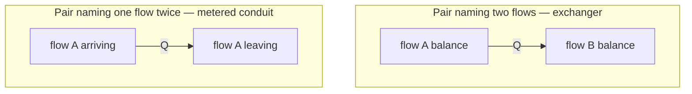
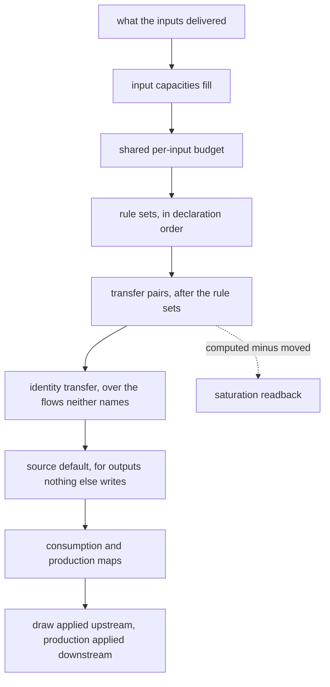

# Transfer Pairs - Plan

## Goal Capsule

- **Objective.** Let a component declare that a quantity it computes moves from one of its continuous flows to another, so MUSCADET can express heat exchangers, membrane permeation, metered conduits and environmental exchange inside the flow formalism.
- **Product authority.** The transfer pair only. The associated flow that would let a quantity travel with its carrier — advection — is a separate work unit and is not active scope here.
- **Authority hierarchy.** A requirement wins on product behaviour. A Key Technical Decision wins on mechanism, within the requirements it cites. A unit overrides neither.
- **Execution profile.** Eight units, dependency-ordered. Units 3 to 6 touch the three sweeps and are the risk concentration; each lands with its own test file.
- **Stop conditions.** Stop and ask if a unit needs a pre-existing test file modified, a new equation band, or an edge added to the connection graph. All three contradict this plan.
- **Tail ownership.** The implementer runs the Verification Contract and commits. Nothing is pushed without the maintainer's word.
- **Product Contract preservation.** Unchanged. The four questions the Product Contract deferred to planning are resolved in KTD1, KTD2, KTD3 and KTD5, and the Outstanding Questions section is removed rather than left empty.

---

## Product Contract

### Summary

A component declares one transfer pair: two of its continuous flows and an equation returning the quantity to move between their balances. The library derives both directions from the sign, draws what the pair needs from upstream, and holds the two sides equal. A pair naming the same flow twice meters that flow's transit, which is the same notion applied to one stream instead of two.

### Problem Frame

MUSCADET transports extensive quantities pulled by demand: a consumer asks, a producer delivers the lesser of what it can make and what was asked. That is right for matter a component decides to take. It is the wrong vehicle for a quantity that moves because a gradient makes it move.

Three experiments on the environment-exchange case measured the consequence. A tank declared with heat in and out is an identity transfer; its output was unwired, so nothing asked, and the exchange returned zero. Declaring an unbounded demand on the input changed nothing, because a declared default only applies to an input no rule and no transfer covers — the intention was stated, correct, and ignored. Only a pure accumulator with an unbounded claim let the heat move, and that claim says "fill at the producer's rate", which happens to be right there and says nothing about heat.

The arithmetic is already correct where it exists. A multi-constituent volume composes a draw at raw-quantity share, which is the mixture ratio. What has no expression is a component saying "move exactly this much, which I computed".

Two shapes were measured on the same model, and each gets one property right. Shaped as an identity transfer, the exchange conserves — the component draws exactly what it passes — but its rate is a proportion of what arrived, so halving the supplier's declared rate halves the exchange: 18.39 moved where the physics requires 36.79, and the tank reached 81.6 instead of 93.2. Shaped as a source, the rate is exact to 2e-8 of the analytic solution, but the quantity appears from nowhere and no supplier is debited. Production is always `declared × factor`, so a component can express a proportion of what arrived or a proportion of a constant, never an absolute computed quantity drawn from a named supplier.

The pattern is not thermal. `Q = G·(X₁ − X₂)` — a rate of an extensive quantity driven by the difference of its conjugate intensive potential — covers heat through an exchanger, moles through a membrane, charge through a resistance, fluid through a pipe. The reference hydrogen model already carries one: its electrolyser declares `flow_H2_membrane_leak` and `flow_O2_membrane_leak`, hydrogen crossing to the oxygen side. It is written as a percentage of production, because a proportion is what the formalism could say.

<!-- ce-section: work-relationships -->
### How This Work Fits Together

This plan owns the transfer pair alone. The breakdown below is how the surrounding work is currently understood, not a committed roadmap; a later plan may revise, split, merge or discard it.

- **The transfer pair** — this plan. Moves a computed quantity between two balances of one component.
  - **Can proceed independently of** the associated flow: a pair forms its own ratios from quantities the component already holds, so nothing here waits on that notion.
- **The associated, or carried, flow** — a quantity that travels with its carrier at the carrier's rate, with no demand channel of its own.
  - **Enables** the advection terms of a thermal balance: what a stream brings in and takes out, which a pair does not express.
  - **Shares** the same motivation — a quantity that moves for reasons other than being demanded.
- **Per-constituent measurement publication** — a channel exposing each constituent of a volume rather than its total. **Shipped** (`12c24f0`), so this is settled rather than pending.
  - **Enables** an observer outside a component to read an intensive property: a channel naming its constituents reads each, and a component dividing two of them publishes the ratio, which is how a J-to-K probe is built with no library change.
  - **Simplifies this plan** rather than blocking it. A pair need not be told how to form a potential from a volume's contents, because a sensor can publish the potential already; the `potential_*` shape an earlier sketch carried is therefore not part of the declaration.
  - **Leaves one half undone**, recorded under Scope Boundaries: a watched threshold still cannot name a constituent.

### Key Decisions

- KD1. **One declaration; the library derives both directions, and the equation returns a signed quantity.** (session-settled: user-directed — chosen over a single signed pair the library routes dynamically: a connection whose direction reverses mid-run would touch ordering, acyclicity and allocation, all of which assume a fixed direction.) Governs R1, R2.
- KD2. **The equation receives raw quantities and forms its own ratios.** (session-settled: user-directed — chosen over declared associated flows handing it intensive properties: the pair then ships alone instead of waiting on the association notion.) Governs R3.
- KD3. **A pair names two flows of the component, not two ports.** (session-settled: user-directed — chosen over an input/output pair: a two-stream exchanger is then native, and a metered conduit is the degenerate case where both names are the same flow.) Governs R4, R5.
- KD4. **A pair publishes upstream what its balances require.** (session-settled: user-directed — chosen over redistributing only what already arrived: without it the three-component conduit returns zero, which is the measured failure.) Governs R6.
- KD5. **A transfer that cannot be supplied is capped, not refused, and the shortfall is readable.** (session-settled: user-approved — chosen over silent capping: saturation is a legitimate physical state, but an invisible one is the defect class this release has spent its life closing.) Governs R7, R8.
- KD6. **The equation is a declared object carrying a continuity attestation, on the `Profile` pattern, and a bare callable is refused.** (session-settled: user-approved — chosen over a bare callable on the `allocation_fun` / `combine_fun` pattern, and over a method the component overrides, which is what the experiments used and what the shipped J-to-K sensor already does through `compute_measurements`.) Governs R11, R12.

  The library has both patterns already, and what separates them is not style: `allocation_fun` and `combine_fun` are bare callables and carry no attestation, while `Profile` is an object whose `continuous=True` has no default and whose bare-callable form is refused outright. A transfer equation belongs on the second, for the identical reason spelled out in `muscadet/profile.py`: it is read from inside the sweeps at the solver's own integration points, so a discontinuous law — a thermostat switching at a threshold — is crossed inside a step and overshoots by that step with no error the solver can detect. Neither a bare callable nor an overridden method can carry the attestation that muscadet cannot infer.

  The secondary gains are real but were not decisive, since both are unreachable today: the mapping form serialises, which a knowledge-base component will need, and the deferred canonical laws become subclasses exactly as `SinusoidalProfile` is of `Profile`. The serialisation destination currently carries discrete components only.

The degenerate case is the part a reader is most likely to miss: one notion covers both shapes.

### Requirements

**Declaration**

- R1. A component declares one transfer pair naming two of its continuous flows and the quantity to move between their balances.
- R2. The declared equation returns a signed quantity, and the library routes the sign to the matching direction; a model never writes a direction clamp.
- R3. The equation reads the raw quantities the component holds or receives and forms whatever ratio it needs; the library hands it no intensive property.
- R11. The equation is declared as an object attesting that it is continuous in the quantities it reads, and a bare callable is refused at declaration with a message naming the mechanism a discontinuous law would need.
- R12. A declaration may name a shipped equation shape through the `{"cls": ...}` mapping form wherever the object itself is accepted.

**Semantics**

- R4. The quantity leaves one flow's balance and enters the other's within one evaluation, at the same value on both sides.
- R5. A pair naming the same flow twice meters that flow's transit: what crosses the component is the computed quantity.
- R6. A pair publishes upstream what its balances require, so a supplier is asked for the quantity the pair will move.
- R7. When the supply cannot meet the computed quantity, both sides are capped together at what is available.
- R8. The gap between the computed quantity and the quantity actually moved is readable on the model.

**Interaction with what already exists**

- R9. A pair drawing on an input that rule sets also consume enters the same per-evaluation budget as those rule sets.
- R10. A pair's contribution to an output's published capability is the quantity it would move if nothing constrained it.

### Key Flows

- F1. Environmental exchange, the degenerate shape
  - **Trigger:** a tank at one temperature sits beside an environment held at another.
  - **Actors:** an environment component, an exchange component, a tank.
  - **Steps:** the exchange component reads the tank's level, computes the quantity from the difference, asks its supplier for it, and moves it across.
  - **Outcome:** the tank relaxes toward the environment's temperature; when it passes above, the sign reverses and it loses instead of gaining.
  - **Covered by:** R2, R5, R6.

- F2. Two-stream exchanger
  - **Trigger:** two streams of different natures cross one component, each carrying its own associated quantity.
  - **Actors:** the two upstream producers, the exchanger, the two downstream consumers.
  - **Steps:** both streams transit; the pair computes the quantity from the two intensive properties it forms itself and moves it from one stream's balance to the other's.
  - **Outcome:** one stream leaves depleted by exactly what the other leaves enriched by, with no mass crossing between them.
  - **Covered by:** R1, R3, R4.

### Acceptance Examples

- AE1. **Covers R2.** Given a pair whose equation returns a negative quantity, when the model is evaluated, then the transfer runs in the opposite direction at the absolute value and the model declares no clamp.
- AE2. **Covers R4.** Given any pair moving a quantity, when conservation is checked per component per stop, then what one balance lost equals what the other gained.
- AE3. **Covers R5, R6.** Given a source, an exchange component and an accumulator in series, when the exchange declares a pair naming one flow twice, then the accumulator receives the computed quantity rather than zero.
- AE4. **Covers R7.** Given a computed quantity larger than the supply can deliver, when the model is evaluated, then both sides move by what was available and neither exceeds it.
- AE5. **Covers R8.** Given the same saturated case, when the model is read, then the computed quantity and the quantity actually moved are both available and differ.
- AE6. **Covers R9.** Given one input consumed by a rule set and drawn on by a pair, when both run in one evaluation, then their combined draw does not exceed what arrived.
- AE7. **Covers R1, R3.** Given an exchanger whose equation divides one flow's quantity by another's, when the two streams change independently, then the moved quantity follows both without any declaration changing.
- AE8. **Covers R11.** Given a pair declared with a bare callable, when the component is built, then the declaration is refused and the message names the watched transition a discontinuous law would need.
- AE9. **Covers R12.** Given a pair declared through the mapping form of a shipped shape, when the model runs, then it moves the same quantity as the equivalent object form.

### Scope Boundaries

**Deferred for later**

- The associated or carried flow — a quantity travelling with its carrier at the carrier's rate. It is what advection needs, and the pair does not depend on it.
- Canonical transfer laws beyond conduction — effectiveness-NTU, LMTD. One shape ships (KTD5); naming the rest is an ergonomics question once the range of laws real models need is known.
- Making a constituent reading available to a WATCHED THRESHOLD. Per-constituent publication shipped, so a channel naming `water` and `heat` reads each and their ratio is the mixture temperature. What no declaration reaches is a threshold on one: a sensor's band is built from the `{name, op, value}` operand vocabulary, which names a measurement channel and has no slot for a constituent of one, so the reading is available to Python and not to a guard. Extending it touches `validate_operand_shape`, the single implementation a rule guard and a discrete production condition both validate through.

**Outside this notion's identity**

- A connection whose direction reverses during a run. Rejected under KD1: fixed direction is assumed by ordering, acyclicity and allocation alike.
- A pair that computes a quantity for a discrete flow. Transfer moves extensive quantities; a boolean is not one.

### Dependencies and Assumptions

- A capacity exports its level as the live ODE variable rather than a republished copy, so a pair can compute its quantity during any sweep without a lag. Verified against `muscadet/capacity.py`. A sourced republication through `add_measurement_out` sits in a later equation band and does lag.
- A quantity computed from an integrated state introduces no circularity: levels are state, not sweep output. A quantity computed from a flow would be circular and is assumed out of scope.
- A pair transfers nothing at instant 0, like everything else that runs through the sweeps. This is the known reporting artefact, not specific to pairs.
- A component can compute and publish a derived quantity at every integration step by overriding `compute_measurements`, measured end to end on a probe reading joules and kilograms and publishing kelvin, gain included. This is why KD6 had to be decided on the attestation rather than on feasibility: the override route works, and is rejected for what it cannot state.
- The serialisation destination carries discrete components only. Read from the platform export fixture: interfaces there are input/output with a discrete production condition, and nothing continuous travels that route yet. So the mapping form of KD6 is a destination rather than an immediate gain.

### Sources

- `docs/review/2026-08-14-temperature-sortie-vanne.svg` — why a valve's throughput starts depending on the tank's temperature; the measured 1.500 against 0.593.
- `docs/review/2026-08-16-environnement-deux-limites.svg` — the three environment-exchange experiments and the two limits they exposed.
- `tests/test_heated_tank_001.py` — the dynamic-reliability benchmark and the four things the knowledge base could not express, of which this plan addresses the first. Its measurement boundary has since moved and the test says so: a constituent is observable, a threshold on one is not.
- `muscadet/profile.py` — the pattern KD6 follows, and the continuity argument it borrows verbatim.
- `tests/test_measurement_constituents_001.py` — per-constituent publication, including the two engine facts it rests on.
- The reference hydrogen model's electrolyser, which declares `flow_H2_membrane_leak` and `flow_O2_membrane_leak` as a percentage of production — an existing non-thermal transfer pair written as a proportion.

---

## Planning Contract

### Key Technical Decisions

- KTD1. **A pair contributes to the three existing sweeps; it gets no equation band of its own.** (session-settled: user-approved — chosen over a fourth band: a band needs its own topological order and re-opens the acyclicity argument for no gain.) `evaluate_capability`, `evaluate_demand` and `evaluate_production` each build a `{flow name: rate}` map through the same `take` / `spend` budget idiom. A pair is a fourth contributor to those maps, beside the rule sets, the identity transfer and the source default. R9 and R10 then hold because the pair uses the machinery that already enforces them, not because a second implementation reproduces it. Governs R9, R10.

- KTD2. **On a contested input, pairs are served after the rule sets in the shared budget.** (session-settled: user-approved — chosen over serving the gradient first: physically defensible, but it starves a rule that has no shortfall channel of its own.) The budget is spent in declaration order and a pair joins the end of that order. Serving it last makes the pair the thing that saturates, which is exactly the state R7 caps and R8 publishes. Governs R7, R9.

- KTD3. **Several pairs over one flow sum.** (session-settled: user-approved — chosen over refusing the second pair and over folding by minimum.) A transfer moves a conserved quantity, and two gradients across one balance add. Deratings fold by minimum because they are competing losses on one production; that rule is not transferable here and must not be carried over by analogy. Governs R4.

- KTD4. **A conduit REPLACES its flow's identity transfer; a two-flow pair leaves both transfers in place and applies a signed delta.** The two shapes cannot share one rule, and conflating them breaks whichever one loses.
  - A pair naming one flow twice meters the transit (R5), so what crosses IS the computed quantity: the flow leaves the identity-transfer residue (`transfer_named_flows` beside `rule_named_flows`) and the pair alone writes it. Left in the residue, the stream would cross once by transfer and once by the pair, and the component would emit twice what it received.
  - A pair naming two flows moves a quantity *between* two streams that keep transiting (F2): both stay in the residue and the pair adds `−Q` to one balance and `+Q` to the other. Removed from the residue, the exchanger's streams would stop crossing the component altogether and the pair would have to carry their whole balance, which is not what an exchanger does.

  Governs R4, R5.

- KTD5. **One canonical shape ships: conduction. Its two operands are a constant or a measurement channel of the component.** (session-settled: user-approved — chosen over shipping the free base alone.) R12's mapping form is vacuous without a parameterised shape, because the free base carries a Python function that no mapping can express. Conduction is the law all three motivating cases use. `{"cls": "ConductiveTransfer", "conductance": G, "potential_a": {...}, "potential_b": {...}}`, where an operand is `{"const": x}` or `{"measurement": name}`. Forming a ratio from a volume's own contents is not an operand form: a sensor publishes that ratio already. Governs R12.

- KTD6. **No non-negativity clamp, which is where this departs from `Profile`.** A profile refuses a negative factor because a negative production has no meaning. A negative transfer has one: the sign IS the direction under KD1. The departure is recorded because the plan otherwise says "follow the profile pattern", and a reader applying that pattern wholesale would clamp away half the behaviour. Governs R2, R11.

- KTD7. **The two readback variables are declared explicit PDMP variables at the pre-run step.** PyCATSHOO refuses `setValue` on a variable its solver does not know about during the differential resolution. Measured on the per-constituent work, where the refusal landed at the first integration step rather than at declaration and cost a full debug cycle. Same rule `register_capability_variables` and the capacity transit hooks register under. Governs R8.

- KTD8. **A pair adds no edge to the connection graph.** The graph's nodes are components; a pair's two flows belong to one component, so the dependency it creates is intra-node. `muscadet/ordering.py` needs no change. This is the claim KTD1 rests on, so it is asserted by a test rather than assumed. Governs R9, R10.

### High-Level Technical Design

Where a pair sits in the production sweep. The other two sweeps have the same shape with the same shared budget; only the bound differs, which is what lets one notion serve all three.

Directional guidance, not implementation specification: the boxes name where the contribution lands, not the call shape.

### Assumptions

- The three sweeps keep their current shape. If a unit finds that one of them has diverged from the `take` / `spend` idiom, that is a stop condition, not something to work around.
- `Capacity.get_quantity(flow)` and the measurement channel's `get_level(flow)` are the two quantity sources a pair's equation reads. Both were exercised this release.

### Risks

- **An equation reading a republished measurement lags a step.** A capacity exports its live ODE variable, so reading a level is lag-free. A reading republished through `add_measurement_out(source=...)` is refreshed by an equation in the `MEASUREMENT_ORDER_BASE` band, which runs *after* the three sweeps, so a pair reading one sees the previous step's value. That is a within-step lag absorbed by the level, the same residual any state-variable tearing carries — but it is silent, and a model whose potential comes through a voting instrument gets it without being told. U7's measurement operand should name the direct-capacity case as the lag-free one.
- **KTD2's ordering is physically debatable.** A gradient does not queue behind a reaction. The choice is defensible on visibility grounds (the pair is the shape with a shortfall channel) rather than on physics, and a model where a rule and a pair genuinely contend for one reagent may want the opposite. Revisit if such a model appears rather than pre-building the option.
- **KTD1 rests entirely on KTD8.** If a pair turns out to create a graph edge after all, the no-new-band decision falls with it and units 3 to 6 need re-cutting. U8 asserts the claim; do not defer that assertion to the end of the unit.

### Sequencing

Units land in dependency order. U1 and U2 are declaration surface and land first because everything else imports them. U3 is the behavioural core. U4 makes saturation visible and depends on U3 producing a cap. U5 and U6 are independent of each other and both depend on U3. U7 is ergonomics over a working mechanism. U8 is the scenario and invariant layer and depends on everything.

---

## Implementation Units

### U1. The `Transfer` declaration object

- **Goal.** A declared, attesting equation object, refusing what it cannot integrate.
- **Requirements.** R11, R12; KTD6.
- **Dependencies.** None.
- **Files.** `muscadet/transfer.py` (new), `muscadet/__init__.py`, `tests/test_transfer_declaration_001.py` (new).
- **Approach.**
  1. Mirror `muscadet/profile.py` structure: a `Transfer` base taking `fun` and a `continuous` flag with no default, a `TRANSFER_CLASSES` registry, and a `build_transfer(spec, ...)` normaliser accepting the object and the `{"cls": ...}` mapping form.
  2. Refuse a bare callable with a message naming the watched transition a discontinuous law would need, in the shape `_CONTINUITY_MESSAGE` uses.
  3. Do **not** copy the non-negativity checks: per KTD6 a signed quantity is the direction.
  4. Export `Transfer`, `ConductiveTransfer` and `build_transfer` from the package root beside `Profile`.
- **Patterns to follow.** `muscadet/profile.py` end to end, including the module docstring that states why the attestation cannot be inferred.
- **Test scenarios.**
  - A `Transfer` built with `continuous=True` and a callable evaluates and returns the callable's value.
  - A bare callable passed where a transfer is expected is refused, and the message names the watched-transition mechanism.
  - `continuous` omitted, `False`, or any truthy non-`True` value is refused.
  - A non-callable `fun` is refused.
  - A negative return value is accepted and returned unchanged, which is the documented departure from `Profile`.
  - The mapping form builds the named shape; an unknown `cls` and a mapping with no `cls` are each refused by name.
- **Verification.** The declaration test file passes and the package still imports.

### U2. Declaring a pair on a component

- **Goal.** `add_transfer` on `ObjFlow`, with the refusals that keep a pair inside the flow formalism.
- **Requirements.** R1, R3; KD3.
- **Dependencies.** U1.
- **Files.** `muscadet/obj.py`, `tests/test_transfer_declaration_001.py`.
- **Approach.**
  1. `add_transfer(name, flows=(a, b), equation=...)`, registered in a `self.transfers` dict keyed by name, in declaration order. Both names may be the same flow, which is the metered conduit of R5.
  2. Resolve both names against the component's continuous flows. Refuse a discrete flow, a capacity name and a measurement-channel name, mirroring what `_resolve_rule_flow` refuses for `cons` and `prod` — a non-conserved estimator must not enter a mass balance.
  3. Refuse a duplicate transfer name.
  4. Normalise `equation` through `build_transfer` so the mapping form works here too.
- **Patterns to follow.** `ObjFlow.add_capacity` for the registry and the declaration-time validation shape; `_resolve_rule_flow` for what a flow name may not be.
- **Test scenarios.**
  - A pair naming two declared continuous flows registers and is readable on the component.
  - A pair naming the same flow twice registers, which is the conduit case.
  - A pair naming a discrete flow is refused, and the message names the flow and the component.
  - A pair naming a measurement channel is refused with the conserved-quantity reason.
  - A pair naming an undeclared flow is refused.
  - A duplicate pair name is refused.
  - The mapping form of the equation is accepted here, not only in `build_transfer`.
- **Verification.** Declarations refuse and accept as enumerated, with no system built.

### U3. The production sweep moves the quantity

- **Goal.** The quantity leaves one balance and enters the other, capped at what the shared budget allows.
- **Requirements.** R2, R4, R5, R7, R9; KTD1, KTD2, KTD3, KTD4.
- **Dependencies.** U2.
- **Files.** `muscadet/evaluation.py`, `muscadet/transfer.py`, `tests/test_transfer_production_001.py` (new).
- **Approach.**
  1. Add `transfer_named_flows(comp)` beside `rule_named_flows`, returning only the flows of **conduit** pairs, and subtract it in `get_identity_transfer_flows` and `get_transferable_flows` (KTD4). A two-flow pair contributes nothing to that set.
  2. In `evaluate_production`, after the rule-set loop and before the identity transfer, evaluate each pair in declaration order. Compute the signed quantity, then route the sign to a source flow and a destination flow.
  3. **Conduit.** Cap the quantity at `take(flow)`, `spend` it (KTD2), and accumulate it into `consumption` and `production` for that flow at the same value. The pair is the only writer, since step 1 removed the flow from the residue.
  4. **Two flows.** Cap the quantity at what the source flow's balance can give — what transits it, plus its stock when a capacity holds it — then accumulate `−Q` onto the source's production and `+Q` onto the destination's. Both flows keep their identity transfer, so the delta rides on top of a stream that still crosses.
  5. Several pairs on one flow accumulate, which is KTD3 and falls out of `accumulate`.
- **Execution note.** Start from a failing conservation assertion rather than from the happy path: what one balance loses equalling what the other gains is the invariant this unit exists for, and it is cheap to satisfy accidentally on a single-pair model. Build the conduit shape first and the two-flow shape second — they take different paths through this unit and the second is the one a conduit-shaped implementation silently breaks.
- **Test scenarios.**
  - Covers AE1. A pair whose equation returns a negative quantity moves the absolute value in the opposite direction, with no clamp in the model.
  - Covers AE2. What the source balance lost equals what the destination gained, asserted per component per stop, on both shapes.
  - Covers AE3. A source, a metered conduit and an accumulator in series: the accumulator receives the computed quantity, not zero.
  - Covers AE6. One input consumed by a rule set and drawn on by a pair: the combined draw does not exceed what arrived.
  - A rule set and a pair on one input are served in that order, and the pair is the one that comes up short.
  - Two pairs on one flow move the sum of their quantities.
  - A conduit's flow is not also carried by the identity transfer, so the component emits what it received once.
  - A two-flow pair's streams both still transit: with the equation returning zero, each output equals its own input.
  - A two-flow pair moves the delta without changing either stream's total: the source's output falls by exactly what the destination's rises.
  - A pair returning zero moves nothing and leaves both balances untouched.
- **Verification.** Conservation holds per component per stop on every scenario in the file, and the two shapes are both exercised.

### U4. The saturation readback

- **Goal.** The gap between what a pair computed and what it moved is readable.
- **Requirements.** R7, R8; KD5, KTD7.
- **Dependencies.** U3.
- **Files.** `muscadet/transfer.py`, `muscadet/obj.py`, `tests/test_transfer_saturation_001.py` (new).
- **Approach.**
  1. Create two `t_double` variables per pair at declaration: what the equation asked for, and what was actually moved.
  2. Register both as explicit PDMP variables in the pre-run step, where `register_capability_variables` registers its own (KTD7). Registering at declaration would give a purely discrete model a PDMP manager it never needed.
  3. Write both from the production sweep, so a reader sees the pair's own account of the step rather than inferring it from the balances.
- **Test scenarios.**
  - Covers AE4. A computed quantity larger than the supply moves what was available, and neither side exceeds it.
  - Covers AE5. In that same saturated case both variables are readable and differ.
  - An unsaturated pair reports the two variables equal.
  - The variables are declared to the solver: writing them from inside the equation raises nothing.
  - A pair whose supply recovers reports the two equal again on the next step, so the readback is per-step state and not a latch.
- **Verification.** The saturated and unsaturated cases both read back correctly in one interactive session.

### U5. The demand sweep publishes what the pair needs

- **Goal.** A supplier is asked for the quantity the pair will move.
- **Requirements.** R6; KD4.
- **Dependencies.** U3.
- **Files.** `muscadet/evaluation.py`, `tests/test_transfer_demand_capability_001.py` (new).
- **Approach.**
  1. In `evaluate_demand`, a **conduit** publishes the quantity its equation currently computes on the flow it meters. This is the whole of R6: it replaced that flow's transfer in U3, so nothing else claims it.
  2. A **two-flow** pair publishes nothing of its own. Both its streams keep their identity transfer, so each already carries its consumer's demand upstream; adding the delta on top would ask for a quantity no balance needs.
  3. A conduit's flow leaves the pure-consumer `var_demand_default` path, exactly as a rule-covered flow does.
  4. Read the quantity from the equation, not from the previous production, so the claim is what the pair intends rather than what it last achieved.
- **Test scenarios.**
  - Covers AE3, demand half. The metered conduit publishes its computed quantity upstream, so the source is asked and the chain does not return zero.
  - A conduit whose quantity changes between steps publishes the new value.
  - A conduit's flow does not also publish its `var_demand_default`.
  - A conduit returning zero publishes zero, not the input's declared default.
  - A two-flow pair leaves both streams' published demand exactly as the same model without the pair publishes it.
- **Verification.** The upstream source sees the pair's claim in the same interactive step.

### U6. The capability sweep accounts for the pair

- **Goal.** An output a pair feeds publishes what the pair could move unconstrained.
- **Requirements.** R10; KTD1.
- **Dependencies.** U3.
- **Files.** `muscadet/capability.py`, `tests/test_transfer_demand_capability_001.py`.
- **Approach.**
  1. In `evaluate_capability`, a pair contributes its unconstrained quantity to its destination flow, through the same `take` / `spend` budget the rule sets use.
  2. Bound it by the source's capability rather than by its delivery, which is the rule the whole sweep exists for.
- **Test scenarios.**
  - A pair's destination output publishes the quantity the pair would move with an unbounded supply.
  - A pair whose source capability is smaller publishes the smaller of the two.
  - A downstream consumer sized on that capability asks for a quantity the pair can honour, so `release_unused_supply` releases nothing.
  - A flow both a rule and a pair produce publishes the sum.
- **Verification.** Capability, demand and delivery agree on the common path, as the existing capability tests assert for rules.

### U7. The conduction shape and the knowledge-base component

- **Goal.** A pair is declarable from data, and the environment case has a shipped component.
- **Requirements.** R12; KTD5.
- **Dependencies.** U4, U5, U6.
- **Files.** `muscadet/transfer.py`, `muscadet/kb/continuous.py`, `tests/test_transfer_declaration_001.py`.
- **Approach.**
  1. `ConductiveTransfer(conductance, potential_a, potential_b)` computing `G × (a − b)`, continuous by construction, so it carries no attestation of its own.
  2. Resolve an operand from `{"const": x}` or `{"measurement": name}` against the owning component. Refuse an unknown operand form by name.
  3. Add `ExchangeContinuous` to the continuous knowledge base, declaring `transfer` and the conduction parameters in its `DECLARATION_KEYS` so an unread key is refused, per the rule that base already enforces.
- **Patterns to follow.** `SinusoidalProfile` for a parameterised subclass that needs no attestation; `SourceContinuous.DECLARATION_KEYS` for the KB surface.
- **Test scenarios.**
  - Covers AE9. The mapping form and the equivalent object form move the same quantity.
  - `ConductiveTransfer` returns a negative quantity when the second potential is the larger, and the transfer reverses.
  - A measurement operand follows the channel it names as the level moves.
  - An unknown operand form is refused at declaration, naming the accepted forms.
  - `ExchangeContinuous` refuses a declaration key it does not read.
- **Verification.** A conduction pair declared from a mapping runs a model end to end.

### U8. The two scenarios, the invariants and the graph claim

- **Goal.** Both Key Flows run, conservation holds, and the no-new-edge claim is asserted.
- **Requirements.** R1 to R10; KTD8.
- **Dependencies.** U7.
- **Files.** `tests/test_transfer_scenarios_001.py` (new).
- **Approach.**
  1. F1 as three components: an environment, an exchange declaring a conduction pair, and a tank. Drive it far enough that the tank crosses the environment's potential and the sign reverses.
  2. F2 as one exchanger with two streams of different natures, each carrying its own quantity, and a pair moving between them.
  3. Assert the equation order the model derives is the one an equivalent model without the pair derives, which is KTD8.
- **Execution note.** Give every component class in this file a prefix unique across `tests/`. A collision resolves globally by class name and surfaces as an unrelated module failing on a flow it declares correctly.
- **Test scenarios.**
  - Covers F1. The tank relaxes toward the environment's potential.
  - Covers F1, sign half. Past the crossing the tank loses instead of gaining, with no declaration change.
  - Covers F2, AE7. An exchanger whose equation divides one flow's quantity by another's follows both as they change independently.
  - Covers AE2 on both scenarios. Conservation per component per stop.
  - Covers KTD8. A model with a pair derives the same equation order as the same model without one, and `EquationOrder.torn` stays empty.
  - A pair inside a loop a capacity already breaks still builds, so the pair does not reintroduce a cycle the tear removed.
- **Verification.** Both flows behave as the Product Contract describes, and the ordering assertion passes.

---

## Verification Contract

| Gate | Command | Applies to |
|---|---|---|
| Full suite | `.venv/bin/python -m pytest tests/ -q` | Every unit. Baseline before this plan: 871 passed, 2 skipped |
| Unit test file | `.venv/bin/python -m pytest tests/test_transfer_<area>_001.py -q` | The unit that owns it, while iterating |
| Formatting | `.venv/bin/black --check muscadet/ tests/` | Any unit touching those trees |

Three repo-specific gates carry more weight than the commands:

- **No pre-existing test file may be modified.** A file is pre-existing if it is present at `30a0f97`. Every file this plan adds is new.
- **A test file that builds a system ends with a `test_delete` calling `deleteSys()` and `cod3s.terminate_session()`.** `tests/conftest.py` collects once per module on top of that; the suite runs near a PyCATSHOO ceiling and a new file can push unrelated modules over it.
- **Component class names in tests are globally unique.** `add_component(cls="X")` resolves by class name across every imported module.

Conservation is the plan's real exit criterion, not a boolean: on every scenario, per component and per stop, what one balance loses equals what the other gains, within the tolerance the existing conservation test uses.

---

## Definition of Done

**Global**

- Every requirement R1 to R12 is exercised by at least one test scenario.
- The full suite passes, with no pre-existing test file modified.
- `muscadet/__init__.py` exports the new public names, and the module docstring of `muscadet/transfer.py` states why the attestation cannot be inferred.
- `CLAUDE.md` carries the transfer pair: the declaration surface, the composition rule of KTD3, and the departure from `Profile` recorded in KTD6.
- No dead-end or experimental code remains from approaches that did not work out.

**Per unit**

| Unit | Done when |
|---|---|
| U1 | The attestation is refused and accepted as enumerated, and a negative return survives |
| U2 | Every refusal fires with a message naming the flow and the component |
| U3 | Conservation holds per component per stop, and a paired flow is not also transferred |
| U4 | The saturated case reports two different values and the unsaturated case two equal ones |
| U5 | The upstream source is asked for the pair's computed quantity in the same step |
| U6 | Capability, demand and delivery agree on the common path |
| U7 | A mapping-declared conduction pair runs a model, and the KB component refuses an unread key |
| U8 | Both Key Flows behave as described, and the equation order is unchanged by the pair |
