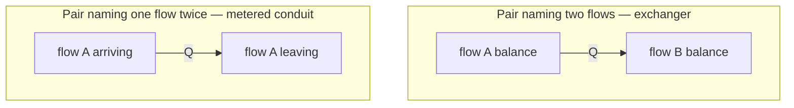

# Transfer Pairs - Plan

## Goal Capsule

- **Objective.** Let a component declare that a quantity it computes moves from one of its continuous flows to another, so MUSCADET can express heat exchangers, membrane permeation, metered conduits and environmental exchange inside the flow formalism.
- **Product authority.** The transfer pair only. The associated flow that would let a quantity travel with its carrier — advection — is a separate work unit and is not active scope here.
- **Open blockers.** How the equation is written declaratively is unresolved and blocks planning; see Outstanding Questions.

## Product Contract

### Summary

A component declares one transfer pair: two of its continuous flows and an equation returning the quantity to move between their balances. The library derives both directions from the sign, draws what the pair needs from upstream, and holds the two sides equal. A pair naming the same flow twice meters that flow's transit, which is the same notion applied to one stream instead of two.

### Problem Frame

MUSCADET transports extensive quantities pulled by demand: a consumer asks, a producer delivers the lesser of what it can make and what was asked. That is right for matter a component decides to take. It is the wrong vehicle for a quantity that moves because a gradient makes it move.

Three experiments on the environment-exchange case measured the consequence. A tank declared with heat in and out is an identity transfer; its output was unwired, so nothing asked, and the exchange returned zero. Declaring an unbounded demand on the input changed nothing, because a declared default only applies to an input no rule and no transfer covers — the intention was stated, correct, and ignored. Only a pure accumulator with an unbounded claim let the heat move, and that claim says "fill at the producer's rate", which happens to be right there and says nothing about heat.

The arithmetic is already correct where it exists. A multi-constituent volume composes a draw at raw-quantity share, which is the mixture ratio. What has no expression is a component saying "move exactly this much, which I computed".

Two shapes were measured on the same model, and each gets one property right. Shaped as an identity transfer, the exchange conserves — the component draws exactly what it passes — but its rate is a proportion of what arrived, so halving the supplier's declared rate halves the exchange: 18.39 moved where the physics requires 36.79, and the tank reached 81.6 instead of 93.2. Shaped as a source, the rate is exact to 2e-8 of the analytic solution, but the quantity appears from nowhere and no supplier is debited. Production is always `declared × factor`, so a component can express a proportion of what arrived or a proportion of a constant, never an absolute computed quantity drawn from a named supplier.

The pattern is not thermal. `Q = G·(X₁ − X₂)` — a rate of an extensive quantity driven by the difference of its conjugate intensive potential — covers heat through an exchanger, moles through a membrane, charge through a resistance, fluid through a pipe. The reference hydrogen model already carries one: its electrolyser declares `flow_H2_membrane_leak` and `flow_O2_membrane_leak`, hydrogen crossing to the oxygen side. It is written as a percentage of production, because a proportion is what the formalism could say.

<!-- ce-section: work-relationships -->
### How This Work Fits Together

This plan owns the transfer pair alone. The breakdown below is how the surrounding work is currently understood, not a committed roadmap; a later plan may revise, split, merge or discard it.

- **The transfer pair** — this plan. Moves a computed quantity between two balances of one component.
  - **Can proceed independently of** the associated flow: a pair forms its own ratios from quantities the component already holds, so nothing here waits on that notion.
- **The associated, or carried, flow** — a quantity that travels with its carrier at the carrier's rate, with no demand channel of its own.
  - **Enables** the advection terms of a thermal balance: what a stream brings in and takes out, which a pair does not express.
  - **Shares** the same motivation — a quantity that moves for reasons other than being demanded.
- **Per-constituent measurement publication** — a channel exposing each constituent of a volume rather than its total.
  - **Enables** an observer outside a component to read an intensive property; a pair does not need it, since it reads its own quantities.
  - **Still to decide** whether it belongs with the associated flow or stands alone.

### Key Decisions

- KD1. **One declaration; the library derives both directions, and the equation returns a signed quantity.** (session-settled: user-directed — chosen over a single signed pair the library routes dynamically: a connection whose direction reverses mid-run would touch ordering, acyclicity and allocation, all of which assume a fixed direction.) Governs R1, R2.
- KD2. **The equation receives raw quantities and forms its own ratios.** (session-settled: user-directed — chosen over declared associated flows handing it intensive properties: the pair then ships alone instead of waiting on the association notion.) Governs R3.
- KD3. **A pair names two flows of the component, not two ports.** (session-settled: user-directed — chosen over an input/output pair: a two-stream exchanger is then native, and a metered conduit is the degenerate case where both names are the same flow.) Governs R4, R5.
- KD4. **A pair publishes upstream what its balances require.** (session-settled: user-directed — chosen over redistributing only what already arrived: without it the three-component conduit returns zero, which is the measured failure.) Governs R6.
- KD5. **A transfer that cannot be supplied is capped, not refused, and the shortfall is readable.** (session-settled: user-approved — chosen over silent capping: saturation is a legitimate physical state, but an invisible one is the defect class this release has spent its life closing.) Governs R7, R8.

The degenerate case is the part a reader is most likely to miss: one notion covers both shapes.

### Requirements

**Declaration**

- R1. A component declares one transfer pair naming two of its continuous flows and the quantity to move between their balances.
- R2. The declared equation returns a signed quantity, and the library routes the sign to the matching direction; a model never writes a direction clamp.
- R3. The equation reads the raw quantities the component holds or receives and forms whatever ratio it needs; the library hands it no intensive property.

**Semantics**

- R4. The quantity leaves one flow's balance and enters the other's within one evaluation, at the same value on both sides.
- R5. A pair naming the same flow twice meters that flow's transit: what crosses the component is the computed quantity.
- R6. A pair publishes upstream what its balances require, so a supplier is asked for the quantity the pair will move.
- R7. When the supply cannot meet the computed quantity, both sides are capped together at what is available.
- R8. The gap between the computed quantity and the quantity actually moved is readable on the model.

**Interaction with what already exists**

- R9. A pair drawing on an input that rule sets also consume enters the same per-evaluation budget as those rule sets.
- R10. A pair's contribution to an output's published capability is the quantity it would move if nothing constrained it.

### Key Flows

- F1. Environmental exchange, the degenerate shape
  - **Trigger:** a tank at one temperature sits beside an environment held at another.
  - **Actors:** an environment component, an exchange component, a tank.
  - **Steps:** the exchange component reads the tank's level, computes the quantity from the difference, asks its supplier for it, and moves it across.
  - **Outcome:** the tank relaxes toward the environment's temperature; when it passes above, the sign reverses and it loses instead of gaining.
  - **Covered by:** R2, R5, R6.

- F2. Two-stream exchanger
  - **Trigger:** two streams of different natures cross one component, each carrying its own associated quantity.
  - **Actors:** the two upstream producers, the exchanger, the two downstream consumers.
  - **Steps:** both streams transit; the pair computes the quantity from the two intensive properties it forms itself and moves it from one stream's balance to the other's.
  - **Outcome:** one stream leaves depleted by exactly what the other leaves enriched by, with no mass crossing between them.
  - **Covered by:** R1, R3, R4.

### Acceptance Examples

- AE1. **Covers R2.** Given a pair whose equation returns a negative quantity, when the model is evaluated, then the transfer runs in the opposite direction at the absolute value and the model declares no clamp.
- AE2. **Covers R4.** Given any pair moving a quantity, when conservation is checked per component per stop, then what one balance lost equals what the other gained.
- AE3. **Covers R5, R6.** Given a source, an exchange component and an accumulator in series, when the exchange declares a pair naming one flow twice, then the accumulator receives the computed quantity rather than zero.
- AE4. **Covers R7.** Given a computed quantity larger than the supply can deliver, when the model is evaluated, then both sides move by what was available and neither exceeds it.
- AE5. **Covers R8.** Given the same saturated case, when the model is read, then the computed quantity and the quantity actually moved are both available and differ.
- AE6. **Covers R9.** Given one input consumed by a rule set and drawn on by a pair, when both run in one evaluation, then their combined draw does not exceed what arrived.
- AE7. **Covers R1, R3.** Given an exchanger whose equation divides one flow's quantity by another's, when the two streams change independently, then the moved quantity follows both without any declaration changing.

### Scope Boundaries

**Deferred for later**

- The associated or carried flow — a quantity travelling with its carrier at the carrier's rate. It is what advection needs, and the pair does not depend on it.
- Canonical transfer laws shipped in the knowledge base — `k·ΔT`, effectiveness-NTU, LMTD. The free equation covers them; naming them is an ergonomics question once the range of laws real models need is known.
- A measurement channel publishing per constituent rather than the whole volume. A pair forms its own ratios from quantities it holds, so it does not need this; an observer outside the component still does.

**Outside this notion's identity**

- A connection whose direction reverses during a run. Rejected under KD1: fixed direction is assumed by ordering, acyclicity and allocation alike.
- A pair that computes a quantity for a discrete flow. Transfer moves extensive quantities; a boolean is not one.

### Dependencies and Assumptions

- A capacity exports its level as the live ODE variable rather than a republished copy, so a pair can compute its quantity during the demand sweep without a lag. Verified against `muscadet/capacity.py`. A sourced republication through `add_measurement_out` sits in a later equation band and does lag.
- A quantity computed from an integrated state introduces no circularity: levels are state, not sweep output. A quantity computed from a flow would be circular and is assumed out of scope.
- A component can already compute a state-dependent rate through a documented extension point; this was measured against the analytic solution of `dT/dt = K(T_env − T)` to 2e-8.
- A pair transfers nothing at instant 0, like everything else that runs through the sweeps. This is the known reporting artefact, not specific to pairs.

### Outstanding Questions

**Resolve before planning**

- How the equation is written at declaration. The library has three precedents for a declared Python function — `allocation_fun`, `combine_fun`, and a time profile — which argue for a callable passed with the pair. The alternative is a method the component overrides, which is what the experiments used. The choice affects how a pair is serialised and whether a knowledge-base component can carry one.

**Deferred to planning**

- Which equation band a pair evaluates in, and whether it needs one of its own or belongs with an existing sweep.
- The priority order between a pair and the rule sets sharing one input, given that rule sets are served in declaration order.
- Whether a component may declare several pairs over the same flow, and how their quantities combine if so.

### Sources

- `docs/review/2026-08-14-temperature-sortie-vanne.svg` — why a valve's throughput starts depending on the tank's temperature; the measured 1.500 against 0.593.
- `docs/review/2026-08-16-environnement-deux-limites.svg` — the three environment-exchange experiments and the two limits they exposed.
- `tests/test_heated_tank_001.py` — the dynamic-reliability benchmark and the four things the knowledge base could not express, of which this plan addresses the first.
- The reference hydrogen model's electrolyser, which declares `flow_H2_membrane_leak` and `flow_O2_membrane_leak` as a percentage of production — an existing non-thermal transfer pair written as a proportion.
